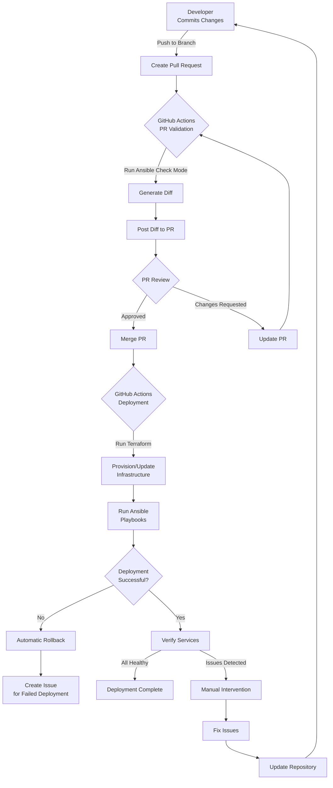
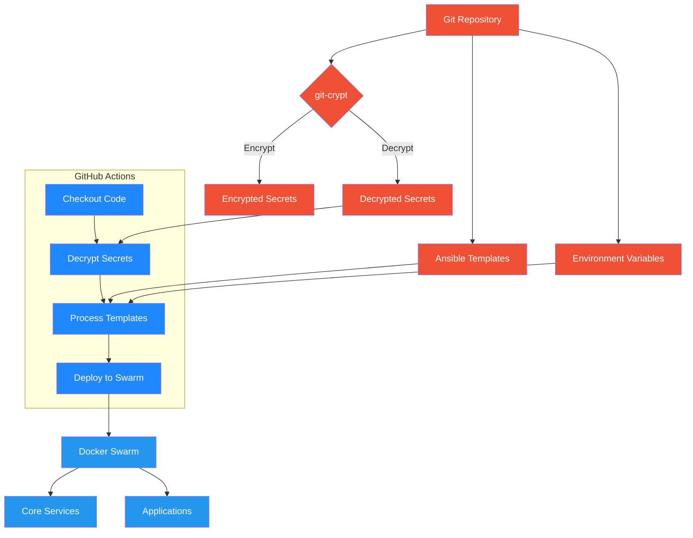
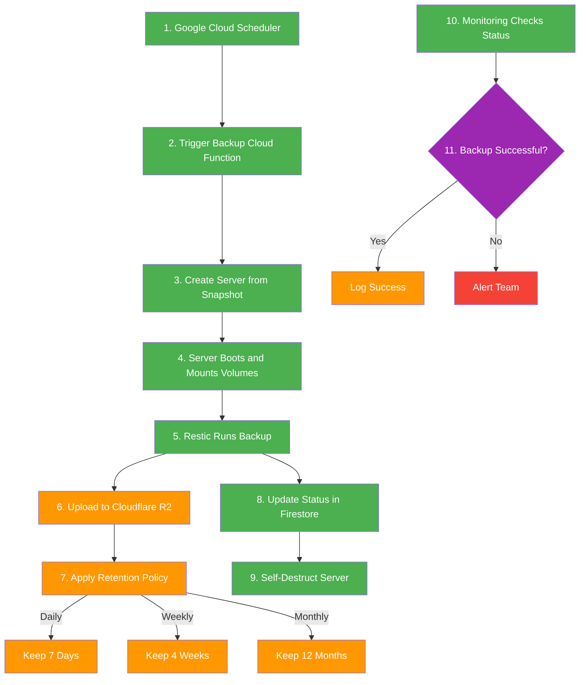
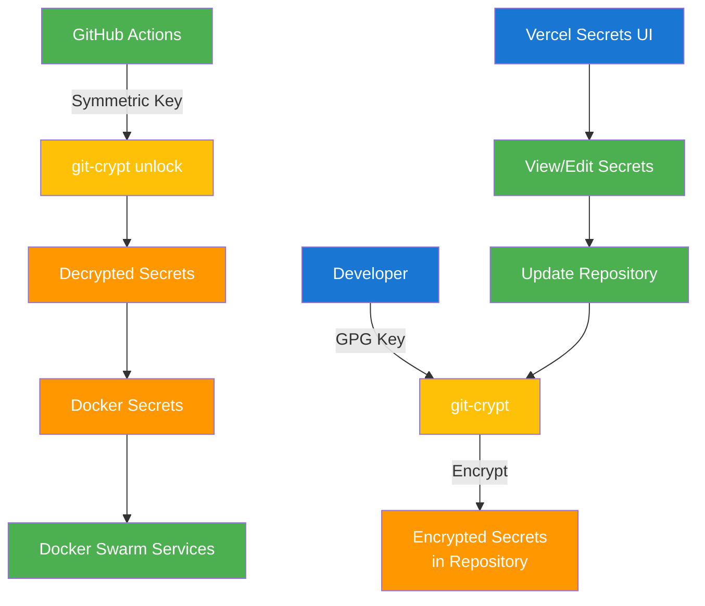

# Multi-Cloud Infrastructure Architecture

## Overview

This document outlines the architecture for a high-availability, multi-cloud infrastructure spanning Hetzner Cloud, Cloudflare, Google Cloud Platform (GCP), Qdrant Cloud, and Groq Cloud. The architecture focuses on automation, avoiding single points of failure (SPOF), and maintaining clear separation of environments.

## Core Components

### 1. Infrastructure Provisioning
- **Terraform** for all cloud resources (Hetzner, Cloudflare, GCP)
- Environment-specific configurations
- Remote state storage in GCS bucket for collaboration

### 2. Configuration Management
- **Ansible** for server setup and application configuration templating
- Environment and application-specific variables in separate YAML files
- Git-crypt for encrypting sensitive information

### 3. Deployment Automation
- **GitHub Actions** for CI/CD pipeline and Ansible orchestration
- PR-based workflow with validation and preview
- Post-deployment verification

### 4. Container Orchestration
- **Docker Swarm** for simplicity and high availability
- SeaweedFS for distributed storage
- Traefik for routing and load balancing

### 5. Serverless Functions
- **Google Cloud Functions** for backup automation and data processing
- **Cloudflare Workers** for API integrations and LLM query processing
- **Google Cloud Scheduler** for reliable function triggering
- **Google Pub/Sub** for event-driven architecture

### 6. External API Integrations
- **Aircall API** for communication system integration
- **Guesty API** for property management integration
- **Webhook-based** real-time data synchronization
- **Vector representation** of all business data

### 7. AI and LLM Integration
- **Qdrant Vector Database** for semantic search capabilities
- **Groq Cloud** for fast LLM inference
- **RocketChat integration** for natural language queries
- **Automated vectorization** of messages and business data

## System Architecture

```mermaid
graph TB
    subgraph "Cloudflare"
        CF_DNS["DNS"]
        CF_R2["R2 Storage"]
        CF_Workers["Workers"]
    end

    subgraph "Hetzner Cloud"
        HZ_Firewall["Firewall"]
        
        subgraph "Private Network"
            subgraph "Docker Swarm Cluster"
                DS_Node1["Node 1 Manager + Worker"]
                DS_Node2["Node 2 Manager + Worker"]
                DS_Node3["Node 3 Manager + Worker"]
                
                subgraph "Core Services"
                    Core_SeaweedFS["SeaweedFS"]
                    Core_Traefik["Traefik"]
                    Core_Netdata["Netdata"]
                end
                
                subgraph "Applications"
                    App_RocketChat["RocketChat"]
                    App_MongoDB["MongoDB"]
                    App_Keycloak["Keycloak"]
                    App_Sync["Sync App"]
                end
            end
            
            HZ_Backup["Backup Server"]
        end
    end

    subgraph "GCP"
        GCP_Firestore["Firestore"]
        GCP_Functions["Cloud Functions"]
        GCP_CloudRun["Cloud Run"]
    end

    subgraph "Vercel"
        Vercel_SecretsUI["Secrets UI"]
    end

    subgraph "External Services"
        Qdrant["Qdrant Cloud Vector DB"]
        Groq["Groq Cloud Inference"]
    end

    %% Connections
    CF_DNS --> HZ_Firewall
    CF_Workers --> HZ_Firewall
    
    DS_Node1 <--> DS_Node2
    DS_Node2 <--> DS_Node3
    DS_Node3 <--> DS_Node1
    
    Core_Traefik --> HZ_Firewall
    
    HZ_Backup --> CF_R2
    
    GCP_Functions <--> HZ_Firewall
    GCP_CloudRun <--> HZ_Firewall
    
    App_RocketChat <--> GCP_Firestore
    App_Sync <--> GCP_Firestore
    
    App_Sync <--> Qdrant
    App_Sync <--> Groq
    
    Vercel_SecretsUI <--> CF_Workers
    
    classDef cloudflare fill:#F6821F,color:white;
    classDef hetzner fill:#D50C2D,color:white;
    classDef gcp fill:#4285F4,color:white;
    classDef vercel fill:#000000,color:white;
    classDef external fill:#666666,color:white;
    classDef swarm fill:#2496ED,color:white;
    classDef core fill:#2496ED,color:white,stroke-dasharray: 5 5;
    classDef apps fill:#2496ED,color:white,stroke-dasharray: 5 5;
    classDef network fill:#009688,color:white;
    
    class CF_DNS,CF_R2,CF_Workers cloudflare;
    class DS_Node1,DS_Node2,DS_Node3,HZ_Backup,HZ_Firewall hetzner;
    class Core_SeaweedFS,Core_Traefik,Core_Netdata core;
    class App_RocketChat,App_MongoDB,App_Keycloak,App_Sync apps;
    class GCP_Firestore,GCP_Functions,GCP_CloudRun gcp;
    class Vercel_SecretsUI vercel;
    class Qdrant,Groq external;
    class "Private Network" network;
```

## Hetzner Cloud Infrastructure

### Docker Swarm Cluster
- **3 nodes** (each acting as both manager and worker)
- Full high availability with no single point of failure
- Automatic manager failover
- Anti-affinity rules for service placement

### Core Services
Located in `/opt/core/<name>`:
- **SeaweedFS**: Distributed file storage with 2x replication
- **Traefik**: Reverse proxy and load balancer
- **Netdata**: System monitoring

### Applications
Located in `/opt/apps/<name>`:
- **RocketChat**: Team communication platform
- **MongoDB**: Database for RocketChat
- **Keycloak**: Identity and access management
- **Sync App**: Custom synchronization application
- All applications use SeaweedFS volumes with 2x replication

### Backup Automation

- **Serverless approach** using Google Cloud Function and Cloud Scheduler
- **Custom snapshot** with pre-installed backup tools
- **Temporary server** created for each backup operation
- **Self-destruction** after backup completion
- **Retention policy**: 7 daily, 4 weekly, 12 monthly backups
- **Monitoring integration** with status updates in Firestore

### Network Security
- Private network for internal communication
- Hetzner firewall with YAML configuration
- Cloudflare as edge security

## Cloudflare Integration

- **R2 Storage**: For backup storage
- **DNS**: For domain management
- **Workers**: 
  - API webhook processing (Aircall, Guesty)
  - LLM query processing
  - Edge computing functions
- **Proxy**: For DDoS protection and caching

## GCP Integration

- **Firestore**: Database for applications and backup status
- **Cloud Functions**: 
  - Backup automation
  - Data vectorization
  - Message processing
- **Cloud Run**: Container-based serverless platform
- **Cloud Scheduler**: Reliable scheduling for automated tasks
- **Pub/Sub**: Event-driven messaging for real-time processing

## Vercel Integration

- **Secrets UI**: Web interface for managing secrets
- **Serverless Functions**: For specific user-facing operations

## External Services

- **Qdrant Cloud**: Vector database for AI applications
- **Groq Cloud**: AI inference platform
- **Aircall API**: Communication system integration
- **Guesty API**: Property management system integration

## Repository Structure

```
infrastructure/
├── terraform/
│   ├── modules/
│   │   ├── hetzner-swarm/
│   │   ├── hetzner-network/
│   │   ├── hetzner-firewall/
│   │   ├── cloudflare/
│   │   ├── gcp/
│   │   │   ├── functions/
│   │   │   ├── scheduler/
│   │   │   └── pubsub/
│   │   └── qdrant/
│   ├── environments/
│       ├── dev/
│       ├── staging/
│       └── prod/
├── ansible/
│   ├── playbooks/
│   │   ├── setup-servers.yml
│   │   ├── deploy-core.yml
│   │   ├── deploy-apps.yml
│   │   └── create-backup-snapshot.yml
│   ├── inventory/
│   │   ├── dev
│   │   ├── staging
│   │   └── prod
│   ├── roles/
│   │   ├── common/
│   │   ├── docker/
│   │   ├── core/
│   │   │   ├── seaweedfs/
│   │   │   ├── traefik/
│   │   │   └── netdata/
│   │   └── apps/
│   │       ├── rocketchat/
│   │       ├── keycloak/
│   │       ├── sync-app/
│   │       └── mongo-listener/
│   └── group_vars/
│       ├── all/
│       │   └── common.yml
│       ├── dev/
│       │   ├── common.yml
│       │   ├── rocketchat.yml
│       │   ├── keycloak.yml
│       │   └── sync-app.yml
│       ├── staging/
│       │   └── (similar structure)
│       └── prod/
│           └── (similar structure)
├── functions/
│   ├── gcp/
│   │   ├── backup/
│   │   │   ├── index.js
│   │   │   └── package.json
│   │   └── vectorize/
│   │       ├── index.js
│   │       └── package.json
│   └── cloudflare/
│       ├── aircall-webhook/
│       │   ├── index.js
│       │   └── wrangler.toml
│       ├── guesty-webhook/
│       │   ├── index.js
│       │   └── wrangler.toml
│       └── llm-query/
│           ├── index.js
│           └── wrangler.toml
├── .github/
│   └── workflows/
│       ├── pr-validation.yml
│       ├── deploy.yml
│       ├── deploy-functions.yml
│       └── backup-verify.yml
├── scripts/
│   ├── validate-ansible.sh
│   ├── backup-verify.sh
│   └── generate-diff.sh
└── secrets/
    ├── dev/
    ├── staging/
    └── prod/
```

## Configuration Management

### Ansible Role Structure Example

```
roles/
└── apps/
    └── rocketchat/
        ├── defaults/
        │   └── main.yml       # Default variables
        ├── tasks/
        │   └── main.yml       # Deployment tasks
        ├── templates/
        │   ├── rocketchat.j2  # Docker Compose template
        │   └── nginx.conf.j2  # Nginx config template
        └── vars/
            └── main.yml       # Role-specific variables
```

### Environment and Application-Specific Variables

```
group_vars/
├── all/
│   └── common.yml             # Variables common to all environments
├── dev/
│   ├── common.yml             # Environment-wide variables
│   ├── rocketchat.yml         # RocketChat specific variables for dev
│   ├── keycloak.yml           # Keycloak specific variables for dev
│   └── sync-app.yml           # Sync app specific variables for dev
├── staging/
│   └── (similar structure)
└── prod/
    └── (similar structure)
```

Example of application-specific configuration:

```yaml
# group_vars/dev/rocketchat.yml
rocketchat:
  domain: chat.dev.example.com
  replicas: 1
  memory: 1G
  features:
    video_calls: false
    file_sharing: true
  integrations:
    keycloak: true
    slack: false
```

```yaml
# group_vars/prod/rocketchat.yml
rocketchat:
  domain: chat.example.com
  replicas: 3
  memory: 2G
  features:
    video_calls: true
    file_sharing: true
  integrations:
    keycloak: true
    slack: true
```

## Deployment Process Flow



## GitHub Actions Workflow Examples

### PR Validation Workflow

```yaml
# .github/workflows/pr-validation.yml
name: PR Validation
on:
  pull_request:
    paths:
      - 'ansible/**'
      - 'terraform/**'

jobs:
  validate:
    runs-on: ubuntu-latest
    steps:
      - uses: actions/checkout@v3
      - name: Set up Python
        uses: actions/setup-python@v4
        with:
          python-version: '3.10'
      - name: Install dependencies
        run: |
          python -m pip install --upgrade pip
          pip install ansible ansible-lint
      - name: Decrypt secrets
        run: |
          echo "${{ secrets.GIT_CRYPT_KEY }}" | base64 -d > git-crypt-key
          git-crypt unlock git-crypt-key
      - name: Validate Ansible
        run: |
          ansible-lint ansible/
      - name: Generate diff (check mode)
        run: |
          ./scripts/generate-diff.sh
      - name: Comment PR
        uses: actions/github-script@v6
        with:
          script: |
            const fs = require('fs');
            const diff = fs.readFileSync('ansible-diff.txt', 'utf8');
            github.rest.issues.createComment({
              issue_number: context.issue.number,
              owner: context.repo.owner,
              repo: context.repo.repo,
              body: '## Ansible Changes Preview\n```diff\n' + diff + '\n```'
            });
```

### Deployment Workflow

```yaml
# .github/workflows/deploy.yml
name: Deploy
on:
  push:
    branches: [main]
    paths:
      - 'ansible/**'
      - 'terraform/**'

jobs:
  deploy:
    runs-on: ubuntu-latest
    steps:
      - uses: actions/checkout@v3
      - name: Set up Python
        uses: actions/setup-python@v4
        with:
          python-version: '3.10'
      - name: Install dependencies
        run: |
          python -m pip install --upgrade pip
          pip install ansible
      - name: Decrypt secrets
        run: |
          echo "${{ secrets.GIT_CRYPT_KEY }}" | base64 -d > git-crypt-key
          git-crypt unlock git-crypt-key
      - name: Deploy with Ansible
        run: |
          ansible-playbook ansible/playbooks/deploy-core.yml -i ansible/inventory/prod
          ansible-playbook ansible/playbooks/deploy-apps.yml -i ansible/inventory/prod
      - name: Verify deployment
        run: |
          ./scripts/verify-deployment.sh
      - name: Notify on failure
        if: failure()
        uses: actions/github-script@v6
        with:
          script: |
            github.rest.issues.create({
              owner: context.repo.owner,
              repo: context.repo.repo,
              title: 'Deployment failed',
              body: 'Deployment failed in workflow run: ' + context.runId
            });
```

## Configuration Management Flow



## Backup Process Flow



## Secrets Management Flow



## Secrets Management with Git-crypt

1. **Setup**:
   - Initialize git-crypt in repository
   - Add team members' GPG keys
   - Define `.gitattributes` to specify encrypted files

2. **Usage**:
   - Store secrets in designated files
   - Commit normally - git-crypt handles encryption
   - Team members can decrypt with their GPG keys

3. **CI/CD Integration**:
   - Store symmetric key in GitHub Secrets
   - Decrypt in GitHub Actions
   - Pass to Ansible as needed

## High Availability Considerations

1. **Docker Swarm**:
   - Multiple manager nodes for control plane HA
   - Services distributed across nodes
   - Automatic recovery from node failures

2. **Data Storage**:
   - SeaweedFS with 2x replication
   - Data distributed across multiple nodes
   - Automatic failover

3. **Load Balancing**:
   - Traefik for service discovery and load balancing
   - Cloudflare for external traffic distribution
   - Health checks for service availability

4. **Backup Strategy**:
   - Regular backups to Cloudflare R2
   - Multiple retention periods
   - Backup verification

## Security Considerations

1. **Network Security**:
   - Private network for internal communication
   - Hetzner firewall for perimeter security
   - Cloudflare for DDoS protection

2. **Secrets Management**:
   - Git-crypt for encrypting sensitive data
   - Docker Secrets for runtime secrets
   - Limited access to production environments

3. **Authentication**:
   - Keycloak for federated identity
   - Role-based access control
   - Multi-factor authentication

4. **Deployment Security**:
   - PR-based workflow with reviews
   - Validation before deployment
   - Limited deployment credentials

## Monitoring and Observability

1. **System Monitoring**:
   - Netdata for real-time metrics
   - Alerting for critical issues
   - Dashboard for system overview

2. **Application Monitoring**:
   - Application-specific health checks
   - Log aggregation
   - Performance metrics

3. **Backup Monitoring**:
   - Verification of backup success
   - Restore testing
   - Alerts for backup failures

4. **Serverless Function Monitoring**:
   - Cloud Function logs for debugging and auditing
   - Cloudflare Worker analytics for performance monitoring
   - Backup status tracking in Firestore
   - Webhook processing metrics for API integrations

5. **AI System Monitoring**:
   - Vector database metrics for query performance
   - LLM response times and usage tracking
   - Query success rates and error monitoring
   - User satisfaction metrics based on feedback

## Serverless Functions Architecture

### 1. Backup Automation

The backup process has been redesigned to use a serverless approach:

- **Google Cloud Scheduler** triggers a Cloud Function daily
- **Backup Cloud Function** creates a server from a pre-configured snapshot
- **Backup Server** automatically mounts volumes, performs backups, and self-destructs
- **Status updates** are sent to Firestore and monitoring systems
- **Retention policies** (7 daily, 4 weekly, 12 monthly) are applied automatically

This approach eliminates the need for a permanent backup server, reducing costs while maintaining robust backup capabilities.

### 2. API Integration Functions

External APIs are integrated using webhook-based Cloudflare Workers:

1. **Aircall/Guesty Webhook Worker** receives real-time updates from external APIs
2. **Data transformation** occurs at the edge for optimal performance
3. **Firestore database** stores the normalized data
4. **Firestore write triggers** a separate Google Cloud Function
5. **Vectorize Function** creates vector representations and updates Qdrant

This architecture provides real-time data synchronization without polling, reducing latency and resource usage. The separation of concerns between the webhook processing and vectorization ensures each component remains focused and maintainable.

### 3. RocketChat Message Vectorization

RocketChat messages are automatically vectorized for AI queries:

- **MongoDB Change Stream Listener** monitors for new messages
- **Google Pub/Sub** receives message events
- **Vectorize Function** creates vector representations
- **Qdrant Vector Database** stores the vectors for semantic search

This approach ensures that all communication is searchable and can be referenced by the LLM system.

### 4. LLM Query Processing

Natural language queries in RocketChat are processed by:

- **LLM Query Cloudflare Worker** receives webhook events from RocketChat
- **Qdrant Vector Database** provides relevant context
- **Groq LLM API** generates responses based on context
- **Response formatting** ensures clear presentation in RocketChat
- **Query and response storage** maintains a history for future reference

This system allows users to query business data using natural language, improving efficiency and accessibility.

## Next Steps

1. **Platform Setup**:
   - Create GitHub repository
   - Set up GitHub Actions workflows
   - Configure git-crypt for secrets

2. **Infrastructure Setup**:
   - Create Terraform modules
   - Define infrastructure for each environment
   - Implement server setup playbooks

3. **Ansible Structure**:
   - Define roles and playbooks
   - Create templates for all services
   - Set up environment and application-specific variables

4. **Deployment Automation**:
   - Implement GitHub Actions workflows
   - Create validation and preview process
   - Set up deployment verification