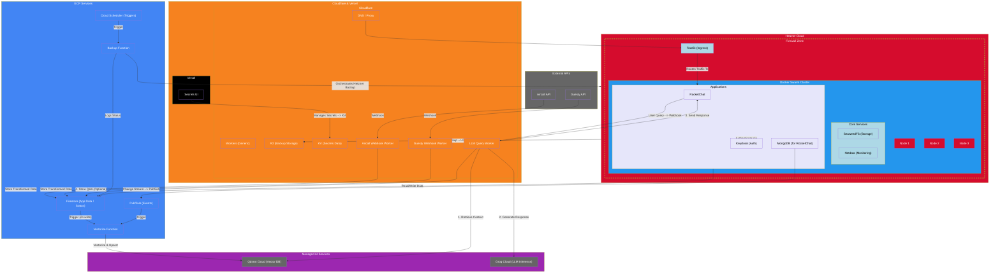

```mermaid
```mermaid
flowchart TD
    %% System Architecture - Flowchart Style

    %% --- Define Styles ---
    classDef cloudflare fill:#F6821F,color:white;
    classDef hetzner fill:#D50C2D,color:white;
    classDef firewall fill:#D50C2D,color:white,stroke-width:4px,stroke-dasharray: 5 5;
    classDef gcp fill:#4285F4,color:white;
    classDef vercel fill:#000000,color:white;
    classDef external fill:#666666,color:white;
    classDef qdrant fill:#656666,color:white;
    classDef groq fill:#666366,color:white;
    classDef swarm fill:#2496ED,color:white;
    classDef core fill:#ADD8E6,color:black;
    classDef apps fill:#E6E6FA,color:black;
    classDef ai fill:#9C27B0,color:white;

    %% --- Structure Definition ---

    subgraph External_APIs [External APIs]
        direction LR
        Ext_Aircall["Aircall API"]
        Ext_Guesty["Guesty API"]
    end

    subgraph Edge_Layer [Cloudflare & Vercel]
        direction LR
        subgraph Cloudflare
           CF_DNS["DNS / Proxy"]
           CF_Workers["Workers (Generic)"]
           CF_R2["R2 (Backup Storage)"]
           CF_KV["KV (Secrets Data)"]
           CF_AircallWorker["Aircall Webhook Worker"]
           CF_GuestyWorker["Guesty Webhook Worker"]
           CF_LLMWorker["LLM Query Worker"]
        end
        subgraph Vercel
            Vercel_SecretsUI["Secrets UI"]
        end
    end

    subgraph Hetzner [Hetzner Cloud]
        subgraph HZ_Firewall [Firewall Zone]
            direction TB
            Core_Traefik["Traefik (Ingress)"]
            subgraph Swarm [Docker Swarm Cluster]
                direction TB
                Node1["Node 1"]
                Node2["Node 2"]
                Node3["Node 3"]

                subgraph Core_Services [Core Services]
                   Core_SeaweedFS["SeaweedFS (Storage)"]
                   Core_Netdata["Netdata (Monitoring)"]
                end

                subgraph Applications [Applications]
                   App_RocketChat["RocketChat"]
                   App_MongoDB["MongoDB (for RocketChat)"]
                   App_Keycloak["Keycloak (Auth)"]
                end
            end
        end
    end

    subgraph GCP [GCP Services]
        direction TB
        GCP_Firestore["Firestore (App Data / Status)"]
        GCP_Scheduler["Cloud Scheduler (Triggers)"]
        GCP_BackupFunc["Backup Function"]
        GCP_VectorizeFunc["Vectorize Function"]
        GCP_PubSub["Pub/Sub (Events)"]
    end

    subgraph AI_Services [Managed AI Services]
        direction LR
        Qdrant["Qdrant Cloud (Vector DB)"]
        Groq["Groq Cloud (LLM Inference)"]
    end

    %% --- Define Primary Flows / Connections ---

    CF_DNS --> Core_Traefik;
    Ext_Aircall -- "Webhook" --> CF_AircallWorker;
    Ext_Guesty -- "Webhook" --> CF_GuestyWorker;
    CF_AircallWorker -- "Store Transformed Data" --> GCP_Firestore;
    CF_GuestyWorker -- "Store Transformed Data" --> GCP_Firestore;
    GCP_Firestore -- "Trigger (on write)" --> GCP_VectorizeFunc;
    App_MongoDB -- "Change Stream --> PubSub" --> GCP_PubSub;
    GCP_PubSub -- "Trigger" --> GCP_VectorizeFunc;
    GCP_VectorizeFunc -- "Vectorize & Upsert" --> Qdrant;
    App_RocketChat -- "User Query --> Webhook" --> CF_LLMWorker;
    CF_LLMWorker -- "1. Retrieve Context" --> Qdrant;
    CF_LLMWorker -- "2. Generate Response" --> Groq;
    CF_LLMWorker -- "3. Send Response" --> App_RocketChat;
    CF_LLMWorker -- "4. Store Q&A (Optional)" --> GCP_Firestore;
    GCP_Scheduler -- "Trigger" --> GCP_BackupFunc;
    GCP_BackupFunc -- "Orchestrates Hetzner Backup" --> Hetzner;
    Hetzner -- "Stores Backup --> R2" --> CF_R2;
    GCP_BackupFunc -- "Logs Status" --> GCP_Firestore;
    Vercel_SecretsUI -- "Manages Secrets --> KV" --> CF_KV;
    Core_Traefik -- "Routes Traffic To" --> Applications;
    Applications -- "Authenticate Via" --> App_Keycloak;
    Applications -- "Read/Write Data" --> GCP_Firestore;

    %% --- Apply Styles ---
    class External_APIs external;
    class Ext_Aircall,Ext_Guesty external;
    class Edge_Layer,Cloudflare,CF_DNS,CF_Workers,CF_R2,CF_KV,CF_AircallWorker,CF_GuestyWorker,CF_LLMWorker cloudflare;
    class Vercel,Vercel_SecretsUI vercel;
    class Hetzner,Node1,Node2,Node3 hetzner;
    class HZ_Firewall firewall;
    class Swarm swarm;
    class Core_Traefik,Core_Services,Core_SeaweedFS,Core_Netdata core;
    class Applications,App_RocketChat,App_MongoDB,App_Keycloak apps;
    class GCP,GCP_Firestore,GCP_Scheduler,GCP_BackupFunc,GCP_VectorizeFunc,GCP_PubSub gcp;
    class AI_Services ai;
    class Qdrant qdrant;
    class Groq groq;
```