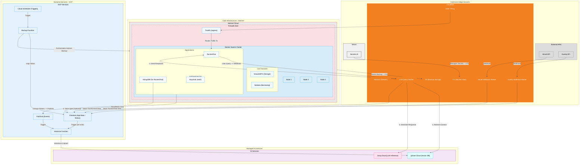

```mermaid
flowchart TD
    %% System Architecture - Flowchart Style (Revised Layout & Styles V3)

    %% --- Define Styles (Lighter Backgrounds) ---
    classDef cloudflare fill:#F38020,color:white,stroke:#F38020;
    classDef hetzner fill:#E8E8E8,color:black,stroke:#D50C2D;
    classDef firewall fill:#FAE0E3,color:black,stroke:#D50C2D,stroke-dasharray: 5 5;
    classDef gcp fill:#E3F2FD,color:black,stroke:#4285F4;
    classDef vercel fill:#F0F0F0,color:black,stroke:#000000;
    classDef external fill:#DCDCDC,color:black,stroke:#666666;
    classDef qdrant fill:#E0FFFF,color:black,stroke:#00C4CC;
    classDef groq fill:#FFE0F0,color:black,stroke:#FF4081;
    classDef swarm fill:#D6ECF8,color:black,stroke:#2496ED;
    classDef core fill:#F0F8FF,color:black,stroke:#2496ED;
    classDef apps fill:#F8F8FF,color:black,stroke:#2496ED;
    classDef ai fill:#F3E5F5,color:black,stroke:#9C27B0;


    %% --- Structure Definition (Top-Down Arrangement) ---

    subgraph Row1 [External & Edge Services]
        direction LR
        subgraph External_APIs [External APIs]
            Ext_Aircall["Aircall API"]:::external
            Ext_Guesty["Guesty API"]:::external
        end

        subgraph Cloudflare_Services [Cloudflare]
            CF_DNS["DNS / Proxy"]:::cloudflare
            CF_Workers["Workers (Generic)"]:::cloudflare
            CF_R2["R2 (Backup Storage)"]:::cloudflare
            CF_KV["KV (Secrets Data)"]:::cloudflare
            CF_AircallWorker["Aircall Webhook Worker"]:::cloudflare
            CF_GuestyWorker["Guesty Webhook Worker"]:::cloudflare
            CF_LLMWorker["LLM Query Worker"]:::cloudflare
        end

        subgraph Vercel_Service [Vercel]
            Vercel_SecretsUI["Secrets UI"]:::vercel
        end
    end


    subgraph Row2 [Core Infrastructure - Hetzner]
      subgraph Hetzner [Hetzner Cloud]
        subgraph HZ_Firewall [Firewall Zone]
            direction TB
            Core_Traefik["Traefik (Ingress)"]:::core
            subgraph Swarm [Docker Swarm Cluster]
                direction TB
                Node1["Node 1"]:::swarm
                Node2["Node 2"]:::swarm
                Node3["Node 3"]:::swarm

                subgraph Core_Services [Core Services]
                   Core_SeaweedFS["SeaweedFS (Storage)"]:::core
                   Core_Netdata["Netdata (Monitoring)"]:::core
                end

                subgraph Applications [Applications]
                   App_RocketChat["RocketChat"]:::apps
                   App_MongoDB["MongoDB (for RocketChat)"]:::apps
                   App_Keycloak["Keycloak (Auth)"]:::apps
                end
            end
        end
      end
    end

    subgraph Row3 [Backend Services - GCP]
      subgraph GCP [GCP Services]
        direction TB
        GCP_Firestore["Firestore (App Data / Status)"]:::gcp
        GCP_Scheduler["Cloud Scheduler (Triggers)"]:::gcp
        GCP_BackupFunc["Backup Function"]:::gcp
        GCP_VectorizeFunc["Vectorize Function"]:::gcp
        GCP_PubSub["Pub/Sub (Events)"]:::gcp
      end
    end

    subgraph Row4 [Managed AI Services]
      subgraph AI_Services [AI Services]
        direction LR
        Qdrant["Qdrant Cloud (Vector DB)"]:::qdrant
        Groq["Groq Cloud (LLM Inference)"]:::groq
      end
    end


    %% --- Define Primary Flows / Connections ---

    CF_DNS --> Core_Traefik;
    Ext_Aircall -- "Webhook" --> CF_AircallWorker;
    Ext_Guesty -- "Webhook" --> CF_GuestyWorker;
    CF_AircallWorker -- "Store Transformed Data" --> GCP_Firestore;
    CF_GuestyWorker -- "Store Transformed Data" --> GCP_Firestore;
    GCP_Firestore -- "Trigger (on write)" --> GCP_VectorizeFunc;
    App_MongoDB -- "Change Stream --> PubSub" --> GCP_PubSub;
    GCP_PubSub -- "Trigger" --> GCP_VectorizeFunc;
    GCP_VectorizeFunc -- "Vectorize & Upsert" --> Qdrant;
    App_RocketChat -- "User Query --> Webhook" --> CF_LLMWorker;
    CF_LLMWorker -- "1. Retrieve Context" --> Qdrant;
    CF_LLMWorker -- "2. Generate Response" --> Groq;
    CF_LLMWorker -- "3. Send Response" --> App_RocketChat;
    CF_LLMWorker -- "4. Store Q&A (Optional)" --> GCP_Firestore;
    GCP_Scheduler -- "Trigger" --> GCP_BackupFunc;
    GCP_BackupFunc -- "Orchestrates Hetzner Backup" --> Hetzner;
    Hetzner -- "Stores Backup --> R2" --> CF_R2;
    GCP_BackupFunc -- "Logs Status" --> GCP_Firestore;
    Vercel_SecretsUI -- "Manages Secrets --> KV" --> CF_KV;
    Core_Traefik -- "Routes Traffic To" --> Applications;
    Applications -- "Authenticate Via" --> App_Keycloak;
    Applications -- "Read/Write Data" --> GCP_Firestore;

    %% --- Apply Subgraph Styles ---
    class Hetzner hetzner;
    class HZ_Firewall firewall;
    class Swarm swarm;
    class GCP gcp;
    class AI_Services ai;
    class External_APIs external;
    class Cloudflare_Services cloudflare;
    class Vercel_Service vercel;
```