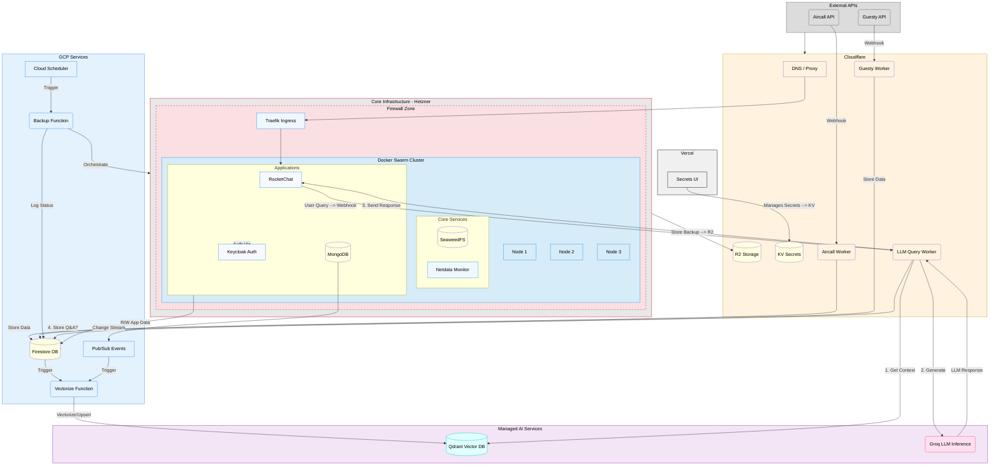

```mermaid
flowchart TD
    %% System Architecture - Flowchart Style (Revised Layout, Styles, Icons V4)

    %% --- Define Styles (Lighter Backgrounds) ---
    classDef cloudflare fill:#FFF3E0,color:black,stroke:#F38020;        %% Light Orange/Yellow
    classDef hetzner fill:#E8E8E8,color:black,stroke:#D50C2D;
    classDef firewall fill:#FAE0E3,color:black,stroke:#D50C2D,stroke-dasharray: 5 5;
    classDef gcp fill:#E3F2FD,color:black,stroke:#4285F4;
    classDef vercel fill:#F0F0F0,color:black,stroke:#000000;
    classDef external fill:#DCDCDC,color:black,stroke:#666666;
    classDef qdrant fill:#E0FFFF,color:black,stroke:#00C4CC;
    classDef groq fill:#FFE0F0,color:black,stroke:#FF4081;
    classDef swarm fill:#D6ECF8,color:black,stroke:#2496ED;
    classDef core fill:#F0F8FF,color:black,stroke:#2496ED;
    classDef apps fill:#F8F8FF,color:black,stroke:#2496ED;
    classDef ai fill:#F3E5F5,color:black,stroke:#9C27B0;
    classDef database fill:#FFFFE0,color:black,stroke:#AAAAAA; %% Specific style for database cylinders

    %% --- Structure Definition (Top-Down Arrangement, Varied Icons) ---

    subgraph External_APIs [External APIs]
        Ext_Aircall("Aircall API"):::external
        Ext_Guesty("Guesty API"):::external
    end

    subgraph Cloudflare_Services [Cloudflare]
        CF_DNS["DNS / Proxy"]:::cloudflare
        CF_R2[("R2 Storage")]:::database
        CF_KV[("KV Secrets")]:::database
        CF_AircallWorker("Aircall Worker"):::cloudflare
        CF_GuestyWorker("Guesty Worker"):::cloudflare
        CF_LLMWorker("LLM Query Worker"):::cloudflare
    end

    subgraph Vercel_Service [Vercel]
        Vercel_SecretsUI["Secrets UI"]:::vercel
    end

    subgraph GCP_Services [GCP Services]
        GCP_Scheduler["Cloud Scheduler"]:::gcp
        GCP_BackupFunc("Backup Function"):::gcp
        GCP_VectorizeFunc("Vectorize Function"):::gcp
        GCP_PubSub["Pub/Sub Events"]:::gcp
        GCP_Firestore[("Firestore DB")]:::database
    end

    subgraph Hetzner_Infra [Core Infrastructure - Hetzner]
        subgraph HZ_Firewall [Firewall Zone]
            Core_Traefik["Traefik Ingress"]:::core
            subgraph Swarm [Docker Swarm Cluster]
                Node1["Node 1"]:::swarm
                Node2["Node 2"]:::swarm
                Node3["Node 3"]:::swarm
                subgraph Core_Services [Core Services]
                   Core_SeaweedFS[("SeaweedFS")]:::database
                   Core_Netdata["Netdata Monitor"]:::core
                end
                subgraph Applications [Applications]
                   App_RocketChat["RocketChat"]:::apps
                   App_MongoDB[("MongoDB")]:::database
                   App_Keycloak["Keycloak Auth"]:::apps
                end
            end
        end
    end


    subgraph AI_Services [Managed AI Services]
        Qdrant[("Qdrant Vector DB")]:::database
        Groq("Groq LLM Inference"):::groq
    end


    %% --- Define Primary Flows / Connections (Encouraging Top-Down) ---

    %% Edge Inputs
    External_APIs --> Cloudflare_Services;
    CF_DNS --> Core_Traefik;
    Vercel_SecretsUI -- "Manages Secrets --> KV" --> CF_KV;

    %% Webhook Flow
    Ext_Aircall -- "Webhook" --> CF_AircallWorker;
    Ext_Guesty -- "Webhook" --> CF_GuestyWorker;
    CF_AircallWorker -- "Store Data" --> GCP_Firestore;
    CF_GuestyWorker -- "Store Data" --> GCP_Firestore;

    %% Data Processing Flow (Firestore Trigger)
    GCP_Firestore -- "Trigger" --> GCP_VectorizeFunc;
    GCP_VectorizeFunc -- "Vectorize/Upsert" --> Qdrant;

    %% Data Processing Flow (Mongo Trigger)
    App_MongoDB -- "Change Stream" --> GCP_PubSub;
    GCP_PubSub -- "Trigger" --> GCP_VectorizeFunc;

    %% Backup Flow
    GCP_Scheduler -- "Trigger" --> GCP_BackupFunc;
    GCP_BackupFunc -- "Orchestrate" --> Hetzner_Infra;
    GCP_BackupFunc -- "Log Status" --> GCP_Firestore;
    Hetzner_Infra -- "Store Backup --> R2" --> CF_R2;

    %% LLM Query Flow
    App_RocketChat -- "User Query --> Webhook" --> CF_LLMWorker;
    CF_LLMWorker -- "1. Get Context" --> Qdrant;
    CF_LLMWorker -- "2. Generate" --> Groq;
    Groq -- "LLM Response" --> CF_LLMWorker;
    CF_LLMWorker -- "3. Send Response" --> App_RocketChat;
    CF_LLMWorker -- "4. Store Q&A?" --> GCP_Firestore;

    %% Internal Hetzner Flow
    Core_Traefik --> Applications;
    Applications -- "Auth Via" --> App_Keycloak;
    Applications -- "R/W App Data" --> GCP_Firestore;
    %% Implicit: Apps use Core_SeaweedFS & App_MongoDB

    %% --- Apply Subgraph Styles ---
    class Hetzner_Infra hetzner;
    class HZ_Firewall firewall;
    class Swarm swarm;
    class GCP_Services gcp;
    class AI_Services ai;
    class External_APIs external;
    class Cloudflare_Services cloudflare;
    class Vercel_Service vercel;
    class Qdrant qdrant;
    class Groq groq;
```