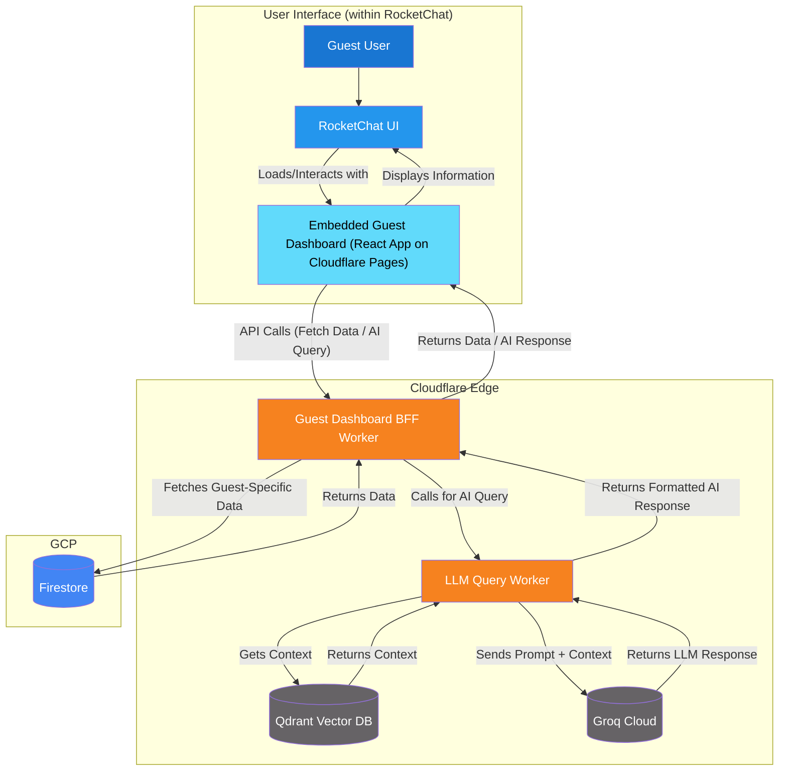

```mermaid
flowchart TD
    subgraph "User Interface (within RocketChat)"
        A["Guest User"] --> B["RocketChat UI"];
        B -- "Loads/Interacts with" --> C["Embedded Guest Dashboard (React App on Cloudflare Pages)"];
    end

    subgraph "Cloudflare Edge"
        C -- "API Calls (Fetch Data / AI Query)" --> D["Guest Dashboard BFF Worker"];
        D -- "Calls for AI Query" --> E["LLM Query Worker"];
        E -- "Gets Context" --> F[("Qdrant Vector DB")];
        F -- "Returns Context" --> E;
        E -- "Sends Prompt + Context" --> G[("Groq Cloud")];
        G -- "Returns LLM Response" --> E;
        E -- "Returns Formatted AI Response" --> D;
    end

    subgraph "GCP"
      D -- "Fetches Guest-Specific Data" --> H[("Firestore")];
      H -- "Returns Data" --> D;
    end

    D -- "Returns Data / AI Response" --> C;
    C -- "Displays Information" --> B;

    classDef user fill:#1976D2,color:white;
    classDef rc fill:#2496ED,color:white;
    classDef react fill:#61DAFB,color:black;
    classDef cf fill:#F6821F,color:white;
    classDef gcp fill:#4285F4,color:white;
    classDef ai fill:#666366,color:white;

    class A user;
    class B rc;
    class C react;
    class D,E cf;
    class H gcp;
    class F,G ai;
```
