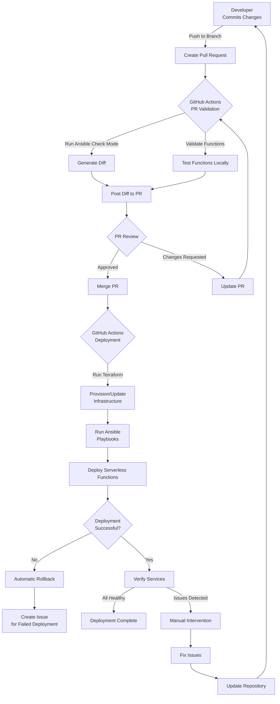

Date: 2025-04-10
---

# Updated Architecture Document

Based on our discussion about the serverless functions requirements, here are the updates that should be made to the main architecture document.

## Additions to Core Components Section

### 5. Serverless Functions
- **Google Cloud Functions** for backup automation and data processing
- **Cloudflare Workers** for API integrations and LLM query processing
- **Google Cloud Scheduler** for reliable function triggering
- **Google Pub/Sub** for event-driven architecture

### 6. External API Integrations
- **Aircall API** for communication system integration
- **Guesty API** for property management integration
- **Webhook-based** real-time data synchronization
- **Vector representation** of all business data

### 7. AI and LLM Integration
- **Qdrant Vector Database** for semantic search capabilities
- **Groq Cloud** for fast LLM inference
- **RocketChat integration** for natural language queries
- **Automated vectorization** of messages and business data

## Additions to System Architecture Section

The system architecture diagram should be updated to include:

1. **New Cloudflare Workers**:
   - Aircall Webhook Worker
   - Guesty Webhook Worker
   - LLM Query Worker

2. **New GCP Components**:
   - Cloud Scheduler
   - Backup Function
   - Vectorize Function
   - Pub/Sub topics

3. **New Docker Swarm Component**:
   - MongoDB Change Stream Listener

4. **External API Connections**:
   - Aircall API
   - Guesty API

## New Section: Serverless Functions Architecture

### 1. Backup Automation

The backup process has been redesigned to use a serverless approach:

- **Google Cloud Scheduler** triggers a Cloud Function daily
- **Backup Cloud Function** creates a server from a pre-configured snapshot
- **Backup Server** automatically mounts volumes, performs backups, and self-destructs
- **Status updates** are sent to Firestore and monitoring systems
- **Retention policies** (7 daily, 4 weekly, 12 monthly) are applied automatically

This approach eliminates the need for a permanent backup server, reducing costs while maintaining robust backup capabilities.

### 2. API Integration Functions

External APIs are integrated using webhook-based Cloudflare Workers:

- **Aircall Webhook Worker** receives real-time updates from the Aircall API
- **Guesty Webhook Worker** receives real-time updates from the Guesty API
- **Data transformation** occurs at the edge for optimal performance
- **Firestore database** stores the normalized data
- **Vectorize Function** creates vector representations for AI queries

This architecture provides real-time data synchronization without polling, reducing latency and resource usage.

### 3. RocketChat Message Vectorization

RocketChat messages are automatically vectorized for AI queries:

- **MongoDB Change Stream Listener** monitors for new messages
- **Google Pub/Sub** receives message events
- **Vectorize Function** creates vector representations
- **Qdrant Vector Database** stores the vectors for semantic search

This approach ensures that all communication is searchable and can be referenced by the LLM system.

### 4. LLM Query Processing

Natural language queries in RocketChat are processed by:

- **LLM Query Cloudflare Worker** receives webhook events from RocketChat
- **Qdrant Vector Database** provides relevant context
- **Groq LLM API** generates responses based on context
- **Response formatting** ensures clear presentation in RocketChat
- **Query and response storage** maintains a history for future reference

This system allows users to query business data using natural language, improving efficiency and accessibility.

## New Section: Data Flows

### API Data Flow

1. External API (Aircall/Guesty) sends webhook event
2. Cloudflare Worker receives, validates, and transforms data
3. Data is stored in Firestore
4. Vectorize Function creates vector representation
5. Vector is stored in Qdrant for semantic search

### Message Vectorization Flow

1. User sends message in RocketChat
2. Message is stored in MongoDB
3. Change Stream Listener detects new message
4. Event is published to Pub/Sub
5. Vectorize Function processes message
6. Vector is stored in Qdrant

### LLM Query Flow

1. User asks question in RocketChat
2. Webhook triggers LLM Query Worker
3. Worker queries Qdrant for relevant context
4. Worker sends query and context to Groq LLM
5. Response is formatted and sent back to RocketChat
6. Query and response are stored and vectorized

## Updates to Repository Structure

```
infrastructure/
├── terraform/
│   ├── modules/
│   │   ├── hetzner-swarm/
│   │   ├── hetzner-network/
│   │   ├── cloudflare/
│   │   ├── gcp/
│   │   │   ├── functions/
│   │   │   ├── scheduler/
│   │   │   └── pubsub/
│   │   └── qdrant/
│   ├── environments/
│       ├── dev/
│       ├── staging/
│       └── prod/
├── ansible/
│   ├── playbooks/
│   │   ├── setup-servers.yml
│   │   ├── deploy-core.yml
│   │   ├── deploy-apps.yml
│   │   └── create-backup-snapshot.yml
│   ├── inventory/
│   │   ├── dev
│   │   ├── staging
│   │   └── prod
│   ├── roles/
│   │   ├── common/
│   │   ├── docker/
│   │   ├── core/
│   │   │   ├── seaweedfs/
│   │   │   ├── traefik/
│   │   │   └── netdata/
│   │   └── apps/
│   │       ├── rocketchat/
│   │       ├── keycloak/
│   │       ├── sync-app/
│   │       └── mongo-listener/
│   └── group_vars/
│       ├── all/
│       │   └── common.yml
│       ├── dev/
│       │   ├── common.yml
│       │   ├── rocketchat.yml
│       │   ├── keycloak.yml
│       │   └── sync-app.yml
│       ├── staging/
│       │   └── (similar structure)
│       └── prod/
│           └── (similar structure)
├── functions/
│   ├── gcp/
│   │   ├── backup/
│   │   │   ├── index.js
│   │   │   └── package.json
│   │   └── vectorize/
│   │       ├── index.js
│   │       └── package.json
│   └── cloudflare/
│       ├── aircall-webhook/
│       │   ├── index.js
│       │   └── wrangler.toml
│       ├── guesty-webhook/
│       │   ├── index.js
│       │   └── wrangler.toml
│       └── llm-query/
│           ├── index.js
│           └── wrangler.toml
├── .github/
│   └── workflows/
│       ├── pr-validation.yml
│       ├── deploy.yml
│       ├── deploy-functions.yml
│       └── backup-verify.yml
├── scripts/
│   ├── validate-ansible.sh
│   ├── backup-verify.sh
│   └── generate-diff.sh
└── secrets/
    ├── dev/
    ├── staging/
    └── prod/
```

## Updates to Deployment Process Flow

The deployment process flow should be updated to include the deployment of serverless functions:



## Updates to Monitoring and Observability Section

### 4. Serverless Function Monitoring
- **Cloud Function logs** for debugging and auditing
- **Cloudflare Worker analytics** for performance monitoring
- **Backup status tracking** in Firestore
- **Webhook processing metrics** for API integrations

### 5. AI System Monitoring
- **Vector database metrics** for query performance
- **LLM response times** and usage tracking
- **Query success rates** and error monitoring
- **User satisfaction metrics** based on feedback