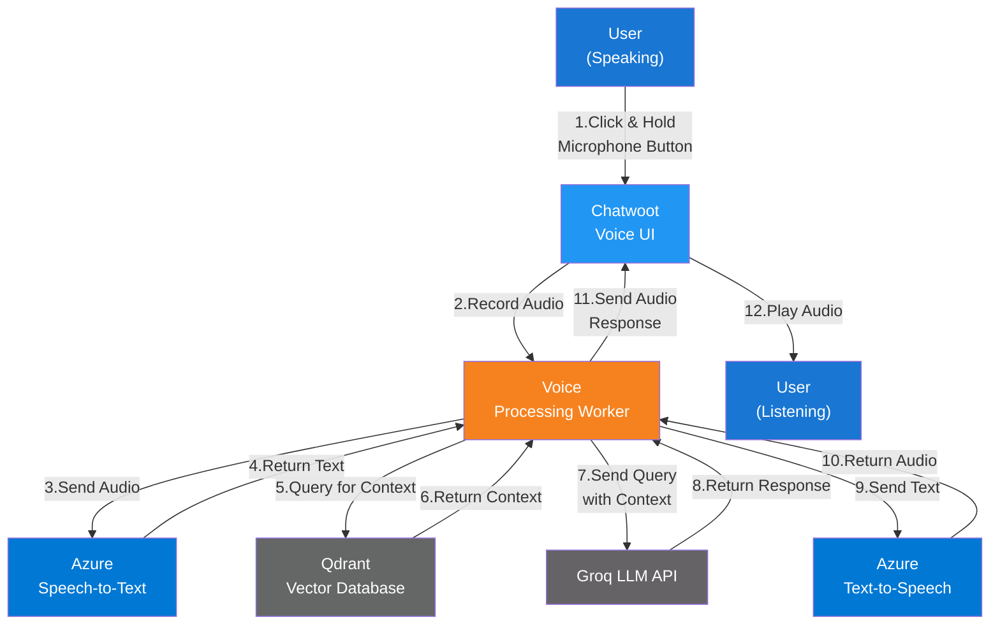
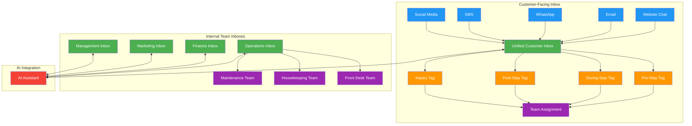
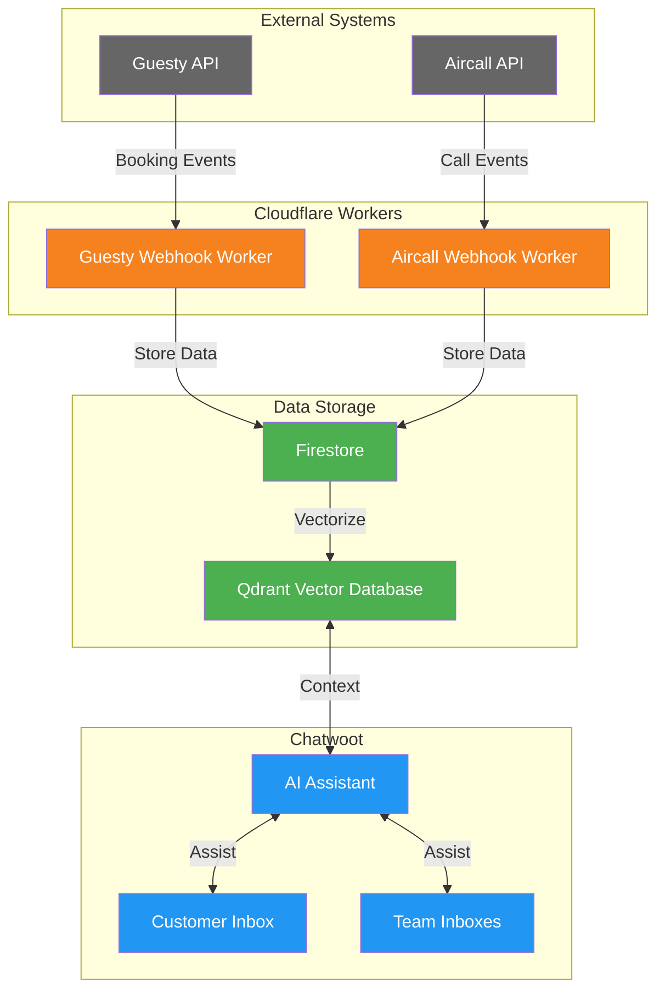

# Chatwoot Architecture Diagrams

## System Architecture with Chatwoot

```mermaid
graph TD
    %% Arrange in a more balanced horizontal layout
    
    %% Top - Vercel and KV Store
    subgraph "Vercel"
        Vercel_SecretsUI["Secrets UI"]
    end
    
    %% KV Store moved near Vercel at the top
    subgraph "Cloudflare"
        CF_KV["KV Store"]
        CF_DNS["DNS"]
        CF_R2["R2 Storage"]
        CF_Workers["Workers"]
        CF_AircallWorker["Aircall Webhook Worker"]
        CF_GuestyWorker["Guesty Webhook Worker"]
        CF_LLMWorker["LLM Query Worker"]
        CF_VoiceWorker["Voice Processing Worker"]
    end
    
    %% Left side - External Services
    subgraph "External Services"
        Aircall["Aircall API"]
        Guesty["Guesty API"]
    end
    
    %% Center - Hetzner Cloud with Firewall wrapper
    subgraph "Hetzner Cloud"
        %% Wrap the entire network in a Firewall subgraph
        subgraph "HZ_Firewall_Zone" [Firewall]
            subgraph "HZ_Network"
                subgraph "Docker Swarm Cluster"
                    DS_Node1["Node 1<br/>Manager + Worker"]
                    DS_Node2["Node 2<br/>Manager + Worker"]
                    DS_Node3["Node 3<br/>Manager + Worker"]
                    
                    subgraph "Core Services"
                        Core_Traefik["Traefik"]
                        Core_SeaweedFS["SeaweedFS"]
                        Core_Netdata["Netdata"]
                    end
                    
                    subgraph "Applications"
                        subgraph "Chatwoot"
                            App_Chatwoot["Chatwoot"]
                            App_PostgreSQL["PostgreSQL"]
                            App_Redis["Redis"]
                        end
                        App_Keycloak["Keycloak"]
                        App_SyncApp["Sync App"]
                    end
                end
                
                HZ_BackupSnapshot["Backup Server Snapshot"]
            end
        end
    end
    
    %% Right side - GCP positioned to avoid overlap with Cloudflare
    subgraph "GCP"
        GCP_Firestore["Firestore"]
        GCP_Scheduler["Cloud Scheduler"]
        GCP_BackupFunction["Backup Function"]
        GCP_VectorizeFunction["Vectorize Function"]
    end

    %% Far right - AI Services
    subgraph "AI Services"
        subgraph "Qdrant Cloud"
            Qdrant["Vector DB"]
        end
        
        subgraph "Groq Cloud"
            Groq["Deepseek-Qwen-32b Inference"]
        end
        
        subgraph "Azure Speech Services"
            Azure_STT["Speech-to-Text"]
            Azure_TTS["Text-to-Speech"]
        end
    end

    %% Network connections (solid lines)
    CF_DNS -->|"DNS Resolution"| HZ_Firewall_Zone
    CF_Workers -->|"API Requests"| HZ_Firewall_Zone
    Core_Traefik -->|"Ingress"| HZ_Firewall_Zone
    
    %% Swarm node connections (dashed lines)
    DS_Node1 -.->|"Swarm Traffic"| DS_Node2
    DS_Node2 -.->|"Swarm Traffic"| DS_Node3
    DS_Node3 -.->|"Swarm Traffic"| DS_Node1
    DS_Node2 -.->|"Swarm Traffic"| DS_Node1
    DS_Node3 -.->|"Swarm Traffic"| DS_Node2
    DS_Node1 -.->|"Swarm Traffic"| DS_Node3
    
    DS_Node1 -.->|"Network"| HZ_Network
    DS_Node2 -.->|"Network"| HZ_Network
    DS_Node3 -.->|"Network"| HZ_Network
    HZ_Network -.->|"Network"| DS_Node1
    HZ_Network -.->|"Network"| DS_Node2
    HZ_Network -.->|"Network"| DS_Node3
    
    %% Storage connections (dotted lines)
    Core_SeaweedFS -.->|"Storage"| App_Chatwoot
    App_Chatwoot -.->|"Storage"| Core_SeaweedFS
    Core_SeaweedFS -.->|"Storage"| App_PostgreSQL
    App_PostgreSQL -.->|"Storage"| Core_SeaweedFS
    Core_SeaweedFS -.->|"Storage"| App_Keycloak
    App_Keycloak -.->|"Storage"| Core_SeaweedFS
    
    %% Backup connections - now going through firewall zone
    GCP_BackupFunction -->|"Create"| HZ_Firewall_Zone
    HZ_BackupSnapshot -->|"Store"| CF_R2
    GCP_Scheduler -->|"Trigger"| GCP_BackupFunction
    
    %% External API connections (colored differently)
    Aircall -->|"Webhook"| CF_AircallWorker
    Guesty -->|"Webhook"| CF_GuestyWorker
    
    %% Data flow connections
    CF_AircallWorker -->|"Store"| GCP_Firestore
    CF_GuestyWorker -->|"Store"| GCP_Firestore
    
    GCP_Firestore -->|"Process"| GCP_VectorizeFunction
    GCP_VectorizeFunction -.->|"Upsert"| Qdrant
    
    %% LLM flow connections
    App_Chatwoot -->|"Query"| CF_LLMWorker
    CF_LLMWorker -.->|"Search"| Qdrant
    CF_LLMWorker -.->|"Generate"| Groq
    CF_LLMWorker -->|"Response"| App_Chatwoot
    
    %% Voice processing connections
    App_Chatwoot -->|"Voice Input"| CF_VoiceWorker
    CF_VoiceWorker -->|"Transcribe"| Azure_STT
    CF_VoiceWorker -.->|"Search"| Qdrant
    CF_VoiceWorker -.->|"Generate"| Groq
    CF_VoiceWorker -->|"Synthesize"| Azure_TTS
    CF_VoiceWorker -->|"Voice Output"| App_Chatwoot
    
    %% Added direct upsert from LLM Worker to Qdrant
    CF_LLMWorker -.->|"Upsert"| Qdrant
    
    App_Chatwoot -->|"Data"| GCP_Firestore
    GCP_Firestore -->|"Data"| App_Chatwoot
    
    %% Sync App connections
    App_SyncApp -->|"Sync"| App_Chatwoot
    App_SyncApp -->|"Sync"| GCP_Firestore
    
    %% Vercel connection to KV Store instead of Workers
    Vercel_SecretsUI -->|"Manage Secrets"| CF_KV
    CF_KV -->|"Access"| Vercel_SecretsUI
    
    classDef cloudflare fill:#F6821F,color:white;
    classDef hetzner fill:#D50C2D,color:white;
    classDef firewall fill:#D50C2D,color:white,stroke-width:4px;
    classDef gcp fill:#4285F4,color:white;
    classDef vercel fill:#000000,color:white;
    classDef external fill:#666666,color:white;
    classDef qdrant fill:#656666,color:white;
    classDef groq fill:#666366,color:white;
    classDef azure fill:#0078D4,color:white;
    classDef swarm fill:#2496ED,color:white;
    classDef core fill:#2496ED,color:white,stroke-dasharray: 5 5;
    classDef apps fill:#2496ED,color:white,stroke-dasharray: 5 5;
    classDef network fill:#009688,color:white;
    
    %% Apply styles to nodes
    class CF_DNS,CF_R2,CF_KV,CF_Workers,CF_AircallWorker,CF_GuestyWorker,CF_LLMWorker,CF_VoiceWorker cloudflare;
    class DS_Node1,DS_Node2,DS_Node3,HZ_BackupSnapshot hetzner;
    class HZ_Firewall_Zone firewall;
    class Core_SeaweedFS,Core_Traefik,Core_Netdata core;
    class App_Chatwoot,App_PostgreSQL,App_Redis,App_Keycloak,App_SyncApp apps;
    class GCP_Firestore,GCP_Scheduler,GCP_BackupFunction,GCP_VectorizeFunction gcp;
    class Vercel_SecretsUI vercel;
    class Qdrant qdrant;
    class Groq groq;
    class Azure_STT,Azure_TTS azure;
    class Aircall,Guesty external;
    class HZ_Network network;
```

## Voice Processing Flow

```mermaid
flowchart TD
    A["User<br/>(Speaking)"] -->|"1.Click & Hold<br/>Microphone Button"| B["Chatwoot<br/>Voice UI"]
    B -->|"2.Record Audio"| C["Voice<br/>Processing Worker"]
    C -->|"3.Send Audio"| D["Azure<br/>Speech-to-Text"]
    D -->|"4.Return Text"| C
    
    C -->|"5.Query for Context"| E["Qdrant<br/>Vector Database"]
    E -->|"6.Return Context"| C
    
    C -->|"7.Send Query<br/>with Context"| F["Groq LLM API"]
    F -->|"8.Return Response"| C
    
    C -->|"9.Send Text"| G["Azure<br/>Text-to-Speech"]
    G -->|"10.Return Audio"| C
    
    C -->|"11.Send Audio<br/>Response"| B
    B -->|"12.Play Audio"| H["User<br/>(Listening)"]
    
    classDef user fill:#1976D2,color:white;
    classDef ui fill:#2196F3,color:white;
    classDef worker fill:#F6821F,color:white;
    classDef azure fill:#0078D4,color:white;
    classDef qdrant fill:#656666,color:white;
    classDef groq fill:#666366,color:white;
    
    class A,H user;
    class B ui;
    class C worker;
    class D,G azure;
    class E qdrant;
    class F groq;
```

## Chatwoot Inbox Structure

```mermaid
flowchart TD
    subgraph "Customer-Facing Inbox"
        A1["Website Chat"]
        A2["Email"]
        A3["WhatsApp"]
        A4["SMS"]
        A5["Social Media"]
        
        A1 --> B["Unified Customer Inbox"]
        A2 --> B
        A3 --> B
        A4 --> B
        A5 --> B
        
        B --> C1["Pre-Stay Tag"]
        B --> C2["During-Stay Tag"]
        B --> C3["Post-Stay Tag"]
        B --> C4["Inquiry Tag"]
        
        C1 --> D["Team Assignment"]
        C2 --> D
        C3 --> D
        C4 --> D
    end
    
    subgraph "Internal Team Inboxes"
        E1["Operations Inbox"]
        E2["Finance Inbox"]
        E3["Marketing Inbox"]
        E4["Management Inbox"]
        
        F1["Maintenance Team"]
        F2["Housekeeping Team"]
        F3["Front Desk Team"]
        
        E1 --> F1
        E1 --> F2
        E1 --> F3
    end
    
    subgraph "AI Integration"
        G["AI Assistant"]
        
        B <--> G
        E1 <--> G
        E2 <--> G
        E3 <--> G
        E4 <--> G
    end
    
    classDef channel fill:#2196F3,color:white;
    classDef inbox fill:#4CAF50,color:white;
    classDef tag fill:#FF9800,color:white;
    classDef team fill:#9C27B0,color:white;
    classDef ai fill:#F44336,color:white;
    
    class A1,A2,A3,A4,A5 channel;
    class B,E1,E2,E3,E4 inbox;
    class C1,C2,C3,C4 tag;
    class D,F1,F2,F3 team;
    class G ai;
```

## Integration Data Flow

```mermaid
flowchart TD
    subgraph "External Systems"
        A1["Guesty API"]
        A2["Aircall API"]
    end
    
    subgraph "Cloudflare Workers"
        B1["Guesty Webhook Worker"]
        B2["Aircall Webhook Worker"]
    end
    
    subgraph "Data Storage"
        C["Firestore"]
        D["Qdrant Vector Database"]
    end
    
    subgraph "Chatwoot"
        E1["Customer Inbox"]
        E2["Team Inboxes"]
        E3["AI Assistant"]
    end
    
    A1 -->|"Booking Events"| B1
    A2 -->|"Call Events"| B2
    
    B1 -->|"Store Data"| C
    B2 -->|"Store Data"| C
    
    C -->|"Vectorize"| D
    
    D <-->|"Context"| E3
    
    E3 <-->|"Assist"| E1
    E3 <-->|"Assist"| E2
    
    classDef external fill:#666666,color:white;
    classDef cloudflare fill:#F6821F,color:white;
    classDef storage fill:#4CAF50,color:white;
    classDef chatwoot fill:#2196F3,color:white;
    
    class A1,A2 external;
    class B1,B2 cloudflare;
    class C,D storage;
    class E1,E2,E3 chatwoot;
```