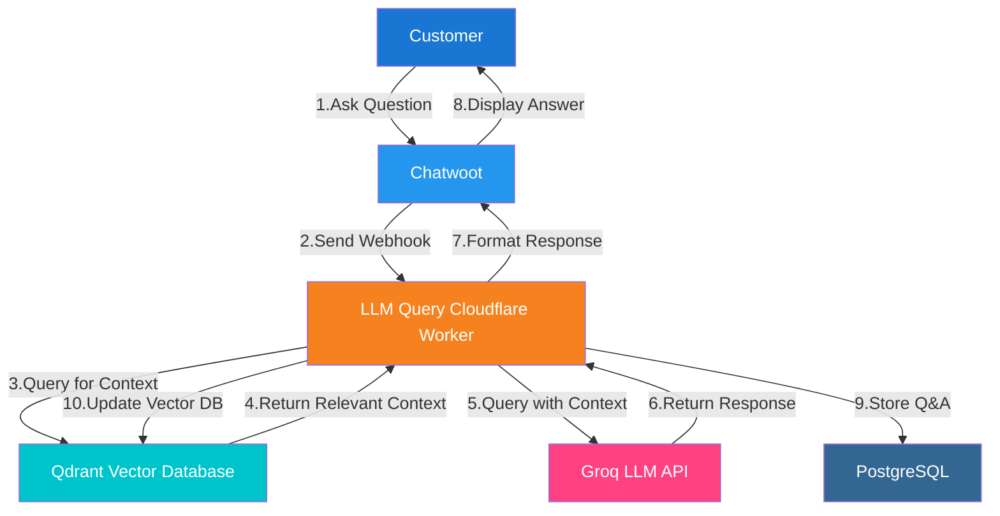
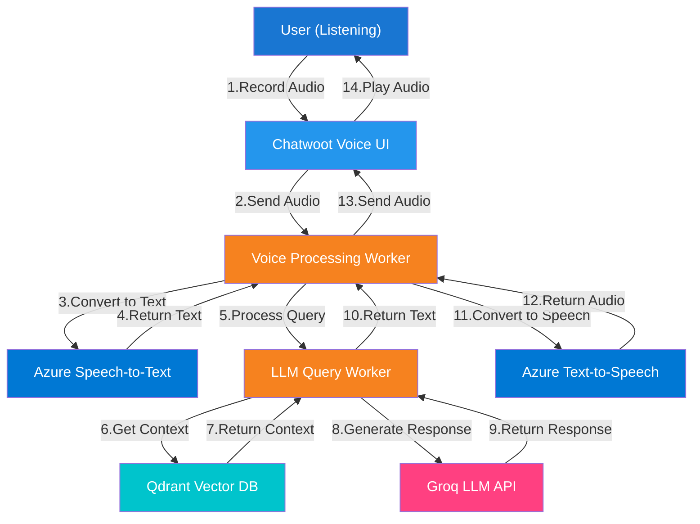
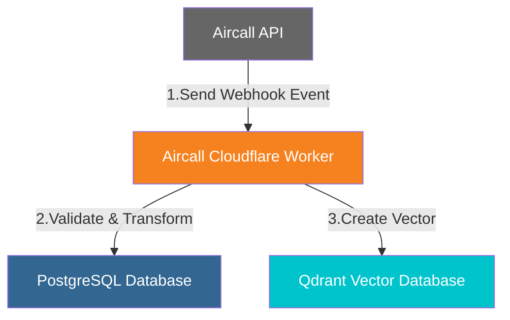
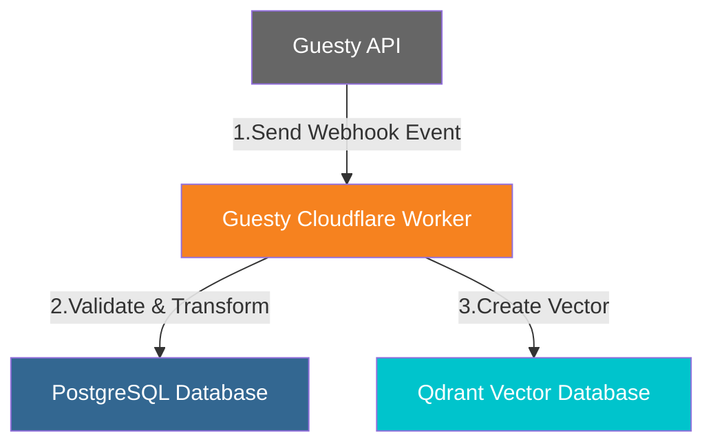

# Chatwoot Architecture Proposal

## Overview

Based on the evaluation of Chatwoot vs. RocketChat, this document proposes architectural changes to implement Chatwoot as the central communication platform for the BnB operation. The proposal includes changes to the system architecture, integration points, and implementation milestones.

## System Architecture

```mermaid
graph TD
    %% Arrange in a more balanced horizontal layout
    
    %% Top - Vercel and KV Store
    subgraph "Vercel"
        Vercel_SecretsUI["Secrets UI"]
    end
    
    %% KV Store moved near Vercel at the top
    subgraph "Cloudflare"
        CF_KV["KV Store"]
        CF_DNS["DNS"]
        CF_R2["R2 Storage"]
        CF_Workers["Workers"]
        CF_AircallWorker["Aircall Webhook Worker"]
        CF_GuestyWorker["Guesty Webhook Worker"]
        CF_LLMWorker["LLM Query Worker"]
        CF_VoiceWorker["Voice Processing Worker"]
    end
    
    %% Left side - External Services
    subgraph "External Services"
        Aircall["Aircall API"]
        Guesty["Guesty API"]
    end
    
    %% Center - Hetzner Cloud with Firewall wrapper
    subgraph "Hetzner Cloud"
        %% Wrap the entire network in a Firewall subgraph
        subgraph "HZ_Firewall_Zone" [Firewall]
            subgraph "HZ_Network"
                subgraph "Docker Swarm Cluster"
                    DS_Node1["Node 1<br/>Manager + Worker"]
                    DS_Node2["Node 2<br/>Manager + Worker"]
                    DS_Node3["Node 3<br/>Manager + Worker"]
                    
                    subgraph "Core Services"
                        Core_Traefik["Traefik"]
                        Core_SeaweedFS["SeaweedFS"]
                        Core_Netdata["Netdata"]
                    end
                    
                    subgraph "Applications"
                        subgraph "Chatwoot"
                            App_Chatwoot["Chatwoot"]
                            App_PostgreSQL["PostgreSQL"]
                            App_Redis["Redis"]
                        end
                        App_Keycloak["Keycloak"]
                    end
                end
                
                HZ_BackupSnapshot["Backup Server Snapshot"]
            end
        end
    end
    
    %% Right side - AI Services
    subgraph "AI Services"
        subgraph "Qdrant Cloud"
            Qdrant["Vector DB"]
        end
        
        subgraph "Groq Cloud"
            Groq["Deepseek-Qwen-32b Inference"]
        end
        
        subgraph "Azure"
            Azure_Speech["Speech Services"]
        end
    end

    %% Network connections (solid lines)
    CF_DNS -->|"DNS Resolution"| HZ_Firewall_Zone
    CF_Workers -->|"API Requests"| HZ_Firewall_Zone
    Core_Traefik -->|"Ingress"| HZ_Firewall_Zone
    
    %% Swarm node connections (dashed lines)
    DS_Node1 -.->|"Swarm Traffic"| DS_Node2
    DS_Node2 -.->|"Swarm Traffic"| DS_Node3
    DS_Node3 -.->|"Swarm Traffic"| DS_Node1
    DS_Node2 -.->|"Swarm Traffic"| DS_Node1
    DS_Node3 -.->|"Swarm Traffic"| DS_Node2
    DS_Node1 -.->|"Swarm Traffic"| DS_Node3
    
    DS_Node1 -.->|"Network"| HZ_Network
    DS_Node2 -.->|"Network"| HZ_Network
    DS_Node3 -.->|"Network"| HZ_Network
    HZ_Network -.->|"Network"| DS_Node1
    HZ_Network -.->|"Network"| DS_Node2
    HZ_Network -.->|"Network"| DS_Node3
    
    %% Storage connections (dotted lines)
    Core_SeaweedFS -.->|"Storage"| App_Chatwoot
    App_Chatwoot -.->|"Storage"| Core_SeaweedFS
    Core_SeaweedFS -.->|"Storage"| App_PostgreSQL
    App_PostgreSQL -.->|"Storage"| Core_SeaweedFS
    Core_SeaweedFS -.->|"Storage"| App_Keycloak
    App_Keycloak -.->|"Storage"| Core_SeaweedFS
    
    %% Backup connections
    HZ_BackupSnapshot -->|"Store"| CF_R2
    
    %% External API connections (colored differently)
    Aircall -->|"Webhook"| CF_AircallWorker
    Guesty -->|"Webhook"| CF_GuestyWorker
    
    %% Data flow connections
    CF_AircallWorker -->|"Store"| App_PostgreSQL
    CF_GuestyWorker -->|"Store"| App_PostgreSQL
    
    %% LLM flow connections
    App_Chatwoot -->|"Query"| CF_LLMWorker
    CF_LLMWorker -.->|"Search"| Qdrant
    CF_LLMWorker -.->|"Generate"| Groq
    CF_LLMWorker -->|"Response"| App_Chatwoot
    
    %% Voice flow connections
    App_Chatwoot -->|"Voice"| CF_VoiceWorker
    CF_VoiceWorker -.->|"STT/TTS"| Azure_Speech
    CF_VoiceWorker -.->|"Query"| CF_LLMWorker
    CF_VoiceWorker -->|"Audio"| App_Chatwoot
    
    %% Added direct upsert from LLM Worker to Qdrant
    CF_LLMWorker -.->|"Upsert"| Qdrant
    
    %% Vercel connection to KV Store
    Vercel_SecretsUI -->|"Manage Secrets"| CF_KV
    CF_KV -->|"Access"| Vercel_SecretsUI
    
    classDef cloudflare fill:#F6821F,color:white;
    classDef hetzner fill:#D50C2D,color:white;
    classDef firewall fill:#D50C2D,color:white,stroke-width:4px;
    classDef vercel fill:#000000,color:white;
    classDef external fill:#666666,color:white;
    classDef qdrant fill:#656666,color:white;
    classDef groq fill:#666366,color:white;
    classDef azure fill:#0078D4,color:white;
    classDef swarm fill:#2496ED,color:white;
    classDef core fill:#2496ED,color:white,stroke-dasharray: 5 5;
    classDef apps fill:#2496ED,color:white,stroke-dasharray: 5 5;
    classDef network fill:#009688,color:white;
    
    %% Apply styles to nodes
    class CF_DNS,CF_R2,CF_KV,CF_Workers,CF_AircallWorker,CF_GuestyWorker,CF_LLMWorker,CF_VoiceWorker cloudflare;
    class DS_Node1,DS_Node2,DS_Node3,HZ_BackupSnapshot hetzner;
    class HZ_Firewall_Zone firewall;
    class Core_SeaweedFS,Core_Traefik,Core_Netdata core;
    class App_Chatwoot,App_PostgreSQL,App_Redis,App_Keycloak apps;
    class Vercel_SecretsUI vercel;
    class Qdrant qdrant;
    class Groq groq;
    class Azure_Speech azure;
    class Aircall,Guesty external;
    class HZ_Network network;
```



## Core Components Changes

The key architectural changes include:

1. **Replace RocketChat with Chatwoot**: Chatwoot becomes the central communication platform for both internal and external communication
2. **Replace MongoDB with PostgreSQL**: Chatwoot requires PostgreSQL as its database
3. **Add Redis**: Required for Chatwoot caching and background jobs
4. **Add Voice Processing**: Integrate Azure Speech Services for voice capabilities
5. **Update Cloudflare Workers**: Modify workers to interact with Chatwoot API and PostgreSQL directly

### Docker Swarm Applications Changes

Current:
```
Located in `/opt/apps/<n>`:
- **RocketChat**: Team communication platform
- **MongoDB**: Database for RocketChat
- **Keycloak**: Identity and access management
```

Proposed:
```
Located in `/opt/apps/<n>`:
- **Chatwoot**: Unified communication platform
- **PostgreSQL**: Database for Chatwoot and operational data
- **Redis**: Required for Chatwoot caching and background jobs
- **Keycloak**: Identity and access management (integrated with Chatwoot)
```

### Cloudflare Workers Changes

Current:
- **Aircall Webhook Worker**: Processes Aircall events and stores in Firestore
- **Guesty Webhook Worker**: Processes Guesty events and stores in Firestore
- **LLM Query Worker**: Processes RocketChat queries, retrieves context from Qdrant, and generates responses via Groq

Proposed:
- **Aircall Webhook Worker**: Processes Aircall events and stores directly in PostgreSQL
- **Guesty Webhook Worker**: Processes Guesty events and stores directly in PostgreSQL
- **LLM Query Worker**: Processes Chatwoot queries, retrieves context from Qdrant, and generates responses via Groq
- **Voice Processing Worker**: New worker to handle voice input/output using Azure Speech Services

## Data Flow Changes

### Customer Inquiry Flow



### Voice Interaction Flow (New)



### Team Communication Flow

Current:
```
Team Member → RocketChat Channel → Team Members
```

Proposed:
```
Team Member → Chatwoot Team Inbox → Team Members
```

## Detailed Integration Changes

### Aircall Integration



### Guesty Integration



## Implementation Considerations

### Database Migration and Consolidation

1. **PostgreSQL Setup**: 
   - Deploy PostgreSQL in Docker Swarm cluster
   - Configure for high availability with proper replication
   - Set up backup procedures using the existing serverless backup approach

2. **Data Consolidation**: 
   - Migrate data from both MongoDB (RocketChat) and Firestore to PostgreSQL
   - Develop scripts to transform and normalize data during migration
   - Ensure all historical data is preserved with proper relationships

3. **Schema Design**:
   - Design PostgreSQL schema to accommodate both Chatwoot data and operational data previously in Firestore
   - Implement proper indexing for performance
   - Set up data partitioning for large tables

### Cloudflare Workers Adaptation

1. **Webhook Workers Update**:
   - Modify Aircall and Guesty webhook workers to store data directly in PostgreSQL instead of Firestore
   - Update data transformation logic to match PostgreSQL schema
   - Implement proper error handling and retry mechanisms

2. **LLM Query Worker Update**:
   - Adapt to work with Chatwoot's API instead of RocketChat
   - Update context retrieval to work with the new data structure
   - Modify response formatting for Chatwoot

3. **Voice Processing Worker**:
   - Develop new worker to handle voice processing
   - Implement integration with Azure Speech Services
   - Create secure audio file handling with proper encryption

### Authentication Integration

1. **Keycloak Integration**: 
   - Integrate Chatwoot with Keycloak for SSO
   - Configure user provisioning and role mapping
   - Ensure secure token handling

2. **API Authentication**: 
   - Set up secure API access for Cloudflare Workers
   - Implement proper token management
   - Configure rate limiting and security measures

## Deployment Strategy

1. **Infrastructure Preparation**:
   - Set up PostgreSQL infrastructure in Docker Swarm
   - Configure Redis for Chatwoot
   - Prepare backup and monitoring systems

2. **Parallel Deployment**:
   - Deploy Chatwoot alongside existing RocketChat
   - Configure initial settings and test basic functionality
   - Validate integration points without affecting production

3. **Data Migration**:
   - Develop and test migration scripts
   - Perform initial data migration to PostgreSQL
   - Validate data integrity and relationships

4. **Worker Adaptation**:
   - Update Cloudflare Workers one by one
   - Test each worker with the new data structure
   - Implement dual-write capability during transition

5. **Cutover Planning**:
   - Develop detailed cutover plan with rollback procedures
   - Schedule maintenance window for final transition
   - Prepare team training and support materials

6. **Final Cutover**:
   - Perform final data synchronization
   - Switch all traffic to Chatwoot
   - Decommission RocketChat and Firestore dependencies

## Security Considerations

1. **Data Protection**:
   - Implement proper encryption for data at rest in PostgreSQL
   - Ensure secure data transmission between components
   - Set up proper access controls and audit logging

2. **API Security**:
   - Implement secure API access with proper authentication
   - Set up rate limiting to prevent abuse
   - Configure proper CORS settings for web interfaces

3. **Voice Data Handling**:
   - Implement secure storage and transmission of voice data
   - Ensure compliance with relevant privacy regulations
   - Set up proper retention policies for voice recordings

4. **Backup Security**:
   - Adapt the existing serverless backup approach for PostgreSQL
   - Ensure proper encryption of backup data
   - Implement secure access controls for backup storage

## Cost Implications

1. **Infrastructure Changes**:
   - Reduced costs from eliminating Firestore dependency
   - Similar infrastructure requirements for PostgreSQL compared to MongoDB
   - Additional Redis requirements for Chatwoot

2. **Voice Processing Costs**:
   - New costs for Azure Speech Services (estimated at $130-$140/month based on projected usage)
   - Potential for cost optimization through caching and compression

3. **Operational Costs**:
   - Potential reduction in overall cloud service costs
   - Simplified architecture may reduce maintenance overhead
   - Consolidated database may improve resource utilization

## Monitoring and Observability

1. **Database Monitoring**:
   - Set up PostgreSQL-specific monitoring in Netdata
   - Configure alerts for database performance issues
   - Implement query performance tracking

2. **Application Monitoring**:
   - Configure Chatwoot-specific health checks
   - Set up monitoring for Redis and background jobs
   - Implement user experience tracking

3. **Worker Monitoring**:
   - Adapt Cloudflare Worker analytics for the new data flow
   - Set up error tracking and alerting
   - Implement performance monitoring for voice processing

4. **Integration Health**:
   - Monitor integration points with external systems
   - Set up alerts for synchronization issues
   - Implement data consistency checks

## Implementation Considerations

### Database Migration and Consolidation

1. **PostgreSQL Setup**: 
   - Deploy PostgreSQL in Docker Swarm cluster
   - Configure for high availability with proper replication
   - Set up backup procedures using the existing serverless backup approach

2. **Data Consolidation**: 
   - Migrate data from both MongoDB (RocketChat) and Firestore to PostgreSQL
   - Develop scripts to transform and normalize data during migration
   - Ensure all historical data is preserved with proper relationships

3. **Schema Design**:
   - Design PostgreSQL schema to accommodate both Chatwoot data and operational data previously in Firestore
   - Implement proper indexing for performance
   - Set up data partitioning for large tables

### Cloudflare Workers Adaptation

1. **Webhook Workers Update**:
   - Modify Aircall and Guesty webhook workers to store data directly in PostgreSQL instead of Firestore
   - Update data transformation logic to match PostgreSQL schema
   - Implement proper error handling and retry mechanisms

2. **LLM Query Worker Update**:
   - Adapt to work with Chatwoot's API instead of RocketChat
   - Update context retrieval to work with the new data structure
   - Modify response formatting for Chatwoot

3. **Voice Processing Worker**:
   - Develop new worker to handle voice processing
   - Implement integration with Azure Speech Services
   - Create secure audio file handling with proper encryption

### Vectorize Function Adaptation

1. **Data Source Change**:
   - Modify to extract data directly from PostgreSQL instead of Firestore
   - Update data processing logic to handle the new schema
   - Implement efficient change detection mechanism

2. **Vector Database Updates**:
   - Ensure vector embeddings maintain consistency during transition
   - Update metadata structure to reflect new data sources
   - Implement proper error handling for the transition period

### Authentication Integration

1. **Keycloak Integration**: 
   - Integrate Chatwoot with Keycloak for SSO
   - Configure user provisioning and role mapping
   - Ensure secure token handling

2. **API Authentication**: 
   - Set up secure API access for Cloudflare Workers
   - Implement proper token management
   - Configure rate limiting and security measures

### Sync App Enhancements

1. **Data Flow Redesign**:
   - Update Sync App to work with PostgreSQL instead of Firestore
   - Modify synchronization logic for the new data structure
   - Implement efficient change detection and propagation

2. **Integration Enhancements**:
   - Improve Guesty and Aircall integrations
   - Add support for additional data sources
   - Implement better error handling and recovery

## Deployment Strategy

1. **Infrastructure Preparation**:
   - Set up PostgreSQL infrastructure in Docker Swarm
   - Configure Redis for Chatwoot
   - Prepare backup and monitoring systems

2. **Parallel Deployment**:
   - Deploy Chatwoot alongside existing RocketChat and Firestore
   - Configure initial settings and test basic functionality
   - Validate integration points without affecting production

3. **Data Migration**:
   - Develop and test migration scripts
   - Perform initial data migration to PostgreSQL
   - Validate data integrity and relationships

4. **Worker Adaptation**:
   - Update Cloudflare Workers one by one
   - Test each worker with the new data structure
   - Implement dual-write capability during transition

5. **Cutover Planning**:
   - Develop detailed cutover plan with rollback procedures
   - Schedule maintenance window for final transition
   - Prepare team training and support materials

6. **Final Cutover**:
   - Perform final data synchronization
   - Switch all traffic to Chatwoot
   - Decommission RocketChat and Firestore dependencies

## Security Considerations

1. **Data Protection**:
   - Implement proper encryption for data at rest in PostgreSQL
   - Ensure secure data transmission between components
   - Set up proper access controls and audit logging

2. **API Security**:
   - Implement secure API access with proper authentication
   - Set up rate limiting to prevent abuse
   - Configure proper CORS settings for web interfaces

3. **Voice Data Handling**:
   - Implement secure storage and transmission of voice data
   - Ensure compliance with relevant privacy regulations
   - Set up proper retention policies for voice recordings

4. **Backup Security**:
   - Adapt the existing serverless backup approach for PostgreSQL
   - Ensure proper encryption of backup data
   - Implement secure access controls for backup storage

## Cost Implications

1. **Infrastructure Changes**:
   - Reduced costs from eliminating Firestore dependency
   - Similar infrastructure requirements for PostgreSQL compared to MongoDB
   - Additional Redis requirements for Chatwoot

2. **Voice Processing Costs**:
   - New costs for Azure Speech Services (estimated at $130-$140/month based on projected usage)
   - Potential for cost optimization through caching and compression

3. **Operational Costs**:
   - Potential reduction in overall cloud service costs
   - Simplified architecture may reduce maintenance overhead
   - Consolidated database may improve resource utilization

## Monitoring and Observability

1. **Database Monitoring**:
   - Set up PostgreSQL-specific monitoring in Netdata
   - Configure alerts for database performance issues
   - Implement query performance tracking

2. **Application Monitoring**:
   - Configure Chatwoot-specific health checks
   - Set up monitoring for Redis and background jobs
   - Implement user experience tracking

3. **Worker Monitoring**:
   - Adapt Cloudflare Worker analytics for the new data flow
   - Set up error tracking and alerting
   - Implement performance monitoring for voice processing

4. **Integration Health**:
   - Monitor integration points with external systems
   - Set up alerts for synchronization issues
   - Implement data consistency checks