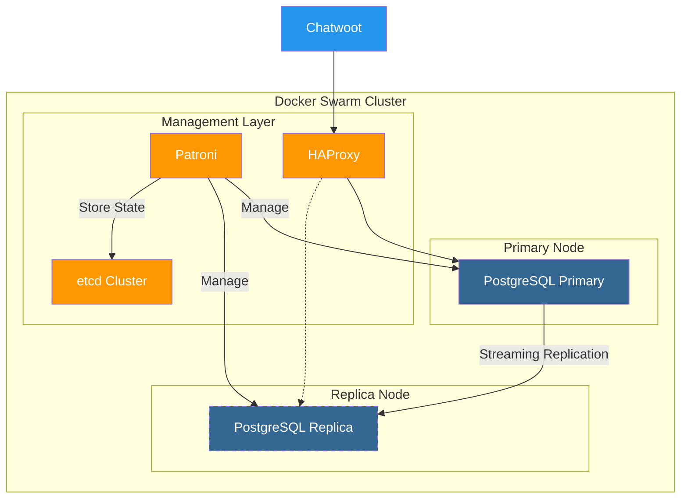
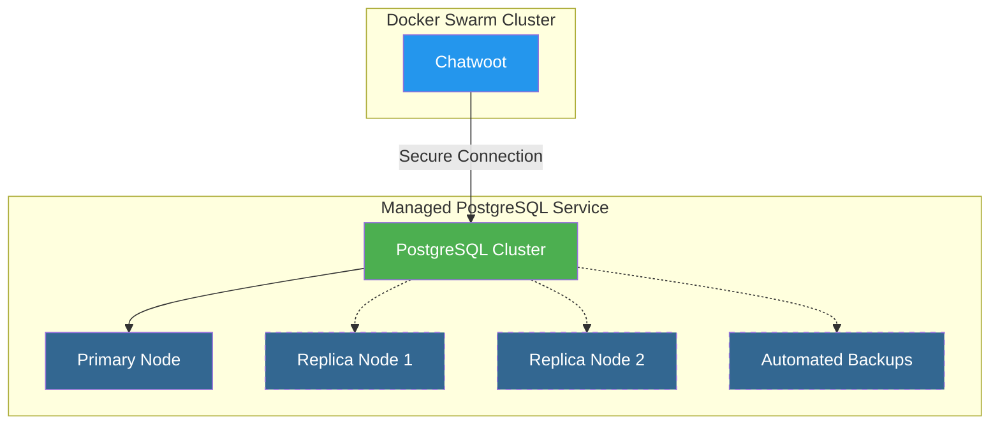
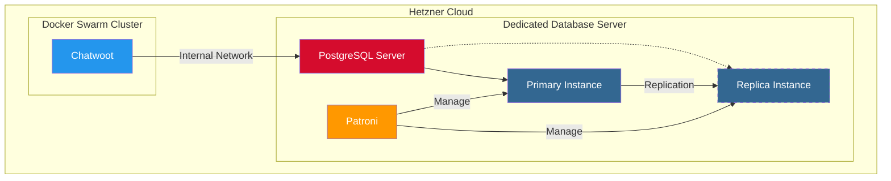
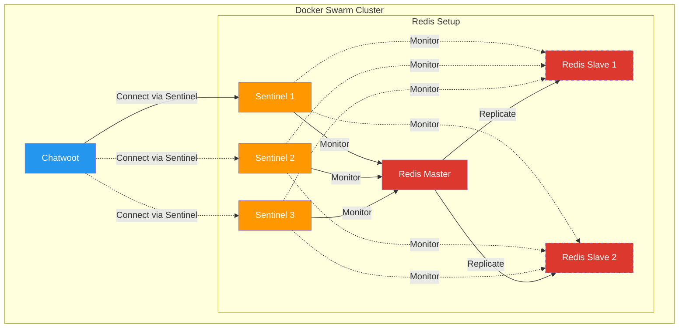
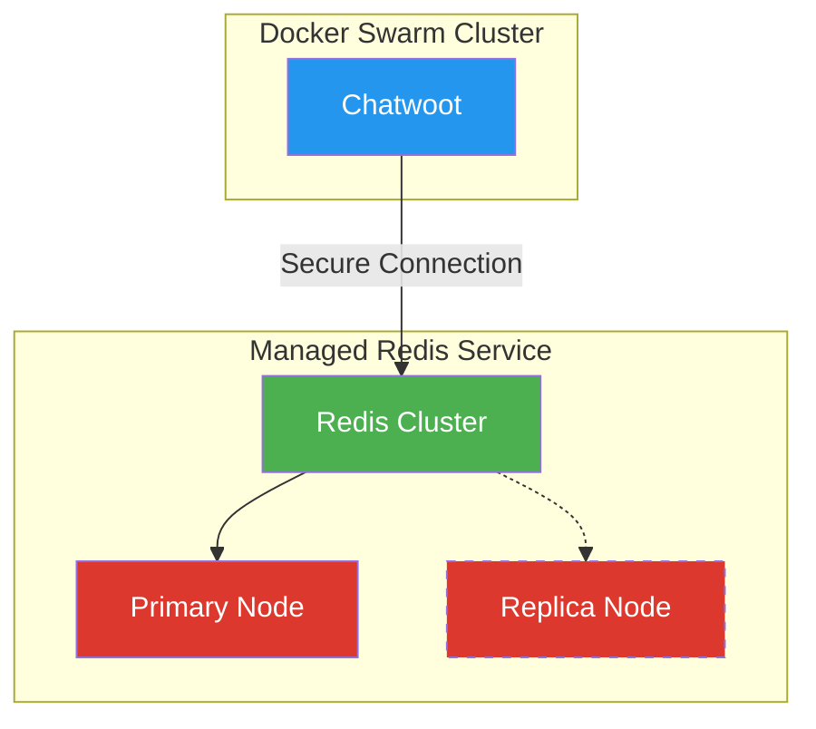

# PostgreSQL and Redis High Availability Options

## PostgreSQL High Availability Considerations

PostgreSQL does not provide built-in clustering or automatic failover capabilities out of the box. Implementing high availability for PostgreSQL requires additional tools and configuration. Here are the main options for PostgreSQL HA in our architecture:

### Option 1: Self-Managed PostgreSQL with Replication

#### Architecture

#### Components
- **PostgreSQL Primary**: Main database server handling writes
- **PostgreSQL Replica**: Read-only replica for failover
- **Patroni**: Manages PostgreSQL high availability
- **etcd**: Distributed key-value store for cluster state
- **HAProxy**: Load balancer for connection routing

#### Implementation Effort
- **Setup Time**: 3-5 days
- **Complexity**: High
- **Maintenance**: Moderate to high
- **Skills Required**: Advanced PostgreSQL administration, Docker Swarm networking

#### Pros
- Complete control over the database environment
- No additional external service costs
- Can leverage existing Docker Swarm infrastructure
- Data remains within your infrastructure

#### Cons
- Complex setup and maintenance
- Requires significant expertise to implement correctly
- Additional components to monitor and maintain
- Potential for split-brain scenarios if not configured properly

#### Estimated Costs
- **Infrastructure**: Additional Docker Swarm resources (~$20-40/month)
- **Development**: 3-5 days of implementation time
- **Maintenance**: 4-8 hours per month for monitoring and updates

### Option 2: External Managed PostgreSQL Service

#### Architecture

#### Potential Providers
1. **Hetzner Managed PostgreSQL**
   - Cost: Starting at €10/month (2GB RAM, 10GB storage)
   - Scaling: Up to 32GB RAM, 400GB storage
   - Features: Automated backups, high availability, monitoring

2. **DigitalOcean Managed PostgreSQL**
   - Cost: Starting at $15/month (1GB RAM, 10GB storage)
   - Scaling: Up to 64GB RAM, 4TB storage
   - Features: Automated backups, standby nodes, monitoring

3. **Aiven for PostgreSQL**
   - Cost: Starting at $19/month (1GB RAM, 5GB storage)
   - Scaling: Up to 64GB RAM, 2TB storage
   - Features: Multi-cloud deployment, advanced monitoring, automated backups

#### Implementation Effort
- **Setup Time**: 1-2 days
- **Complexity**: Low
- **Maintenance**: Minimal
- **Skills Required**: Basic database configuration, secure networking

#### Pros
- Significantly reduced implementation time
- Built-in high availability and failover
- Automated backups and point-in-time recovery
- Professional monitoring and support
- Reduced operational burden

#### Cons
- Monthly service costs
- Data stored outside your infrastructure
- Potential network latency
- Less control over configuration options

#### Estimated Costs
- **Service**: €20-50/month (depending on size and provider)
- **Development**: 1-2 days of implementation time
- **Maintenance**: 1-2 hours per month for monitoring

### Option 3: Hybrid Approach with Managed PostgreSQL on Hetzner

#### Architecture

#### Implementation
- Dedicated Hetzner server(s) for PostgreSQL outside Docker Swarm
- Manual setup of PostgreSQL with replication
- Connected to Docker Swarm via private network
- Automated backup scripts to R2 Storage

#### Implementation Effort
- **Setup Time**: 2-3 days
- **Complexity**: Moderate
- **Maintenance**: Moderate
- **Skills Required**: PostgreSQL administration, Linux server management

#### Pros
- Better performance than containerized PostgreSQL
- More control than fully managed service
- Data remains within Hetzner infrastructure
- Simpler than containerized HA setup

#### Cons
- Additional server costs
- Manual setup and maintenance
- Less automated than managed services
- Requires server administration skills

#### Estimated Costs
- **Infrastructure**: Additional Hetzner server(s) (€20-40/month)
- **Development**: 2-3 days of implementation time
- **Maintenance**: 2-4 hours per month for monitoring and updates

## Redis High Availability Options

Redis offers more straightforward high availability options compared to PostgreSQL.

### Option 1: Redis Sentinel in Docker Swarm

#### Architecture

#### Implementation Effort
- **Setup Time**: 1-2 days
- **Complexity**: Moderate
- **Maintenance**: Low to moderate
- **Skills Required**: Redis configuration, Docker Swarm networking

#### Pros
- Automatic failover capabilities
- Relatively simple to set up compared to PostgreSQL HA
- Works well in containerized environments
- No additional external service costs

#### Cons
- Additional containers to manage
- Requires proper configuration for reliable operation
- Potential for split-brain scenarios if network issues occur

### Option 2: External Managed Redis Service

#### Architecture

#### Potential Providers
1. **Upstash**
   - Cost: Starting at $10/month (1GB data)
   - Features: Global replication, serverless-friendly

2. **Redis Labs**
   - Cost: Starting at $14/month (1GB data)
   - Features: Multi-AZ deployment, auto-scaling

3. **Aiven for Redis**
   - Cost: Starting at $19/month (1GB memory)
   - Features: Multi-cloud deployment, advanced monitoring

#### Implementation Effort
- **Setup Time**: 0.5-1 day
- **Complexity**: Low
- **Maintenance**: Minimal
- **Skills Required**: Basic Redis configuration

#### Pros
- Minimal setup and maintenance
- Built-in high availability
- Professional monitoring and support
- Reduced operational burden

#### Cons
- Monthly service costs
- Data stored outside your infrastructure
- Potential network latency

## Cost-Benefit Analysis

### PostgreSQL Options Comparison

| Factor | Self-Managed | Managed Service | Hybrid Approach |
|--------|--------------|----------------|-----------------|
| Initial Setup Cost | High (3-5 days) | Low (1-2 days) | Medium (2-3 days) |
| Monthly Cost | Low ($20-40) | Medium ($20-50) | Medium ($20-40) |
| Maintenance Effort | High | Very Low | Medium |
| Reliability | Medium-High | Very High | High |
| Performance | Medium-High | High | Very High |
| Control | Very High | Low | High |
| Data Sovereignty | High | Low-Medium | High |
| Scalability | Medium | High | Medium-High |

### Redis Options Comparison

| Factor | Self-Managed Sentinel | Managed Service |
|--------|----------------------|----------------|
| Initial Setup Cost | Medium (1-2 days) | Very Low (0.5-1 day) |
| Monthly Cost | Low ($0-10) | Low-Medium ($10-20) |
| Maintenance Effort | Medium | Very Low |
| Reliability | Medium-High | Very High |
| Performance | High | High |
| Control | High | Low |
| Data Sovereignty | High | Low-Medium |
| Scalability | Medium | High |

## Recommendations

### For PostgreSQL

**Recommendation: Start with Hetzner Managed PostgreSQL**

Rationale:
1. **Development Speed**: Significantly faster implementation (1-2 days vs. 3-5 days)
2. **Reliability**: Professional management reduces risk of data loss
3. **Cost-Effectiveness**: The monthly cost difference is offset by reduced development and maintenance time
4. **Focus**: Allows you to focus on core application development rather than database administration
5. **Future Flexibility**: Can migrate to self-managed later if needed

Estimated Cost:
- €20-30/month for a production-ready managed PostgreSQL instance
- 1-2 days of implementation time

### For Redis

**Recommendation: Self-Managed Redis Sentinel**

Rationale:
1. **Simplicity**: Redis Sentinel is relatively straightforward to set up
2. **Cost**: Lower ongoing costs compared to managed services
3. **Integration**: Better integration with Docker Swarm
4. **Requirements**: Redis for Chatwoot has lower HA requirements than PostgreSQL

Estimated Cost:
- Minimal additional infrastructure cost (uses existing Docker Swarm)
- 1-2 days of implementation time

### Alternative Approach

If development time is the most critical factor, using managed services for both PostgreSQL and Redis would reduce the initial implementation time by approximately 3-4 days, with an additional monthly cost of €30-50.

## Implementation Plan for Recommended Approach

### PostgreSQL (Hetzner Managed)

1. **Setup**:
   - Create Hetzner Managed PostgreSQL instance
   - Configure networking for secure access
   - Set up user accounts and permissions
   - Configure SSL connections

2. **Integration**:
   - Update Chatwoot configuration to connect to managed PostgreSQL
   - Configure connection pooling
   - Set up monitoring and alerts

3. **Backup Strategy**:
   - Leverage built-in backup features
   - Configure additional backup to R2 Storage for redundancy
   - Test restore procedures

### Redis (Self-Managed Sentinel)

1. **Setup**:
   - Deploy Redis master and slaves as Docker services
   - Configure Redis Sentinel for automatic failover
   - Set up persistence configuration

2. **Integration**:
   - Configure Chatwoot to connect via Sentinel
   - Set up proper connection handling with retry logic
   - Implement monitoring for Redis cluster health

3. **Testing**:
   - Simulate master failure scenarios
   - Verify automatic failover
   - Test application behavior during failover