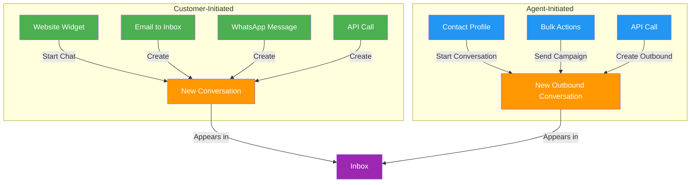
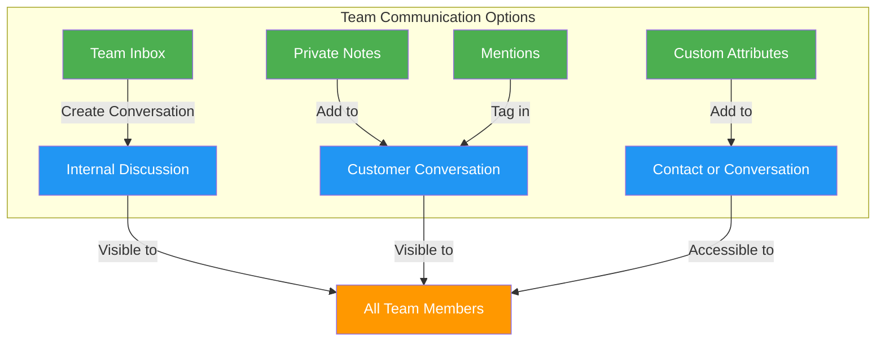

# Conversation Initiation in Chatwoot

## Overview

Chatwoot's conversation model differs significantly from RocketChat's channel-based approach. This document explains how conversations are initiated in Chatwoot and how to adapt team workflows accordingly.

## Conversation Types in Chatwoot

Chatwoot organizes communications into three primary types:

1. **Customer Conversations**: Communications between team members and customers
2. **Team Conversations**: Internal communications between team members
3. **Automated Conversations**: System-initiated communications based on triggers

## Initiating Conversations

### Customer Conversations

Customer conversations can be initiated in several ways:

#### Customer-Initiated Process:
1. Customer interacts with a communication channel (widget, email, etc.)
2. Chatwoot creates a new conversation in the appropriate inbox
3. Agents are notified of the new conversation
4. Agents respond through the inbox interface

#### Agent-Initiated Process:
1. Agent navigates to Contacts section
2. Agent selects a contact or creates a new one
3. Agent clicks "Start Conversation" and selects the channel
4. Agent sends the first message to initiate the conversation

### Team Conversations

For internal team communication, Chatwoot offers several approaches:

#### Team Inbox Approach:
1. Create a dedicated "Team" inbox (not connected to external channels)
2. Team members can create conversations within this inbox
3. These conversations function like internal discussions
4. All team members with access to the inbox can participate

#### Private Notes Approach:
1. Add private notes to customer conversations
2. These notes are only visible to team members, not customers
3. Useful for internal discussion about a specific customer issue

#### Mentions Approach:
1. Use @mentions within private notes or team conversations
2. Notifies specific team members about important information
3. Creates a more directed communication flow

## Implementation for BnB Team Communication

For the BnB operation, we recommend implementing:

### 1. Structured Team Inboxes

Create dedicated team inboxes for different operational areas:

- **General Team**: For company-wide announcements and discussions
- **Property Management**: For property-specific issues and coordination
- **Guest Experience**: For guest-related discussions
- **Maintenance**: For maintenance requests and tracking

### 2. Contact-Based Organization

Organize team communication around contacts and properties:

- Create contacts for each property
- Use custom attributes to store property details
- Initiate conversations about properties through their contact profiles
- Add private notes for internal discussion about properties

### 3. Conversation Initiation Workflow

Train team members on the new conversation initiation workflow:

1. **For customer communication**:
   - Respond to incoming conversations in customer inboxes
   - Initiate outbound conversations from contact profiles when needed

2. **For team communication**:
   - Use the appropriate team inbox to start a new conversation
   - Select relevant team members to include
   - Use a clear subject line or initial message to establish context
   - Use @mentions to draw attention to specific team members

3. **For property-related communication**:
   - Navigate to the property's contact profile
   - Start a conversation in the appropriate team inbox
   - Reference the property in the subject or initial message
   - Use custom attributes to maintain property context

## Comparison with RocketChat

| Feature | RocketChat | Chatwoot | Adaptation Strategy |
|---------|------------|----------|---------------------|
| Starting conversations | Create or join channels | Respond to inboxes or initiate from contacts | Use team inboxes and contact-based initiation |
| Team channels | Dedicated persistent channels | Team inboxes and private notes | Create structured team inboxes |
| Direct messages | 1:1 private messages | Private conversations in team inboxes | Use team inbox for 1:1 communication |
| Group discussions | Public/private channels | Multi-participant conversations | Create conversations and add participants |
| Persistent history | Channel history | Conversation history | Use proper labeling and organization |

## Custom Development Options

If the team requires more RocketChat-like functionality, consider these custom development options:

1. **Quick Conversation Button**:
   - Add a custom "New Conversation" button to the Chatwoot UI
   - Implement a modal for selecting participants and topic
   - Create the conversation via Chatwoot's API

2. **Team Channel Simulation**:
   - Create a custom sidebar component showing "channels"
   - Map these to filtered views of team inbox conversations
   - Provide one-click access to specific conversation types

3. **Conversation Templates**:
   - Develop templates for common conversation types
   - Allow quick creation of structured conversations
   - Include predefined participants and initial messages

## Training Recommendations

To help the team adapt to Chatwoot's conversation model:

1. **Initial Training**:
   - Provide hands-on training sessions for all team members
   - Focus on the new workflow for initiating conversations
   - Demonstrate the different approaches for team communication

2. **Reference Materials**:
   - Create quick reference guides for common tasks
   - Develop workflow diagrams for different communication scenarios
   - Provide FAQ documents addressing common questions

3. **Transition Period**:
   - Implement a phased approach to migration
   - Start with a pilot group to identify challenges
   - Gather feedback and adjust workflows as needed