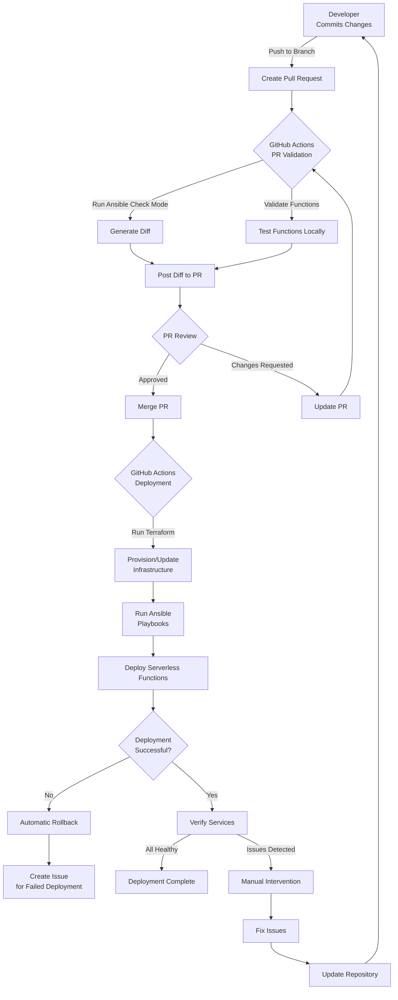
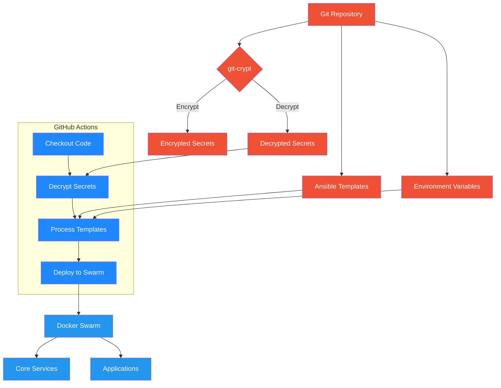
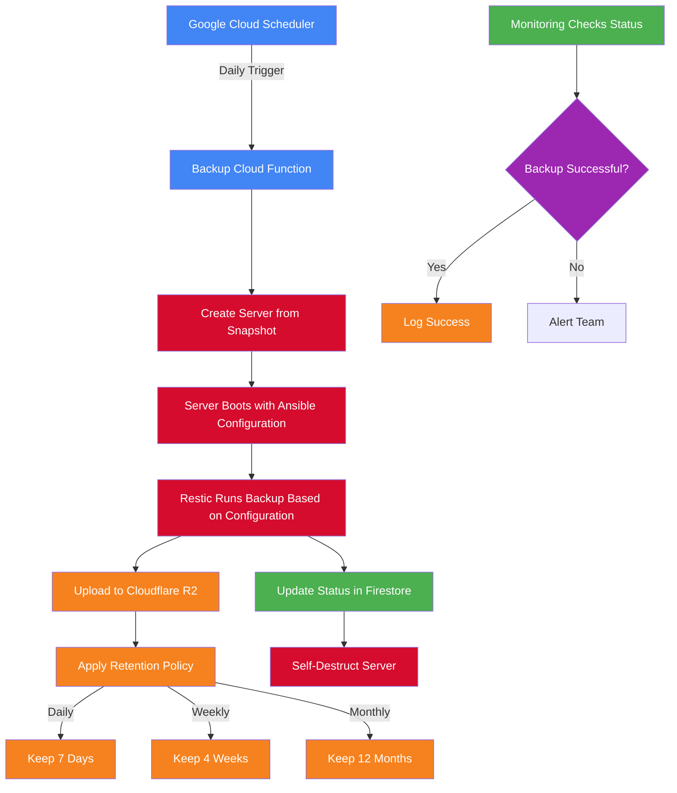
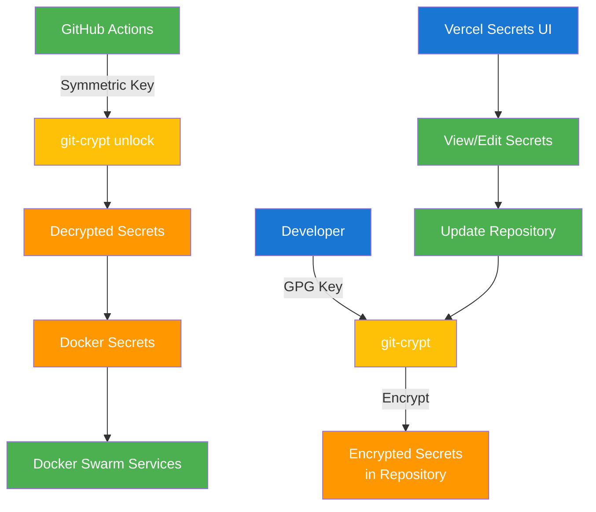
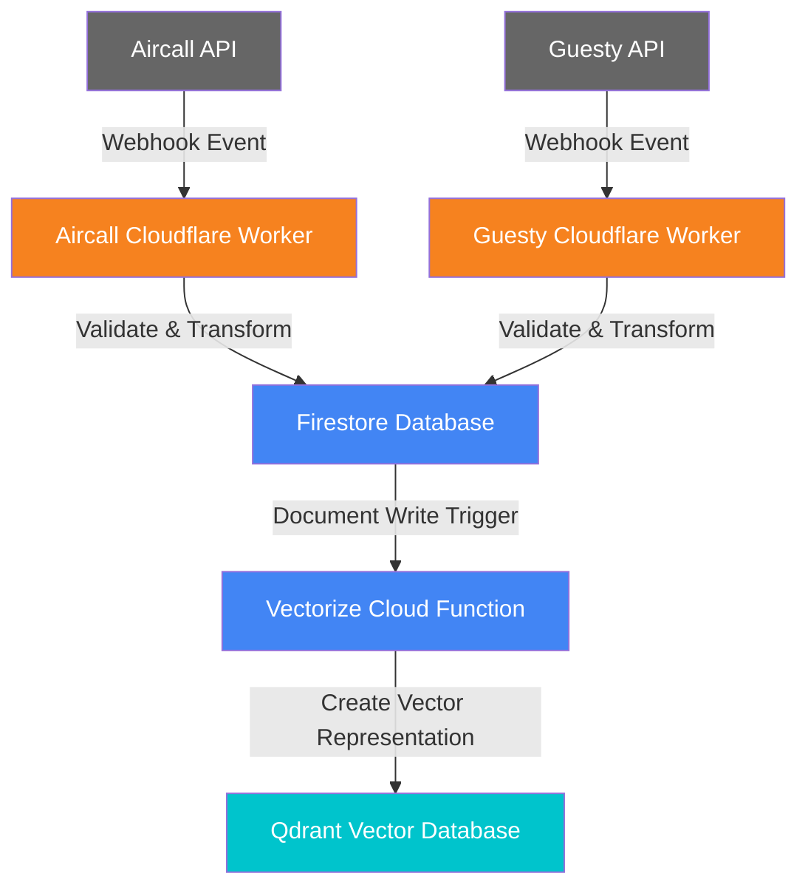
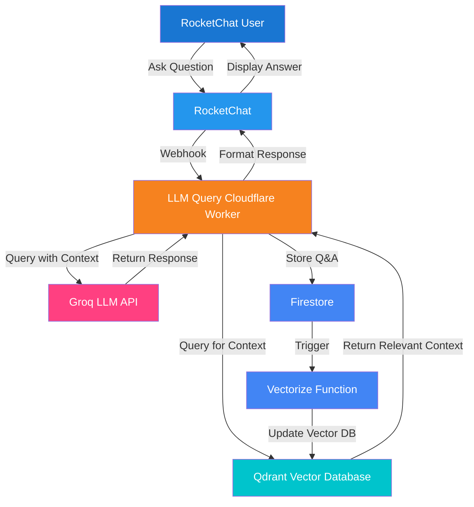

# Infrastructure Architecture and Process Flows

## System Architecture

```mermaid
graph TB
    subgraph "Cloudflare"
        CF_DNS["DNS"]
        CF_R2["R2 Storage"]
        CF_Workers["Workers"]
        CF_AircallWorker["Aircall Webhook Worker"]
        CF_GuestyWorker["Guesty Webhook Worker"]
        CF_LLMWorker["LLM Query Worker"]
    end

    subgraph "Hetzner Cloud"
        HZ_Firewall["Firewall"]
        
        subgraph "HZ_Network"
            subgraph "Docker Swarm Cluster"
                DS_Node1["Node 1\nManager + Worker"]
                DS_Node2["Node 2\nManager + Worker"]
                DS_Node3["Node 3\nManager + Worker"]
                
                subgraph "Core Services"
                    Core_SeaweedFS["SeaweedFS"]
                    Core_Traefik["Traefik"]
                    Core_Netdata["Netdata"]
                end
                
                subgraph "Applications"
                    subgraph "RocketChat"
                        App_RocketChat["RocketChat"]
                        App_MongoDB["MongoDB"]
                    end
                    App_Keycloak["Keycloak"]
                    App_Sync["Sync App"]
                end
            end
            
            HZ_BackupSnapshot["Backup Server Snapshot"]
        end
    end

    subgraph "GCP"
        GCP_Firestore["Firestore"]
        GCP_Functions["Cloud Functions"]
        GCP_CloudRun["Cloud Run"]
        GCP_Scheduler["Cloud Scheduler"]
        GCP_BackupFunction["Backup Function"]
        GCP_VectorizeFunction["Vectorize Function"]
        GCP_PubSub["Pub/Sub"]
    end

    subgraph "Vercel"
        Vercel_SecretsUI["Secrets UI"]
    end

    subgraph "External Services"
        Qdrant["Qdrant Cloud\nVector DB"]
        Groq["Groq Cloud\nInference"]
        Aircall["Aircall API"]
        Guesty["Guesty API"]
    end

    %% Connections
    CF_DNS --> HZ_Firewall
    CF_Workers --> HZ_Firewall
    
    DS_Node1 <--> DS_Node2
    DS_Node2 <--> DS_Node3
    DS_Node3 <--> DS_Node1
    
    DS_Node1 <--> HZ_Network
    DS_Node2 <--> HZ_Network
    DS_Node3 <--> HZ_Network
    
    Core_SeaweedFS <--> App_RocketChat
    Core_SeaweedFS <--> App_MongoDB
    Core_SeaweedFS <--> App_Keycloak
    Core_SeaweedFS <--> App_Sync
    
    Core_Traefik --> HZ_Firewall
    
    GCP_BackupFunction --> HZ_BackupSnapshot
    HZ_BackupSnapshot --> CF_R2
    
    GCP_Scheduler --> GCP_BackupFunction
    
    Aircall --> CF_AircallWorker
    Guesty --> CF_GuestyWorker
    
    CF_AircallWorker --> GCP_Firestore
    CF_GuestyWorker --> GCP_Firestore
    
    GCP_Firestore --> GCP_VectorizeFunction
    GCP_VectorizeFunction --> Qdrant
    
    App_RocketChat --> CF_LLMWorker
    CF_LLMWorker --> Qdrant
    CF_LLMWorker --> Groq
    CF_LLMWorker --> App_RocketChat
    
    App_RocketChat <--> GCP_Firestore
    App_Sync <--> GCP_Firestore
    
    App_Sync <--> Qdrant
    App_Sync <--> Groq
    
    Vercel_SecretsUI <--> CF_Workers
    
    classDef cloudflare fill:#F6821F,color:white;
    classDef hetzner fill:#D50C2D,color:white;
    classDef gcp fill:#4285F4,color:white;
    classDef vercel fill:#000000,color:white;
    classDef external fill:#666666,color:white;
    classDef swarm fill:#2496ED,color:white;
    classDef core fill:#2496ED,color:white,stroke-dasharray: 5 5;
    classDef apps fill:#2496ED,color:white,stroke-dasharray: 5 5;
    classDef network fill:#009688,color:white;
    
    class CF_DNS,CF_R2,CF_Workers,CF_AircallWorker,CF_GuestyWorker,CF_LLMWorker cloudflare;
    class DS_Node1,DS_Node2,DS_Node3,HZ_BackupSnapshot,HZ_Firewall hetzner;
    class Core_SeaweedFS,Core_Traefik,Core_Netdata core;
    class App_RocketChat,App_MongoDB,App_Keycloak,App_Sync apps;
    class GCP_Firestore,GCP_Functions,GCP_CloudRun,GCP_Scheduler,GCP_BackupFunction,GCP_VectorizeFunction,GCP_PubSub gcp;
    class Vercel_SecretsUI vercel;
    class Qdrant,Groq,Aircall,Guesty external;
    class HZ_Network network;
```

## Deployment Process Flow

## Configuration Management Flow

## Backup Process Flow

## Secrets Management Flow

## API Integration Flow

## LLM Query Process Flow

