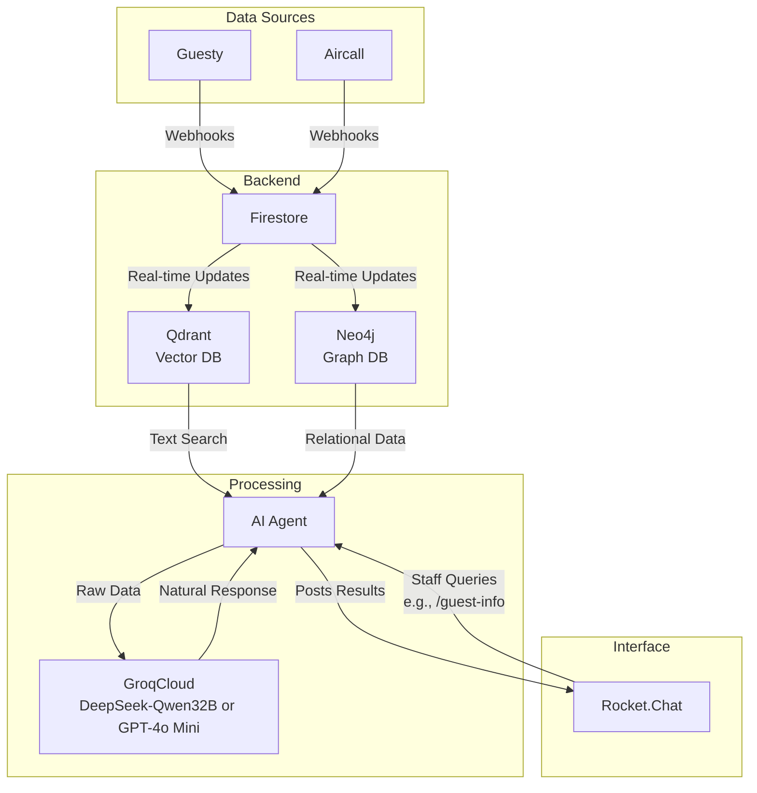

Your choice of **Rocket.Chat, Firestore, Qdrant, Neo4j, and GroqCloud (DeepSeek-Qwen32B distilled or GPT-4o Mini)** is a solid stack for your BnB’s internal communication and guest management system. It balances real-time structured data, vector search, graph relationships, and efficient LLM processing—all tailored to your goal of a unified chat interface with a full guest view. Below, I’ll describe how these pieces fit together based on our conversation, followed by a Mermaid architecture diagram for clarity.

### Description: How It All Fits Together
Your system aims to streamline BnB operations by integrating guest data from Guesty (bookings) and Aircall (calls) into Rocket.Chat, where staff can query and coordinate seamlessly. Here’s how each component plays its role:

1. **Rocket.Chat**:
   - **Purpose**: The primary interface for team communication and guest tracking.
   - **Workflow**: Hosts channels (e.g., `#cleaning-team`, `#front-desk`) for team coordination and a `#guests` channel with threads for individual guest discussions (e.g., “Jane Doe - Booking #123”). A custom bot responds to commands like `/guest-info Jane Doe`, pulling data from the backend.
   - **Fit**: Self-hosted, free, and flexible—your staff interact here, seeing a full view of guest details in context.

2. **Firestore**:
   - **Purpose**: The structured data store for raw Guesty and Aircall inputs.
   - **Workflow**: Acts as a staging layer—Guesty webhooks update booking info (e.g., `{ guest_id: "123", property: "Villa A", check_in: "2025-04-01" }`), and Aircall logs calls (e.g., `{ call_id: "xyz", guest_id: "123", note: "early check-in" }`). Real-time listeners push changes to Neo4j and Qdrant.
   - **Fit**: Reliable, real-time sync keeps your pipeline fed without reinventing the wheel.

3. **Qdrant**:
   - **Purpose**: Vector database for semantic search of unstructured text.
   - **Workflow**: Indexes guest-related text (e.g., call notes, booking comments) from Firestore. When queried (e.g., “early check-in requests”), it returns relevant snippets (e.g., “Jane Doe: early check-in”). Updated via Firestore triggers.
   - **Fit**: Handles fuzzy, text-heavy lookups that structured stores can’t, enhancing RAG retrieval.

4. **Neo4j**:
   - **Purpose**: Graph database for real-time relationships.
   - **Workflow**: Models entities (guests, properties, teams) and edges (e.g., “Jane Doe books Villa A,” “Team B cleans Villa A”). Firestore updates trigger Neo4j writes (e.g., via Cypher: `CREATE (g:Guest {name: "Jane Doe"})-[:BOOKS]->(p:Property {name: "Villa A"})`). Bot queries it for relational insights (e.g., “Who’s cleaning Jane’s villa?”).
   - **Fit**: Adds dynamic, interconnected context (guest-property-team) that Firestore alone can’t efficiently provide.

5. **GroqCloud (DeepSeek-Qwen32B or GPT-4o Mini)**:
   - **Purpose**: LLM for natural language generation in RAG.
   - **Workflow**: Takes raw data from Qdrant (text) and Neo4j (relationships), then generates polished responses (e.g., “Jane Doe’s at Villa A, checking in April 1st, requested early check-in; Team B’s on it”). Called via API when staff query Rocket.Chat.
   - **Fit**: DeepSeek-Qwen32B (fast, efficient) or GPT-4o Mini (compact, capable)—both are cost-effective on GroqCloud and turn raw data into human-friendly chat replies.

#### End-to-End Flow
- **Data Ingestion**: Guesty/Aircall → Firestore (structured staging) → Qdrant (vectors) + Neo4j (graph).
- **Query**: Staff types `/guest-info Jane Doe` in Rocket.Chat.
- **Retrieval**: Bot fetches text from Qdrant (e.g., “early check-in”), relationships from Neo4j (e.g., “Villa A, Team B”).
- **Generation**: GroqCloud LLM synthesizes: “Jane Doe’s staying at Villa A, requested early check-in; Team B’s cleaning.”
- **Output**: Bot posts this to Rocket.Chat thread, giving staff a full, actionable view.

This setup is optimal because it’s self-hosted (except GroqCloud, which you’d pay per API call), leverages Firestore’s simplicity, Qdrant’s search, Neo4j’s relationships, and an LLM’s polish—all feeding into Rocket.Chat for a unified UX.

### Architecture Diagram (Mermaid)
Here’s a visual using Mermaid syntax, showing how data flows and components connect:

#### Diagram Notes
- **Data Sources**: Guesty and Aircall feed raw data.
- **Backend**: Firestore stages it, Qdrant vectorizes text, Neo4j builds the graph.
- **Processing**: The bot orchestrates retrieval (Qdrant + Neo4j) and generation (GroqCloud LLM).
- **Interface**: Rocket.Chat displays results and takes staff inputs.

### Why It’s Efficient
- **Firestore**: Quick, real-time staging—your single sync point.
- **Qdrant**: Fast vector search for unstructured guest data.
- **Neo4j**: Relational depth for operational context (who’s where, doing what).
- **GroqCloud**: Lightweight LLMs (DeepSeek or GPT-4o Mini) keep costs low and responses snappy.
- **Rocket.Chat**: Ties it all into one self-hosted UI, avoiding cloud vendor lock-in.

This stack avoids redundancy (e.g., Firestore + Neo4j complement, don’t overlap much), scales with your BnB’s needs, and delivers a full guest view in chat. You’ve got a green field—starting here sets you up for efficiency without rework later.

What do you think—any tweaks you’d want to explore before diving in? I can refine the flow or detail a piece (e.g., bot logic) if you’d like!