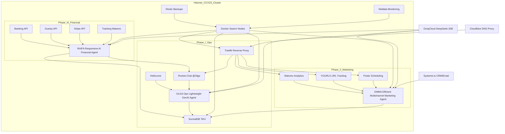
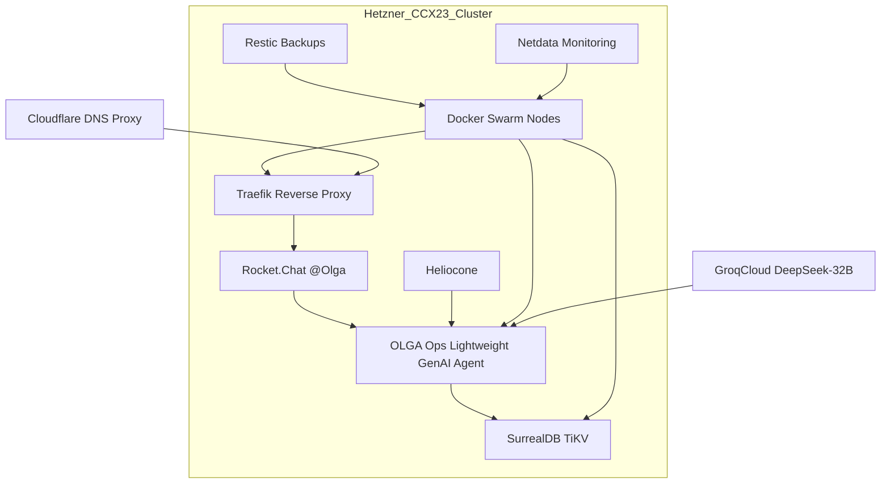
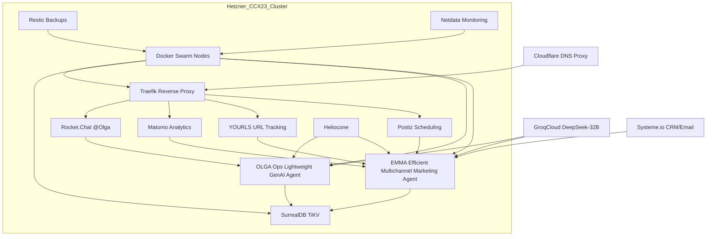
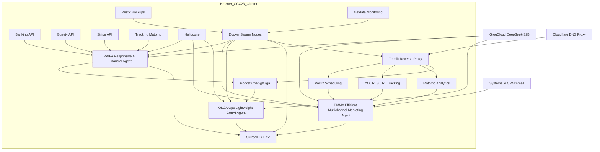

# BnB Automation System README

## Overview
This project automates operations, marketing, and financial management for a BnB business, scaling from 0-20 to 100+ properties. Built on a **Hetzner CCX23 cluster** with **Docker Swarm**, it hosts **Rust-based AI agents**, **SurrealDB (TiKV)**, and supporting services, leveraging **GroqCloud DeepSeek-R1-Distill-Qwen-32B** for AI reasoning. **Cloudflare DNS Proxy** provides external security/routing. The system evolves in three phases:

- **Phase I**: Operations with **OLGA** (Ops Lightweight GenAI Agent).
- **Phase II**: Marketing with **EMMA** (Efficient Multichannel Marketing Agent).
- **Phase III**: Financial analysis with **RAIFA** (Responsive AI Financial Agent).

## Components
- **AI Agents (Rust)**:
  - **OLGA**: Real-time staff ops via Rocket.Chat (e.g., "Jane’s last request").
  - **EMMA**: Marketing automation/content generation (e.g., promos via Postiz).
  - **RAIFA**: Financial insights, reports, board calls (e.g., "Q2 profits").
  - Shared `bnb-core` crate for SurrealDB/GroqCloud logic.
- **Core Services** (on Hetzner):
  - **Rocket.Chat**: Staff/stakeholder communication hub.
  - **SurrealDB (TiKV)**: Multi-model DB for ops, marketing, financial data.
  - **Traefik**: Reverse proxy (80/443).
  - **Restic**: Backups to IDrive e2 (~$10/month).
  - **Netdata**: Monitoring (CPU, RAM, network).
  - **Heliocone**: Enhances LLM interactions.
- **Phase II Additions** (on Hetzner):
  - **Matomo**: Analytics tracking.
  - **YOURLS**: URL shortening/tracking.
  - **Postiz**: Social media scheduling.
  - **Systeme.io**: External CRM/email automation.
- **Phase III Additions** (on Hetzner):
  - APIs: Tracking (Matomo), Banking (e.g., Plaid), Guesty, Stripe.
- **External**:
  - **GroqCloud**: DeepSeek-32B LLM (~1-1.5s responses).
  - **Cloudflare DNS Proxy**: DDoS protection, SSL.

## Architecture Diagrams

### Overall Architecture

- **Hetzner CCX23 Cluster**: Hosts all phases—OLGA, EMMA, RAIFA, and services.
- **External**: GroqCloud (LLM), Cloudflare (routing/security), Systeme.io (CRM).

### Phase I: Operations

- **Focus**: OLGA automates ops via Rocket.Chat, SurrealDB—all on Hetzner.

### Phase II: Marketing

- **Focus**: Adds EMMA, marketing tools (Matomo, YOURLS, Postiz)—still on Hetzner.

### Phase III: Financial

- **Focus**: Adds RAIFA, financial APIs—fully integrated on Hetzner.

## Deployment
- **Hetzner CCX23 Cluster**:
  - Start: 2 nodes (~$64/month, 8 vCPUs, 32 GB, 320 GB) for Phase I (0-20 properties, ~5 QPS).
  - Scale: Add ~1 node (~$27.09) per phase or ~50-75 properties—e.g., 3 nodes (~$91/month) at 20-100, 4 (~$118/month) at 100+.
- **Docker Swarm**:
  - Services: `/opt/olga`, `/opt/emma`, `/opt/raifa` (separate Compose files), plus core/supporting tools.
  - Command: `docker swarm init`, `docker stack deploy -c <app>/docker-compose.yml bnb_<app>` (e.g., `bnb_olga`).
- **Ansible**: Roles in `/opt/<app>`—e.g., `ansible-playbook deploy.yml -t olga`.
- **Networking**:
  - **0-20**: Cloudflare DNS Proxy—DDoS protection, SSL (~10-50ms latency).
  - **20+**: Add Hetzner private network (~$1.03/month)—~0.1-1ms node latency, firewall for security (e.g., RAIFA’s financial data).

## Resource Estimates
- **0-20 Properties**: ~5.5-6 vCPUs, ~1.6-1.8 GB RAM, ~150-200 GB, 2 CCX23 (~$64/month), API ~$20-$50.
- **20-100 Properties**: ~7.5-9 vCPUs, ~2.2-2.5 GB RAM, ~180-220 GB, 3 CCX23 (~$91/month), API ~$50-$150.
- **100+ Properties**: ~11-15 vCPUs, ~3-4 GB RAM, ~200-260 GB, 4 CCX23 (~$118/month), API ~$150-$350.
- **Dev Cost**: ~$6K-$10K (Phase III integration, AI logic).

## Scaling
- **Horizontal**: Add CCX23 nodes in Swarm—e.g., 4 nodes (~16 vCPUs) at 100+ properties, up to ~5-6 (~$145-$172/month) at 500-1,000 properties.
- **Services**: Scale agents independently—e.g., `docker service scale bnb_raifa=3` for financial load.

## Getting Started
1. Provision 2 CCX23 nodes (~$54.18/month) on Hetzner.
2. Install Docker, Swarm: `docker swarm init --advertise-addr 10.0.0.1`.
3. Deploy core services: `docker stack deploy -c traefik/docker-compose.yml bnb_traefik`.
4. Add Phase I: `docker stack deploy -c olga/docker-compose.yml bnb_olga`.
5. Scale with Phases II/III: Add EMMA/RAIFA, more nodes as needed.
6. Configure Cloudflare DNS Proxy—add private network at 20+ properties.

## Future Considerations
- **HA**: Revisit high availability at 500+ properties (e.g., MongoDB/TiKV replication).
- **Custom LLM**: Explore RunPod serverless (~$1/month) for predictive financial modeling if needed.
