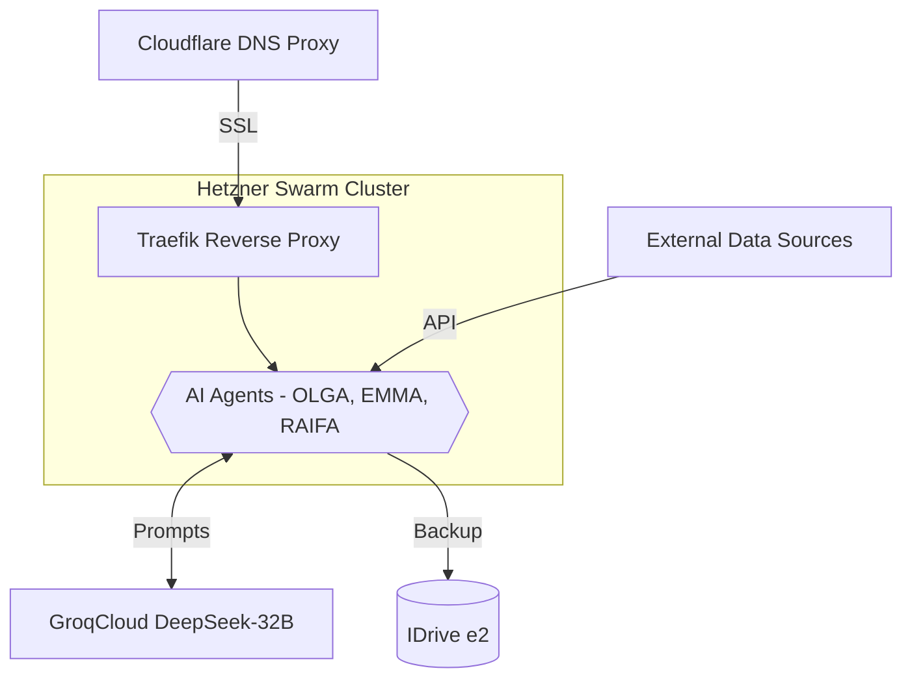
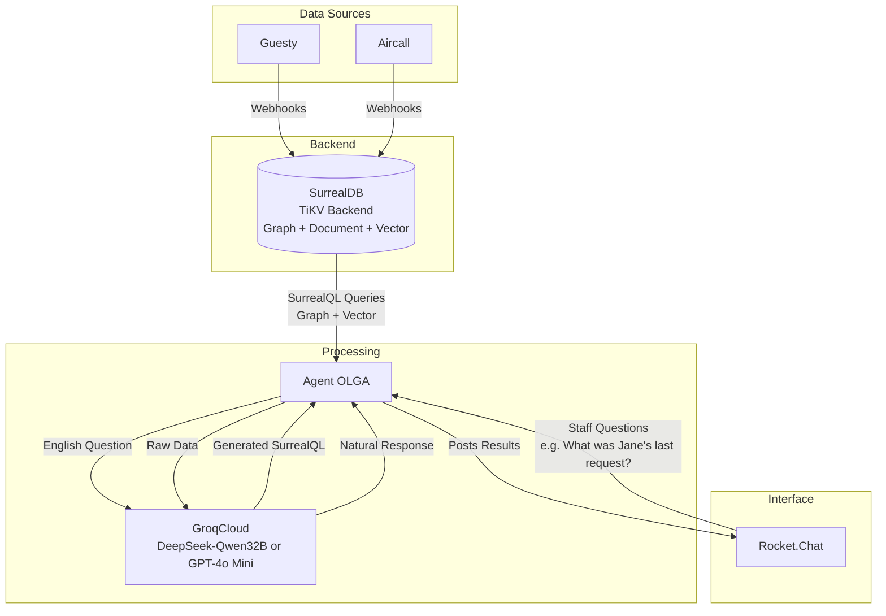
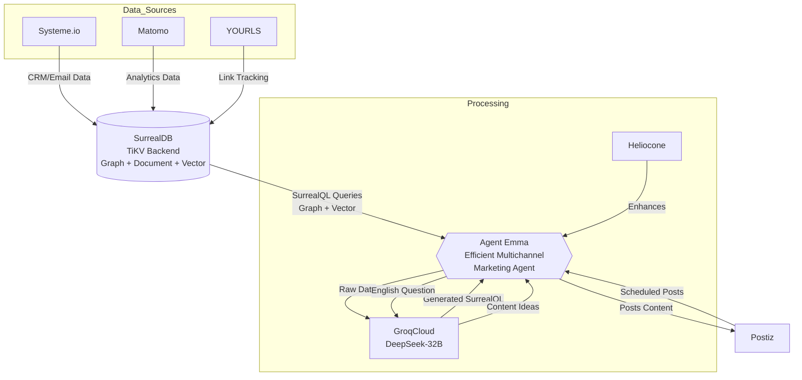
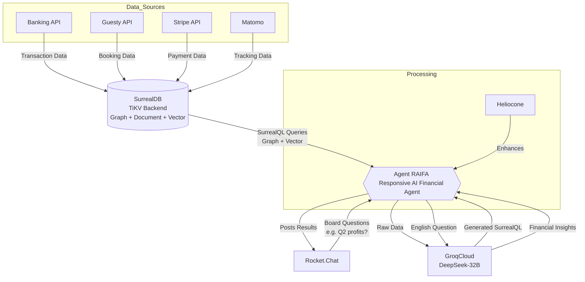

# BnB Automation System README

## Overview
This project automates operations, marketing, and financial management for a BnB business, scaling from 0-20 to 100+ properties. Built on a **Hetzner CCX23 cluster** with **Docker Swarm**, it hosts **Rust-based AI agents**, **SurrealDB (TiKV)**, and supporting services, leveraging **GroqCloud DeepSeek-R1-Distill-Qwen-32B** for AI reasoning. **Cloudflare DNS Proxy** provides external security/routing, and **IDrive e2** handles backups. The system evolves in three phases:

- **Phase I**: Operations with **OLGA** (Ops Lightweight GenAI Agent).
- **Phase II**: Marketing with **EMMA** (Efficient Multichannel Marketing Agent).
- **Phase III**: Financial analysis with **RAIFA** (Responsive AI Financial Agent).

## Components
- **AI Agents (Rust)**:
  - **OLGA**: Real-time staff ops via Rocket.Chat (e.g., "Jane’s last request").
  - **EMMA**: Marketing automation/content generation (e.g., promos via Postiz).
  - **RAIFA**: Financial insights, reports, board calls (e.g., "Q2 profits").
  - Shared `bnb-core` crate for SurrealDB/GroqCloud logic.
- **Core Services** (on Hetzner):
  - **Rocket.Chat**: Staff/stakeholder communication hub.
  - **SurrealDB (TiKV)**: Multi-model DB for ops, marketing, financial data.
  - **Traefik**: Reverse proxy (80/443).
  - **Restic**: Backups to IDrive e2 (~$10/month).
  - **Netdata**: Monitoring (CPU, RAM, network).
  - **Heliocone**: Enhances LLM interactions.
- **Phase II Additions** (on Hetzner):
  - **Matomo**: Analytics tracking.
  - **YOURLS**: URL shortening/tracking.
  - **Postiz**: Social media scheduling.
- **Phase III Additions** (on Hetzner):
  - None—relies on external APIs.
- **External**:
  - **GroqCloud**: DeepSeek-32B LLM (~1-1.5s responses).
  - **Cloudflare DNS Proxy**: DDoS protection, SSL.
  - **IDrive e2**: Cloud backup storage.
  - **Guesty**, **Aircall**: Phase I data sources.
  - **Systeme.io**: Phase II data source.
  - **Banking API**, **Guesty API**, **Stripe API**: Phase III data sources.

## Architecture Diagrams

### Overall Architecture

- **Simplified view**: Hetzner CCX23 Cluster (running Docker Swarm) hosts AI Agents (OLGA, EMMA, RAIFA), connecting to external GroqCloud, Systeme.io, and IDrive e2 via Traefik, routed through Cloudflare.

### Phase I: Operations

- **Focus**: OLGA processes operational data from external Guesty and Aircall via SurrealDB, answers staff questions through Rocket.Chat, enhanced by GroqCloud and Heliocone, with backups to IDrive e2.

### Phase II: Marketing

- **Focus**: EMMA generates marketing content using internal Matomo, YOURLS, and SurrealDB data, schedules via Postiz, integrates with external Systeme.io, enhanced by GroqCloud and Heliocone, with backups to IDrive e2.

### Phase III: Financial

- **Focus**: RAIFA analyzes financial data from external Banking, Guesty, Stripe APIs and internal Matomo via SurrealDB, answers board questions through Rocket.Chat, enhanced by GroqCloud and Heliocone, with backups to IDrive e2.

## Deployment
- **Hetzner CCX23 Cluster**:
  - Scales horizontally with Docker Swarm based on property count and phase needs.
  - Services: `/opt/olga`, `/opt/emma`, `/opt/raifa` (separate Compose files), plus core/supporting tools.
  - Command: `docker swarm init`, `docker stack deploy -c <app>/docker-compose.yml bnb_<app>` (e.g., `bnb_olga`).
- **Ansible**: Roles in `/opt/<app>`—e.g., `ansible-playbook deploy.yml -t olga`.
- **Networking**:
  - **0-20 Properties**: Cloudflare DNS Proxy—DDoS protection, SSL (~10-50ms latency).
  - **20+ Properties**: Add Hetzner private network (~$1.03/month)—~0.1-1ms node latency, firewall for security (e.g., RAIFA’s financial data).

## Cost Comparison
| **Phase** | **vCPUs** | **RAM (GB)** | **Storage (GB)** | **Nodes (CCX23)** | **Total Cost/Month** | **API Costs/Month** |
|-----------|-----------|--------------|------------------|-------------------|----------------------|---------------------|
| **0-20 Properties** |
| I         | 5.5-6     | 1.6-1.8     | 150-200          | 2 (~$54.18 + $10) | ~$64          | $20-$50            |
| II        | 0.5-1.5   | 0.2-0.4     | 10-20            | 0                 | ~$0           | $10-$30            |
| III       | 0.5-1     | 0.2-0.3     | 10-20            | 0                 | ~$0           | $10-$20            |
| Total     | 6.5-8     | 2-2.5       | 170-220          | 2 (~$54.18 + $10) | ~$64          | $40-$100           |
| **20-100 Properties** |
| I         | 6-7       | 1.8-2       | 160-210          | 2 (~$54.18 + $10) | ~$64          | $30-$80            |
| II        | 1.5-2     | 0.4-0.5     | 20-30            | 1 (~$27.09)       | ~$27          | $20-$70            |
| III       | 1.5-2     | 0.3-0.5     | 10-20            | 0                 | ~$0           | $30-$50            |
| Total     | 9-11      | 2.5-3       | 190-240          | 3 (~$81.27 + $10) | ~$91          | $80-$200           |
| **100+ Properties** |
| I         | 7-9       | 2-2.5       | 170-220          | 3 (~$81.27 + $10) | ~$91          | $50-$100           |
| II        | 2-3       | 0.5-0.8     | 20-30            | 0                 | ~$0           | $30-$100           |
| III       | 2-3       | 0.5-0.7     | 10-30            | 1 (~$27.09)       | ~$27          | $70-$150           |
| Total     | 11-15     | 3-4         | 200-260          | 4 (~$108.36 + $10)| ~$118        | $150-$350          |

- **Notes**: Costs are exclusive per phase—I (OLGA + core), II (EMMA + marketing), III (RAIFA + financials). Total sums I + II + III at each property scale. One-time dev cost: ~$6K-$10K (full Phase III rollout).

## Scaling
- **Horizontal**: Add ~1 CCX23 node (~$27.09) as properties grow or phases advance—e.g., 2 nodes at 0-20 (all phases), 3 at 20-100, 4 at 100+ (Phase III).
- **Services**: Scale agents independently—e.g., `docker service scale bnb_raifa=3` for financial load.

## Getting Started
1. Provision 2 CCX23 nodes (~$54.18/month) on Hetzner.
2. Install Docker, Swarm: `docker swarm init --advertise-addr 10.0.0.1`.
3. Deploy core services: `docker stack deploy -c traefik/docker-compose.yml bnb_traefik`.
4. Add Phase I: `docker stack deploy -c olga/docker-compose.yml bnb_olga`.
5. Scale with Phases II/III: Add EMMA/RAIFA, more nodes as needed.
6. Configure Cloudflare DNS Proxy—add private network at 20+ properties.

## Future Considerations
- **HA**: Revisit high availability at 500+ properties (e.g., MongoDB/TiKV replication).
- **Custom LLM**: Explore RunPod serverless (~$1/month) for predictive financial modeling if needed.
