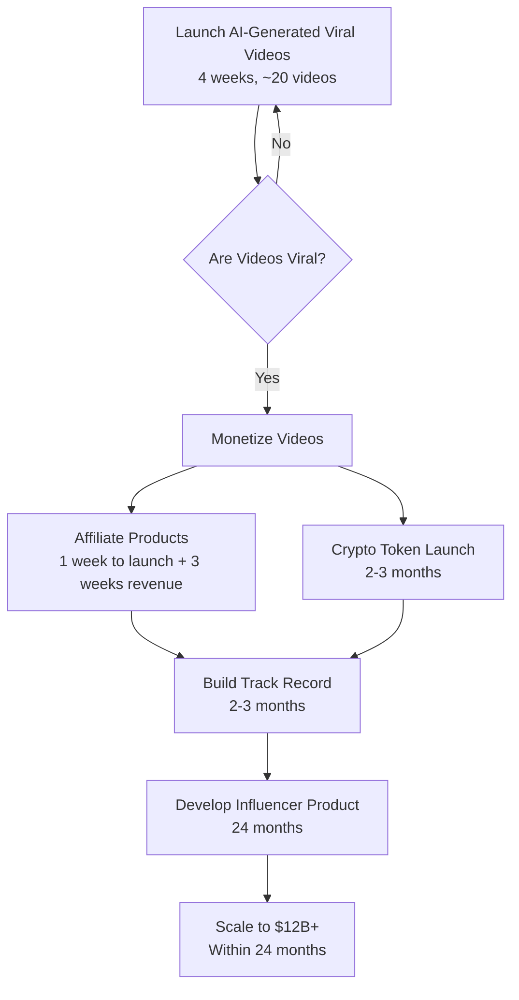

Here’s an updated diagram with your specified timelines added to each step. I’ve incorporated your details: 4 weeks to get to monetized videos (assuming 20 videos to go viral), 1 week for launching affiliate products followed by 3 weeks for revenue, 2-3 months for the crypto token launch, 2-3 months to build a track record, and 24 months for the final two steps (developing the influencer product and scaling to $12B+). Since some steps have parallel or overlapping timelines, I’ve noted the durations alongside each node for clarity.

### Explanation of Timelines:
1. **Launch AI-Generated Viral Videos (4 weeks)**: Assumes ~20 videos to achieve virality.
2. **Monetize Videos**: Splits into two paths:
   - **Affiliate Products (1 week launch + 3 weeks revenue)**: Total of 4 weeks.
   - **Crypto Token Launch (2-3 months)**: Runs parallel to affiliate products.
3. **Build Track Record (2-3 months)**: Starts after monetization paths converge, assuming it builds on both affiliate and crypto success.
4. **Develop Influencer Product (24 months)**: Begins after a track record is established.
5. **Scale to $12B+ (within 24 months)**: Combined with the product development phase, as scaling likely happens concurrently over the same 24-month period.

Total estimated timeline from start to finish: ~4 weeks (viral) + 2-3 months (monetization/track record) + 24 months (product/scaling) = roughly 27-28 months, depending on the crypto token launch duration (2 or 3 months).
