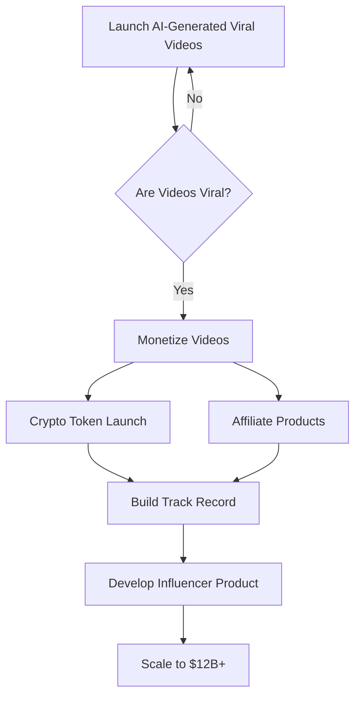

---
I can help you create a Mermaid diagram to visualize your marketing project plan. Here's a flowchart that represents the steps you described:

This diagram shows:
1. The initial launch of AI-generated viral videos in a loop until they go viral
2. Once viral, moving to monetization through two parallel paths (crypto token and affiliate products)
3. Building a track record from the monetization success
4. Developing a product for influencers
5. Scaling to your $12B+ goal
