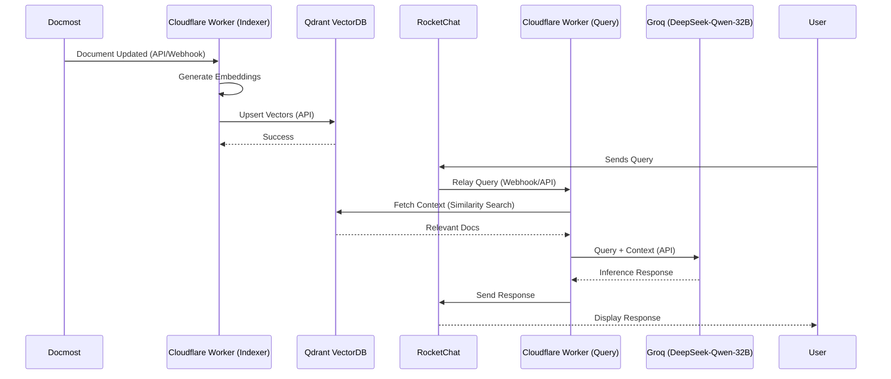

```mermaid
sequenceDiagram
    participant D as Docmost
    participant CW1 as Cloudflare Worker (Indexer)
    participant Q as Qdrant VectorDB
    participant R as RocketChat
    participant CW2 as Cloudflare Worker (Query)
    participant G as Groq (DeepSeek-Qwen-32B)

    %% Indexing Flow
    D->>CW1: Document Updated (API/Webhook)
    CW1->>CW1: Generate Embeddings
    CW1->>Q: Upsert Vectors (API)
    Q-->>CW1: Success

    %% Query Flow
    User->>R: Sends Query
    R->>CW2: Relay Query (Webhook/API)
    CW2->>Q: Fetch Context (Similarity Search)
    Q-->>CW2: Relevant Docs
    CW2->>G: Query + Context (API)
    G-->>CW2: Inference Response
    CW2->>R: Send Response
    R-->>User: Display Response
```