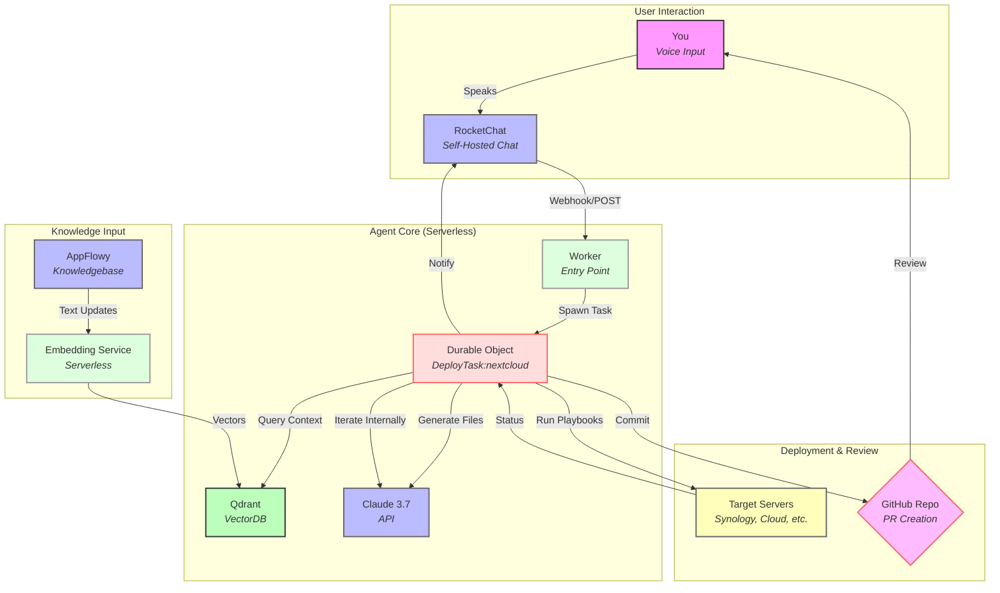

Durable Objects (DO) from Cloudflare are indeed a cool twist—they give you persistent storage and stateful logic in a serverless environment, which could supercharge your AI Agent. With DO, your Agent could maintain its own memory across requests, making it more "agentic" by tracking progress, self-correcting, and iterating without needing an external database like Firestore. Let’s explore how this fits into your stack and how it could autonomously update your infrastructure in a feedback-driven way.

### Why Durable Objects Fit
- **Stateful Serverless**: Unlike standard Cloudflare Workers (stateless, 10ms bursts), DOs persist data and run longer-lived logic per unique object (e.g., one DO per deployment task). Think of it as a tiny, per-task server.
- **Feedback Loop**: A DO can hold state (e.g., “Deploying Nextcloud, step 2 of 5”) and iterate internally, querying Claude or checking server status without restarting from scratch each time.
- **Coordination**: Each deployment could get its own DO instance (keyed by, say, `deploy-nextcloud-2025-03-29`), avoiding conflicts across tasks.

### How It Updates Your Stack Agentically
An "agentic" AI autonomously reasons, plans, and adapts—your Agent would need to:
1. **Understand Intent**: Parse your voice command (e.g., “Update my Nextcloud stack on Synology”).
2. **Plan**: Break it into steps (e.g., fetch config, generate files, deploy, verify).
3. **Iterate**: Check outcomes, refine with Claude, and retry if needed.
4. **Persist**: Track progress and results across iterations.
5. **Finalize**: Commit changes and notify you.

With Durable Objects, the Agent can self-manage this loop. Here’s how:

#### Workflow with Durable Objects
1. **Voice Command**: You say, “Update Nextcloud on Synology with 4GB storage” in RocketChat.
2. **Webhook Trigger**: RocketChat hits a Worker endpoint (e.g., `/deploy`).
3. **DO Instantiation**: The Worker spawns a Durable Object (e.g., `DeployTask:nextcloud-synology-2025-03-29`).
4. **State Initialization**: DO stores:
   - Command: “Update Nextcloud, 4GB storage”
   - Target: “Synology”
   - Step: 1 (e.g., “Fetch context”)
   - Attempts: 0
5. **Execution Loop**:
   - **Step 1**: Query Qdrant for Synology-specific context (e.g., `/volume1/docker`), store result in DO.
   - **Step 2**: Call Claude 3.7 with context + command, generate updated `docker-compose.yml` and playbook, save in DO state.
   - **Step 3**: Deploy via Ansible (e.g., SSH to Synology), store exit code/output.
   - **Feedback**: Check output (e.g., “Nextcloud running?” via HTTP probe). If failed, increment Attempts, tweak prompt (e.g., “Fix volume mount”), re-query Claude, repeat.
6. **Convergence**: Once successful (e.g., Nextcloud responds on port 8080), DO commits files to GitHub, raises PR, and notifies RocketChat.
7. **Cleanup**: DO self-deletes or marks itself complete, freeing resources.

#### Agentic Feedback Loop
- **Internal Iteration**: The DO runs a loop (e.g., `while (!success && attempts < 5)`) within its execution window (up to 30s per request, extendable with alarms).
- **Self-Correction**: If Ansible fails (e.g., “volume not found”), the DO analyzes the error, adjusts the Claude prompt (e.g., “Correct this playbook…”), and retries.
- **Learning**: It could log successful patterns back to Qdrant (e.g., “Synology needed X tweak”) via the Embedding Service, improving future runs.

### Architecture with Durable Objects
Here’s the updated diagram, incorporating DOs for that agentic flair:



#### Changes
- **Worker**: Now an entry point that spawns DOs.
- **Durable Object**: Ellipse-shaped, red-toned node for the task-specific Agent logic.
- **Loop**: Explicit “Iterate Internally” arrow within the DO.

### Coding the Agentic Behavior
Here’s a rough Cloudflare Worker + DO snippet (JavaScript):

```javascript
// worker.js
addEventListener("fetch", event => {
  event.respondWith(handleRequest(event.request));
});

async function handleRequest(request) {
  const url = new URL(request.url);
  if (url.pathname === "/deploy") {
    const body = await request.json();
    const taskId = `deploy-${body.app}-${Date.now()}`;
    const id = DEPLOY_ENV.durableObject.idFromName(taskId);
    const stub = DEPLOY_ENV.durableObject.get(id);
    return stub.fetch(request);
  }
  return new Response("Not Found", { status: 404 });
}

// durable-object.js
export class DeployTask {
  constructor(state, env) {
    this.state = state;
    this.env = env; // Access Qdrant, Claude, GitHub API keys
  }

  async fetch(request) {
    let task = await this.state.storage.get("task") || {
      command: (await request.json()).command,
      step: 1,
      attempts: 0,
      success: false
    };

    while (!task.success && task.attempts < 5) {
      if (task.step === 1) {
        task.context = await fetchQdrant(task.command, this.env.QDRANT_KEY);
        task.step++;
      } else if (task.step === 2) {
        task.files = await callClaude(task.command, task.context, this.env.CLAUDE_KEY);
        task.step++;
      } else if (task.step === 3) {
        task.result = await deployFiles(task.files, this.env.SSH_KEY);
        if (task.result.success) {
          task.success = true;
        } else {
          task.attempts++;
          task.context += `\nError: ${task.result.error}. Fix it.`;
          task.step = 2; // Retry Claude
        }
      }
      await this.state.storage.put("task", task);
    }

    if (task.success) {
      await commitToGitHub(task.files, this.env.GITHUB_TOKEN);
      await notifyRocketChat("Deployment done!", this.env.ROCKETCHAT_URL);
    }
    return new Response(JSON.stringify(task), { status: 200 });
  }
}

async function fetchQdrant(command, key) { /* Query Qdrant */ }
async function callClaude(command, context, key) { /* Call Claude */ }
async function deployFiles(files, sshKey) { /* Run Ansible */ }
async function commitToGitHub(files, token) { /* Raise PR */ }
async function notifyRocketChat(msg, url) { /* Post to chat */ }

export default { durableObject: DeployTask };
```

#### Key Points
- **State**: `this.state.storage` holds task progress (in-memory + persistent).
- **Loop**: `while` iterates until success or max attempts.
- **Feedback**: Errors trigger Claude retries with updated context.

### My Take
Durable Objects make your Agent truly agentic—self-contained, iterative, and stateful—without needing a separate DB. It’s perfect for updating your stack: it can tweak Nextcloud configs, test them, and refine until it works, all while you sip coffee. Cloudflare’s edge keeps it snappy, and the PR step ensures you’re not blind to changes. Prototype this with a simple “update Nginx port” task—should light up your Synology in no time.

What do you think—does this feel like the autonomous vibe you’re after? Want to tweak the loop or deployment logic?