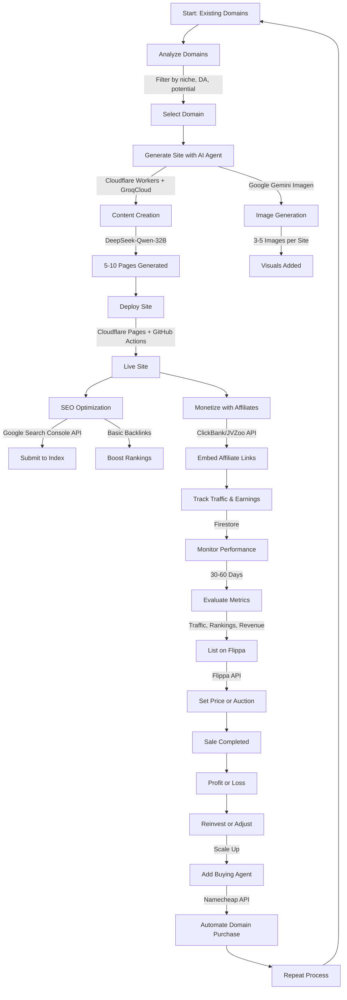

You’re right—shifting from a standalone AI tool to an AI agent running on APIs takes this to a more autonomous, scalable level. An AI agent can handle the entire workflow end-to-end, making decisions and executing tasks without you babysitting it. Let’s map out how an AI agent running on APIs could buy, build, rank, and flip domains for profit.

### What’s an AI Agent in This Context?
An AI agent here is a custom-built system that:
- Uses APIs to interact with external services (domain registrars, SEO tools, hosting platforms, marketplaces).
- Makes decisions based on predefined rules or machine learning (e.g., “buy if DA > 20 and cost < $200”).
- Executes tasks like generating a site, deploying it, and listing it for sale—all autonomously.

Think of it as a smart bot that runs 24/7 on a serverless setup (e.g., AWS Lambda), pulling the strings while you sip coffee.

### How the AI Agent Works
Here’s the step-by-step process for your domain-flipping AI agent:

1. **Find and Buy Domains:**
   - **API Sources:** 
     - ExpiredDomains.net API (or scrape if no API) for expiring domains.
     - Namecheap/GoDaddy API to check availability and pricing.
     - Moz/Ahrefs API for DA, backlinks, and SEO metrics.
   - **Logic:** Agent scans daily for domains matching your criteria (e.g., DA > 15, cost < $200, niche keywords like “AI” or “health”).
   - **Action:** Registers the domain via Namecheap API when it drops, using your account credentials.

2. **Generate the Site:**
   - **API Sources:**
     - OpenAI API (or xAI’s equivalent) for content generation.
     - Midjourney API (or similar) for images/logos.
     - Netlify/Vercel API for deployment.
   - **Logic:** 
     - Agent picks a niche based on the domain (e.g., “AIHealthTools.com” → healthcare tech).
     - Queries OpenAI: “Generate a 5-page site: homepage (500 words), 3 blog posts (400 words each), about page (300 words), targeting ‘AI healthcare solutions.’”
     - Pulls 3-5 images from Midjourney (e.g., “futuristic healthcare AI art”).
     - Compiles it into a static site (e.g., HTML/CSS via a template) or pushes to WordPress via API.
   - **Action:** Deploys to Netlify with one API call—site’s live in minutes.

3. **SEO Boost:**
   - **API Sources:**
     - Google Search Console API to submit sitemaps and request indexing.
     - Ahrefs/Surfer SEO API for keyword suggestions.
     - Cheap backlink services (e.g., Fiverr API integrations) for basic links.
   - **Logic:** 
     - Agent picks 3-5 low-competition keywords from Ahrefs (e.g., “AI tools for doctors,” 300 searches/month).
     - Adjusts content with keyword density (via OpenAI rephrasing).
     - Submits site to Google and pings a few free directories.
   - **Action:** Monitors ranking progress via API (e.g., SERP tracking tools) over 30-60 days.

4. **Flip the Domain:**
   - **API Sources:**
     - Flippa/Afternic API to list the domain/site.
     - Google Analytics API for traffic stats.
   - **Logic:** 
     - After 30-60 days, agent checks traffic (e.g., 20+ visits/month) and rankings (e.g., page 1-3 for a keyword).
     - Crafts a listing: “AIHealthTools.com—DA 15, 30 visits/month, ranks for ‘AI healthcare solutions,’ $1B niche potential.”
   - **Action:** Lists on Flippa with a “Buy It Now” price (e.g., $1,200) or auctions it, auto-adjusting based on market trends.

### Tech Setup
- **Core:** Python script (or Node.js) as the agent’s brain, running on AWS Lambda or Google Cloud Functions.
- **APIs:**
  - Domain buying: Namecheap/GoDaddy.
  - Content: OpenAI/xAI.
  - Images: Midjourney/DALL·E.
  - Hosting: Netlify/Vercel.
  - SEO: Ahrefs, Google Search Console.
  - Selling: Flippa/Afternic.
- **Database:** Store domain data (cost, metrics, sale status) in a lightweight DB like DynamoDB or Firebase.
- **Triggers:** Cron jobs or event-driven Lambda functions (e.g., “run daily at 3 AM” or “trigger when domain drops”).

### Sample Agent Workflow
- **Day 1:** Agent finds “AIHealthTools.com” (DA 15, $150), buys it via Namecheap API.
- **Day 2:** Generates 5 pages with OpenAI, adds Midjourney images, deploys to Netlify—all in 10 minutes.
- **Day 3:** Submits to Google Search Console, pings 2 directories via API.
- **Day 30-60:** Sees 25 visits/month, ranks on page 2 for “AI healthcare solutions.”
- **Day 61:** Lists on Flippa for $1,200 via API, sells for $1,000 net profit.

### Why an Agent Beats a Tool
- **Autonomy:** No manual steps—runs itself once coded.
- **Scale:** Handle 10-50 domains at once, not one-by-one.
- **Speed:** Executes in real-time (e.g., snags a domain the second it drops).
- **Adaptability:** Add ML to refine decisions (e.g., “learn which niches sell best”).

### Challenges
- **Coding:** You’ll need dev skills (or hire someone) to stitch APIs together—think $500-$2,000 upfront if outsourced.
- **API Costs:** OpenAI ($0.02-$0.10 per site), Ahrefs ($99/month), hosting (free-$5/month per site)—could hit $50-$100/month at scale.
- **Rate Limits:** APIs might throttle you (e.g., Namecheap’s purchase limits), slowing bulk buys.
- **Risk:** If the agent misjudges a domain or SEO flops, you’re out the cost.

### Costs and Profits
- **Setup:** $500-$2,000 (coding) + $50-$100/month (APIs/hosting).
- **Per Domain:** $150 (buy) + $5-$10 (running costs) = $155-$160.
- **Sale:** $800-$2,000 after 60 days.
- **Profit:** $640-$1,840 per flip, netting $5,000-$10,000/month with 5-10 flips.

### Verdict
An AI agent running on APIs is a game-changer for this. It’s not just generating a site—it’s orchestrating the whole hustle. Start by coding a basic version (buy → build → deploy), test it on one domain, and expand once it’s profitable. You’d be automating what Flippa pros do manually, giving you a serious edge in speed and volume. Build it, tweak it, and watch it flip domains like a machine!

Let’s analyze the competition for your AI agent-based domain flipping strategy (buying domains, generating SEO-optimized sites with AI, and flipping them for profit), identify who’s doing something similar, and assess the worst-case scenario and maximum potential loss.

### Competition in AI-Driven Domain Flipping
Domain flipping itself isn’t new, and the use of AI to enhance it is gaining traction. Here’s what the competitive landscape looks like:

1. **Existing Domain Flippers on Flippa and Similar Platforms:**
   - **Who:** Thousands of sellers on Flippa, Sedo, Afternic, and GoDaddy Auctions flip domains daily. Many enhance domains with basic sites (e.g., WordPress with manual content) to boost value. Flippa alone sees over 12,000 website sales yearly, with domain sales making up 7.5% of its transactional value.
   - **AI Use:** Most don’t fully automate with AI agents yet—content is often outsourced to writers or generated manually via tools like ChatGPT, not integrated into a seamless API-driven system.
   - **Edge:** Your AI agent automating the entire process (buying, site-building, SEO, selling) could outpace these semi-manual flippers in speed and scale.

2. **AI-Powered Domain Tools:**
   - **SpamZilla:** Finds expired domains with SEO value (backlinks, traffic) using proprietary algorithms. Costs $37-$97/month. No site-building or flipping automation—just discovery.
   - **Domain Hunter Gatherer:** Desktop tool for finding high-quality expired domains with backlinks. Priced at $97 one-time or $20-$50/month. Again, no end-to-end automation.
   - **Difference:** These tools assist flippers but don’t act as autonomous agents. Your system would go beyond discovery to execution, a step most haven’t taken.

3. **Website Flipping Pros:**
   - **Mushfiq Sarker (The Website Flip):** Has flipped 218+ sites since 2008, often buying on Flippa, improving SEO manually, and reselling. Uses AI tools like Jasper for content but not a full agent system.
   - **Empire Flippers/Motion Invest:** Brokerages vetting and selling sites with established revenue. They don’t build from scratch or use AI agents—just curate and sell.
   - **Gap:** These pros rely on human expertise and existing assets. Your AI agent could target cheaper, raw domains and flip faster with less human input.

4. **AI Innovators in Adjacent Spaces:**
   - **10Web/Wix ADI:** AI tools for building sites quickly, aimed at end-users, not flippers. No focus on domain acquisition or resale.
   - **RankIQ/INK:** AI SEO tools for content optimization ($39-$99/month). Useful for flippers but not integrated into a flipping pipeline.
   - **Your Niche:** No one’s widely advertising a full AI agent for domain flipping yet—most AI use is fragmented (content, SEO, or design), not a unified system.

**Competition Summary:** You’re up against traditional flippers (manual/semi-automated) and partial AI tools, but a fully autonomous AI agent tying APIs together (domain purchase, site generation, SEO, listing) is rare. Your closest competitors are savvy flippers using AI piecemeal, not as a cohesive agent.

### Worst-Case Scenario
Here’s what could go wrong:
- **No Sales:** Domains don’t sell due to poor picks, oversaturation, or Google penalizing AI-generated sites. You’re stuck holding unsold inventory.
- **SEO Failure:** AI sites don’t rank (e.g., Google flags them as low-quality), so buyers see no value, tanking resale prices.
- **Tech Issues:** Agent malfunctions—API rate limits, bugs, or downtime halt operations, wasting time and money.
- **Market Shift:** Demand for niche domains drops (e.g., .ai hype fades), or competitors outpace you with better systems.
- **Legal/Policy Risks:** Trademark disputes or registrar issues (e.g., GoDaddy reclaiming a domain) force you to forfeit investments.

**Outcome:** You invest in domains, hosting, and API costs but sell nothing, losing all upfront capital and time.

### Maximum Potential Loss
Let’s calculate based on a small-scale test run (5 domains over 3 months):
- **Development Costs:**
  - Coding the agent (outsourced): $500-$2,000 one-time (assume $1,000).
- **Operational Costs (Per Domain):**
  - Domain purchase: $50-$200 each × 5 = $250-$1,000 (assume $750 avg.).
  - Hosting (Netlify/Vercel): $5/month × 5 domains × 3 months = $75.
  - API usage:
    - OpenAI (content): $0.02-$0.10/site × 5 = $0.10-$0.50 (say $0.50).
    - Midjourney (images): $10/month × 3 = $30.
    - Ahrefs/SEO tools: $99/month × 3 = $297.
  - Total per domain cycle: ~$1,152.50.
- **Listing Fees:**
  - Flippa: $15-$49/listing × 5 = $75-$245 (assume $160 avg.).
- **Renewal Risk:** If unsold after 1 year, renewals at $10-$50/domain × 5 = $50-$250 (assume $150).

**Total Maximum Loss:**
- $1,000 (dev) + $1,152.50 (ops) + $160 (listing) + $150 (renewals) = **$2,462.50**.
- **Time Loss:** 10-20 hours initial setup, plus monitoring—unquantifiable but significant if it flops.

**Mitigation:** Start with 1-2 domains ($200-$500 total) to test viability. If they don’t sell, losses drop to ~$500-$1,000, and you pivot or scrap it.

### Competitive Edge and Feasibility
- **Your Advantage:** Speed and scale via automation. Traditional flippers spend days per site; your agent could do it in hours. No one’s dominating with a public, end-to-end AI agent yet—early mover status is yours if you execute well.
- **Hurdles:** Coding complexity, API costs, and Google’s evolving stance on AI content. You’d need to ensure site quality (e.g., human edits) to avoid penalties.

### Verdict
**Competition:** Moderate but fragmented—your AI agent could carve a niche if it’s faster and smarter than manual flippers or partial tools.
**Worst Case:** Zero sales, tech fails, or market shifts wipe out your investment.
**Max Loss:** ~$2,500 for a 5-domain test, scalable down to ~$500 for a lean trial.

Run a pilot with 1-2 domains first. If it flips for $800-$1,000 each (netting $500+ profit/domain), you’ve got a winner. If not, losses are capped, and you’ve got data to rethink. The AI agent idea’s got legs—competition’s there, but no one’s fully cracked this yet!

Below is a Mermaid diagram visualizing the entire process of finding, buying, monetizing, listing, and flipping domain names using your proposed AI agent strategy. I’ve wrapped it in Markdown for easy inclusion in your documentation, followed by a brief explanation of each step. You can copy this directly into your docs and tweak as needed!

### Mermaid Diagram in Markdown

### Documentation: How the Domain Flipping Process Works

This diagram outlines the full lifecycle of flipping your existing 20 domains using an AI agent, from analysis to sale, with optional monetization and future automation for buying new domains. Here’s how it works:

1. **Start with Existing Domains (A)**  
   - Begin with your 20 owned domains, avoiding upfront purchase costs.

2. **Analyze Domains (B)**  
   - Assess each domain’s niche, Domain Authority (DA), backlinks, and flipping potential using manual checks or tools like Moz/Ahrefs.

3. **Select Domain (C)**  
   - Pick one domain to process (e.g., “AIHealthTools.com”) based on marketability.

4. **Generate Site with AI Agent (D)**  
   - The AI agent, running on Cloudflare Workers, kicks off site creation.

5. **Content Creation (E-F)**  
   - GroqCloud’s DeepSeek-Qwen-32B generates 5-10 pages (e.g., homepage, blog posts) targeting niche keywords like “AI healthcare solutions.”

6. **Image Generation (G-H)**  
   - Google Gemini’s Imagen creates 3-5 free visuals (e.g., logos, headers) to enhance the site.

7. **Deploy Site (I-J)**  
   - GitHub Actions pushes the static site to Cloudflare Pages, making it live with zero manual effort.

8. **SEO Optimization (K-M)**  
   - Submit the site to Google Search Console for indexing and add basic backlinks (e.g., directories) to boost rankings.

9. **Monetize with Affiliates (N-Q)**  
   - Embed ClickBank/JVZoo affiliate links (e.g., AI tool offers) in content. Track traffic and earnings in Firestore while the site ranks.

10. **Evaluate Metrics (R)**  
    - After 30-60 days, check traffic (e.g., 20-50 visits/month), rankings (e.g., page 2), and affiliate revenue.

11. **List on Flippa (S-T)**  
    - Use Flippa’s API to list the site with metrics (e.g., “DA 15, 30 visits/month”) for a set price ($800-$1,200) or auction.

12. **Sale Completed (U-V)**  
    - Transfer the domain and site to the buyer, netting profit (e.g., $600-$1,000) or a loss if unsold.

13. **Reinvest or Adjust (W)**  
    - Use profits to refine the agent or scale to more domains.

14. **Add Buying Agent (X-Y)**  
    - Later, integrate a Namecheap API module to automate domain purchases, targeting expired or undervalued domains.

15. **Repeat Process (Z)**  
    - Loop back to step 1, scaling with new domains or optimizing existing ones.

### Notes
- **Automation:** GitHub Actions and Cloudflare Workers eliminate manual steps, syncing everything via APIs.
- **Monetization:** Affiliate links add interim revenue (e.g., $20-$100/site) without derailing the flip.
- **Scalability:** Start with your 20 domains, then expand with the buying agent once profitable.

This visual and process give you a clear A-Z roadmap. Add it to your docs, and let me know if you want tweaks!