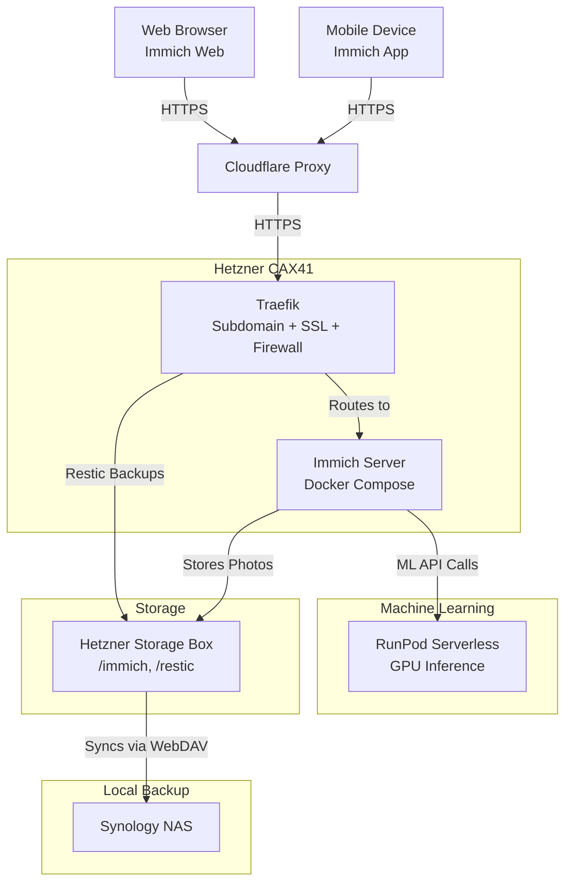

# Immich Self-Hosted Setup with Hetzner, RunPod, Synology, and Security Enhancements

This document outlines a self-hosted photo management solution using **Immich** on a **Hetzner CAX41** cloud server, with storage and backups on a **Hetzner Storage Box**, machine learning outsourced to **RunPod Serverless**, off-site backups to a **Synology NAS**, and enhanced security via a **Cloudflare Proxy** and **Hetzner Cloud Firewall**. The setup is optimized for personal use (e.g., 100 photos/month), keeping costs low (~€27.46–€27.98/month) and the CAX41 lightweight for other tasks.

## Architecture Overview

The components interact as follows:



- **Clients**: Immich app/web connects to `immich.yaml.space` via Cloudflare.
- **Cloudflare Proxy**: Secures and caches traffic to CAX41.
- **CAX41**: Runs Immich, Traefik, restic, protected by a firewall.
- **Storage Box**: Stores photos and backups, mounted on CAX41.
- **RunPod**: Handles ML (e.g., CLIP).
- **Synology**: Backups via WebDAV.

---

## Components and Configuration

### 1. Hetzner CAX41 (Compute)
- **Specs**: 16 ARM vCPUs, 32 GB RAM, 320 GB NVMe SSD, €23.99/month.
- **Role**: Hosts Immich’s core services (server, microservices, Redis, Postgres), Traefik for routing/SSL, and restic for server backups.
- **Setup**:
  - OS: Ubuntu 22.04.
  - Docker: `sudo apt install docker.io docker-compose`.
  - Traefik: Routes `immich.yaml.space`, adjusted for Cloudflare Proxy (see below).
  - Immich: Deployed via Docker Compose (Ansible role).
  - Restic: Backs up to Storage Box.

### 2. Hetzner Storage Box (Storage and Backups)
- **Specs**: 1 TB, €3.39/month, supports SSHFS, SFTP, WebDAV.
- **Role**: Stores Immich photos and restic backups.
- **Mounting on CAX41**:
  - Protocol: SSHFS.
  - Command:
    ```bash
    sudo apt install sshfs
    sudo mkdir /mnt/storagebox
    sshfs u12345@u12345.your-storagebox.de:/home /mnt/storagebox -o reconnect
    ```
  - Immich Config: `UPLOAD_LOCATION=/mnt/storagebox/immich`.
- **Restic Backup Config**:
  - Install: `sudo apt install restic`.
  - Repository: `sftp:u12345@u12345.your-storagebox.de:/restic`.
  - Init:
    ```bash
    export RESTIC_REPOSITORY="sftp:u12345@u12345.your-storagebox.de:/restic"
    export RESTIC_PASSWORD="your_secure_password"
    restic init
    ```
  - Backup: `/opt/immich`, `/var/lib/docker/volumes`:
    ```bash
    restic backup /opt/immich /var/lib/docker/volumes --exclude=/mnt/storagebox
    ```
  - Cron: Daily at 2 AM:
    ```bash
    0 2 * * * RESTIC_REPOSITORY="sftp:u12345@u12345.your-storagebox.de:/restic" RESTIC_PASSWORD="your_secure_password" /usr/bin/restic backup /opt/immich /var/lib/docker/volumes --exclude=/mnt/storagebox
    ```
  - Prune: Keep 7 daily, 4 weekly, 12 monthly:
    ```bash
    restic forget --keep-daily 7 --keep-weekly 4 --keep-monthly 12 --prune
    ```
- **Why Chosen**: Cheaper than R2 (€3.39 vs. €14 for 1 TB), dual-purpose (photos + backups), direct WebDAV sync.

### 3. RunPod Serverless (Machine Learning)
- **Role**: Offloads Immich’s ML tasks.
- **Why Chosen**: GPU acceleration, cost-effective ($0.08–$0.60/month for 100 photos), full ML support.
- **Configuration**:
  - **Endpoint Setup**:
    1. Sign up at [runpod.io](https://www.runpod.io).
    2. Create Serverless endpoint:
       - Image: `ghcr.io/immich-app/immich-machine-learning:v1.100.0`.
       - GPU: NVIDIA A40 ($0.00058/second).
       - Workers: Flex (scale to 0).
    3. Deploy and get URL (e.g., `https://your-endpoint.runpod.io`).
  - **Immich Integration**:
    - Update `.env`:
      ```env
      MACHINE_LEARNING_HOST=https://your-endpoint.runpod.io
      ```
    - Disable local ML in `docker-compose.yml`:
      ```yaml
      # immich-machine-learning:
      #   image: ghcr.io/immich-app/immich-machine-learning:v1.100.0
      #   ...
      ```
  - **Cost**: 
    - 100 photos (batched): ~$0.08/month.
    - 100 photos (individual): ~$0.60/month.

### 4. Synology NAS (Backup)
- **Role**: Off-site backup of Storage Box (photos and restic).
- **Sync Method**: WebDAV via Cloud Sync.
- **Configuration**:
  1. Install Cloud Sync in DSM.
  2. Create task:
     - Provider: WebDAV.
     - Server: `https://u12345.your-storagebox.de`.
     - Username: `u12345`.
     - Password: Storage Box password.
     - Port: 443.
     - Remote Path: `/` (includes `/immich`, `/restic`).
     - Local Path: `/backup/storagebox`.
  3. Options: Download remote changes, real-time sync.
  4. Verify: Check `/backup/storagebox/immich` and `/restic`.

### 5. Cloudflare Proxy (Security Layer)
- **Role**: Enhances security and performance for `immich.yaml.space`.
- **Why Added**: DDoS protection, IP masking, caching, free with your `yaml.space` domain.
- **Setup**:
  1. **DNS**:
     - In Cloudflare, add A record: `immich.yaml.space` → CAX41 public IP.
     - Enable Proxy (orange cloud).
  2. **SSL/TLS**:
     - Set to “Full” (encrypts Cloudflare ↔ CAX41).
     - Use Cloudflare’s free SSL cert (Traefik still generates Let’s Encrypt certs).
  3. **Firewall Rules**:
     - Allow HTTPS (port 443) only.
     - Block direct IP access: `(ip.src eq <CAX41_IP> and not cf.edge) then block`.
     - Rate limit: 100 requests/minute (adjust as needed).
  4. **Caching**:
     - Cache static assets (e.g., `/assets/*`) for 1 hour.
- **Traefik Adjustments**:
  - **Current**: Traefik handles SSL via Let’s Encrypt (`certresolver=letsencrypt`) and routes `Host(immich.yaml.space)`.
  - **With Cloudflare**:
    - Ensure Traefik accepts proxied traffic:
      ```yaml
      traefik:
        image: traefik:v2.10
        command:
          - "--entrypoints.websecure.address=:443"
          - "--providers.docker=true"
          - "--certificatesresolvers.letsencrypt.acme.httpchallenge=true"
          - "--certificatesresolvers.letsencrypt.acme.httpchallenge.entrypoint=web"
          - "--certificatesresolvers.letsencrypt.acme.email=your@email.com"
          - "--certificatesresolvers.letsencrypt.acme.storage=/letsencrypt/acme.json"
          - "--serversTransport.insecureSkipVerify=true"  # Skip Cloudflare cert verification
        ports:
          - "443:443"
        volumes:
          - /var/run/docker.sock:/var/run/docker.sock
          - ./letsencrypt:/letsencrypt
      ```
    - Add `insecureSkipVerify` to trust Cloudflare’s upstream cert (avoids SSL handshake issues).
    - Immich service labels remain unchanged:
      ```yaml
      - "traefik.http.routers.immich.rule=Host(`immich.yaml.space`)"
      - "traefik.http.routers.immich.tls=true"
      - "traefik.http.routers.immich.tls.certresolver=letsencrypt"
      ```

### 6. Hetzner Cloud Firewall (Security Layer)
- **Role**: Restricts CAX41 inbound/outbound traffic.
- **Why Added**: Blocks non-essential ports, enhances server security alongside Cloudflare.
- **Setup**:
  1. **Create Firewall** (Hetzner Cloud Console):
     - Name: `immich-firewall`.
     - Apply to: CAX41 instance.
  2. **Inbound Rules**:
     - Allow TCP 443 (HTTPS) from 0.0.0.0/0 (Cloudflare IPs proxied).
     - Allow TCP 22 (SSH) from your IP only (e.g., `your.ip/32`).
     - Drop all else.
  3. **Outbound Rules**:
     - Allow TCP 443 (HTTPS) to RunPod (`*.runpod.io` IPs, or 0.0.0.0/0 if dynamic).
     - Allow TCP 22 (SFTP) to Storage Box (`*.your-storagebox.de` IPs).
     - Allow all for Synology sync (or restrict to NAS IP).
  4. **Apply**: Save and test connectivity (SSH, Immich).
- **Notes**: Use `ufw` as fallback if firewall rules fail:
  ```bash
  sudo ufw allow 443
  sudo ufw allow from your.ip to any port 22
  sudo ufw deny all
  sudo ufw enable
  ```

---

## Why Not Hetzner Private Cloud?
A Private Cloud (CAX41 + Cloud Volume + Firewall + Cloudflare) was considered:
- **Cost**: €34.07 (1 TB Volume) vs. €27.46 (Storage Box).
- **Backup**: Cloud Volume needs CAX41 relay vs. Storage Box’s direct WebDAV.
- **Verdict**: Current setup with added Cloudflare Proxy and Firewall achieves similar security cheaper.

---

## How It All Fits Together
1. **Photo Upload**:
   - Immich app → HTTPS → Cloudflare Proxy → CAX41 (port 443, firewall-approved) → Traefik → Immich → `/mnt/storagebox/immich`.
2. **Machine Learning**:
   - Immich → RunPod Serverless (outbound 443 allowed) → GPU processes CLIP → Results return.
3. **Server Backup**:
   - Restic on CAX41 → SFTP to `/mnt/storagebox/restic` (outbound 22 allowed).
4. **Off-Site Backup**:
   - Storage Box (`/immich`, `/restic`) → Synology via WebDAV (outbound allowed).

---

## Cost Breakdown
- **CAX41**: €23.99/month.
- **Storage Box**: €3.39/month (1 TB).
- **RunPod**: $0.08–$0.60/month (100 photos).
- **Synology**: €0 (your hardware).
- **Cloudflare**: €0 (free tier).
- **Total**: €27.46–€27.98/month (~$30–$31 USD).

---

## Why This Setup?
- **CAX41**: Runs Immich and extras, kept light by RunPod.
- **Storage Box**: Cheap, dual-purpose, WebDAV sync.
- **RunPod**: Affordable GPU ML.
- **Synology**: Seamless backup.
- **Cloudflare + Firewall**: Security without Private Cloud cost.

For scaling, upgrade Storage Box (5 TB, €13.99/month) or tighten firewall rules.
