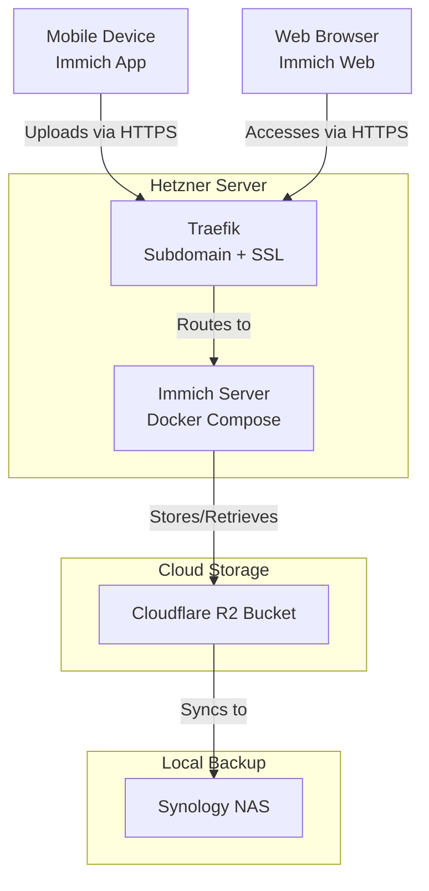

```mermaid
graph TD
    A[Mobile Device<br>Immich App] -->|Uploads via HTTPS| B[Hetzner Server<br>Traefik]
    C[Web Browser<br>Immich Web] -->|Accesses via HTTPS| B
    B -->|Routes to| D[Immich Server<br>Docker Compose]
    D -->|Stores/Retrieves| E[Cloudflare R2 Bucket<br>Mounted via S3 API]
    E -->|Syncs to| F[Synology NAS<br>Local Backup]
    
    subgraph Hetzner Server
        B[Traefik<br>Subdomain + SSL]
        D[Immich Server<br>Docker Compose]
    end
    
    subgraph Cloud Storage
        E[Cloudflare R2 Bucket]
    end
    
    subgraph Local Backup
        F[Synology NAS]
    end
```