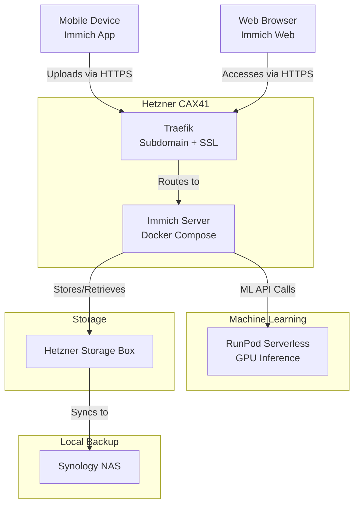

```mermaid
graph TD
    A[Mobile Device<br>Immich App] -->|Uploads via HTTPS| B[CAX41<br>Traefik]
    C[Web Browser<br>Immich Web] -->|Accesses via HTTPS| B
    B -->|Routes to| D[Immich Server<br>Docker Compose]
    D -->|Stores/Retrieves| E[Hetzner Storage Box<br>Mounted via SSHFS]
    D -->|ML API Calls| F[RunPod Serverless<br>GPU Inference]
    E -->|Syncs to| G[Synology NAS<br>Local Backup]
    
    subgraph Hetzner CAX41
        B[Traefik<br>Subdomain + SSL]
        D[Immich Server<br>Docker Compose]
    end
    
    subgraph Machine Learning
        F[RunPod Serverless<br>GPU Inference]
    end
    
    subgraph Storage
        E[Hetzner Storage Box]
    end
    
    subgraph Local Backup
        G[Synology NAS]
    end
```