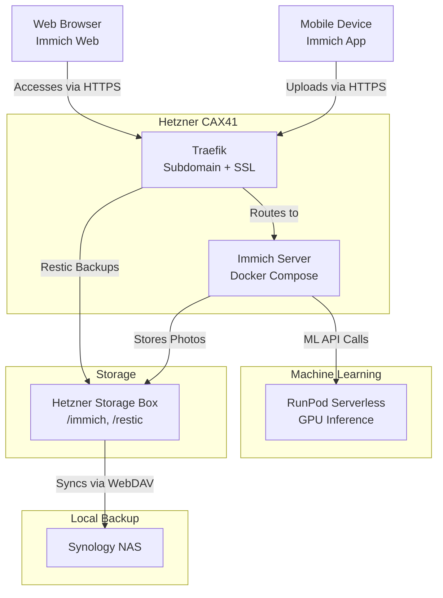

# Immich Self-Hosted Setup with Hetzner, RunPod, and Synology

This document outlines a self-hosted photo management solution using **Immich** on a **Hetzner CAX41** cloud server, with storage on a **Hetzner Storage Box**, machine learning outsourced to **RunPod Serverless**, and backups to a **Synology NAS**. The setup is designed for personal use (e.g., 100 photos/month), keeping costs low (~€27.46–€27.98/month) and the CAX41 lightweight for other tasks.

## Architecture Overview

The components interact as follows:



- **Clients**: Immich app/web connects to `immich.yaml.space`.
- **CAX41**: Runs Immich’s core services and Traefik.
- **Storage Box**: Stores photos, mounted on CAX41.
- **RunPod**: Handles ML (e.g., CLIP for smart search).
- **Synology**: Backups via WebDAV.

---

## Components and Configuration

### 1. Hetzner CAX41 (Compute)
- **Specs**: 16 ARM vCPUs, 32 GB RAM, 320 GB NVMe SSD, €23.99/month.
- **Role**: Hosts Immich’s core services (server, microservices, Redis, Postgres) and Traefik for routing/SSL.
- **Setup**:
  - OS: Ubuntu 22.04.
  - Docker: Installed with `sudo apt install docker.io docker-compose`.
  - Traefik: Routes `immich.yaml.space` via Cloudflare DNS to CAX41’s public IP, using Let’s Encrypt SSL.
  - Immich: Deployed via Docker Compose (see Ansible role).

### 2. Hetzner Storage Box (Storage)
- **Specs**: 1 TB, €3.39/month, supports SSHFS, WebDAV, SFTP.
- **Role**: Primary storage for Immich uploads.
- **Mounting on CAX41**:
  - Protocol: SSHFS (simple filesystem mount).
  - Command:
    ```bash
    sudo apt install sshfs
    sudo mkdir /mnt/storagebox
    sshfs u12345@u12345.your-storagebox.de:/home /mnt/storagebox -o reconnect
    ```
  - Immich Config: `UPLOAD_LOCATION=/mnt/storagebox` in `.env`.
- **Why Chosen**: Cheaper than Cloudflare R2 for 1 TB (€3.39 vs. €14), seamless integration via SSHFS, direct WebDAV sync to Synology.

### 3. RunPod Serverless (Machine Learning)
- **Role**: Offloads Immich’s ML tasks (e.g., CLIP for smart search) to keep CAX41 light.
- **Why Chosen**: GPU acceleration, cost-effective ($0.08–$0.60/month for 100 photos), supports full `immich-machine-learning` container.
- **Configuration**:
  - **Endpoint Setup**:
    1. Sign up at [runpod.io](https://www.runpod.io).
    2. Create a Serverless endpoint:
       - Image: `ghcr.io/immich-app/immich-machine-learning:v1.100.0`.
       - GPU: NVIDIA A40 ($0.00058/second).
       - Workers: Flex (scale to 0, bill only during execution).
    3. Deploy and get endpoint URL (e.g., `https://your-endpoint.runpod.io`).
  - **Immich Integration**:
    - Update `.env`:
      ```env
      MACHINE_LEARNING_HOST=https://your-endpoint.runpod.io
      ```
    - Disable local ML in `docker-compose.yml`:
      ```yaml
      # immich-machine-learning:
      #   image: ghcr.io/immich-app/immich-machine-learning:v1.100.0
      #   ...
      ```
  - **Cost Estimate**:
    - 100 photos (batched in 10s): ~13 seconds/session × 10 = 130 seconds × $0.00058 = $0.0754 (~$0.08/month).
    - 100 photos (individual): ~10.3 seconds/photo × 100 = 1,030 seconds × $0.00058 = $0.5974 (~$0.60/month).

### 4. Synology NAS (Backup)
- **Role**: Local backup of Storage Box contents.
- **Sync Method**: WebDAV via Synology Cloud Sync.
- **Configuration**:
  1. Install Cloud Sync in DSM Package Center.
  2. Create a sync task:
     - Provider: WebDAV.
     - Server: `https://u12345.your-storagebox.de`.
     - Username: `u12345`.
     - Password: Storage Box password.
     - Port: 443.
     - Remote Path: `/home` (or `/home/immich`).
     - Local Path: `/backup/immich`.
  3. Options:
     - Direction: Download remote changes only (one-way sync).
     - Schedule: Real-time or hourly.
  4. Start sync and verify files appear on Synology.
- **Why WebDAV**: Direct, simple, no middleman (unlike R2’s S3 needing CAX41 relay), supported by both Storage Box and Synology.

---

## How It All Fits Together

1. **Photo Upload**:
   - You upload a photo via Immich app → HTTPS to `immich.yaml.space` → Traefik on CAX41 → Immich server.
2. **Storage**:
   - Immich writes the photo to `/mnt/storagebox` (SSHFS-mounted Storage Box).
3. **Machine Learning**:
   - Immich triggers an ML task (e.g., smart search) → API call to RunPod Serverless → GPU processes CLIP inference → Results return to Immich.
4. **Backup**:
   - Storage Box’s `/home` syncs to Synology NAS via WebDAV in near real-time → Photos backed up to `/backup/immich`.

---

## Cost Breakdown
- **CAX41**: €23.99/month (compute).
- **Storage Box**: €3.39/month (1 TB storage).
- **RunPod**: $0.08–$0.60/month (100 photos, A40 Flex Workers).
- **Synology**: €0 (your hardware).
- **Total**: €27.46–€27.98/month (~$30–$31 USD).

---

## Why This Setup?
- **CAX41**: Powerful enough for Immich and other apps, kept light by outsourcing ML.
- **Storage Box**: Cost-effective (€3.39 vs. €14 for R2 at 1 TB), simple SSHFS mount, direct WebDAV backup.
- **RunPod**: Cheap GPU inference ($0.08 batched), full Immich ML support, no local resource hogging.
- **Synology**: Seamless WebDAV sync for redundancy.

This balances cost, simplicity, and performance for personal photo management. For setup tweaks or scaling (e.g., more photos), adjust RunPod workers or Storage Box size.

