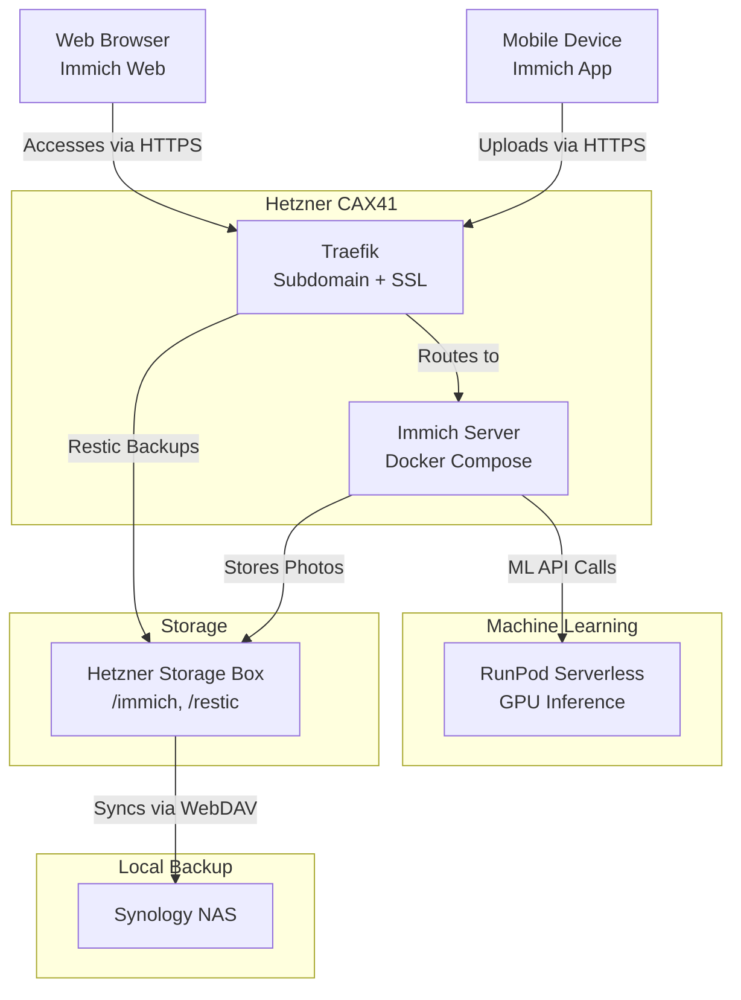

# Immich Self-Hosted Setup with Hetzner, RunPod, and Synology

This document outlines a self-hosted photo management solution using **Immich** on a **Hetzner CAX41** cloud server, with storage and backups on a **Hetzner Storage Box**, machine learning outsourced to **RunPod Serverless**, and off-site backups to a **Synology NAS**. The setup is optimized for personal use (e.g., 100 photos/month), keeping costs low (~€27.46–€27.98/month) and the CAX41 lightweight for other tasks.

## Architecture Overview

The components interact as follows:



- **Clients**: Immich app/web connects to `immich.yaml.space`.
- **CAX41**: Runs Immich’s core services, Traefik, and restic backups.
- **Storage Box**: Stores photos and server backups, mounted on CAX41.
- **RunPod**: Handles ML (e.g., CLIP for smart search).
- **Synology**: Backups via WebDAV.

---

## Components and Configuration

### 1. Hetzner CAX41 (Compute)
- **Specs**: 16 ARM vCPUs, 32 GB RAM, 320 GB NVMe SSD, €23.99/month.
- **Role**: Hosts Immich’s core services (server, microservices, Redis, Postgres), Traefik for routing/SSL, and restic for server backups.
- **Setup**:
  - OS: Ubuntu 22.04.
  - Docker: `sudo apt install docker.io docker-compose`.
  - Traefik: Routes `immich.yaml.space` via Cloudflare DNS to CAX41’s public IP, using Let’s Encrypt SSL.
  - Immich: Deployed via Docker Compose (see Ansible role).
  - Restic: Backs up key dirs to Storage Box (see below).

### 2. Hetzner Storage Box (Storage and Backups)
- **Specs**: 1 TB, €3.39/month, supports SSHFS, SFTP, WebDAV.
- **Role**: Primary storage for Immich photos and restic backups of CAX41.
- **Mounting on CAX41**:
  - Protocol: SSHFS.
  - Command:
    ```bash
    sudo apt install sshfs
    sudo mkdir /mnt/storagebox
    sshfs u12345@u12345.your-storagebox.de:/home /mnt/storagebox -o reconnect
    ```
  - Immich Config: `UPLOAD_LOCATION=/mnt/storagebox/immich` (create `/immich` subdir for photos).
- **Restic Backup Config**:
  - Install: `sudo apt install restic`.
  - Repository: `sftp:u12345@u12345.your-storagebox.de:/restic`.
  - Init:
    ```bash
    export RESTIC_REPOSITORY="sftp:u12345@u12345.your-storagebox.de:/restic"
    export RESTIC_PASSWORD="your_secure_password"
    restic init
    ```
  - Backup: `/opt/immich`, `/var/lib/docker/volumes` (excludes `/mnt/storagebox`):
    ```bash
    restic backup /opt/immich /var/lib/docker/volumes --exclude=/mnt/storagebox
    ```
  - Cron: Daily at 2 AM:
    ```bash
    0 2 * * * RESTIC_REPOSITORY="sftp:u12345@u12345.your-storagebox.de:/restic" RESTIC_PASSWORD="your_secure_password" /usr/bin/restic backup /opt/immich /var/lib/docker/volumes --exclude=/mnt/storagebox
    ```
  - Prune: Keep 7 daily, 4 weekly, 12 monthly:
    ```bash
    restic forget --keep-daily 7 --keep-weekly 4 --keep-monthly 12 --prune
    ```
- **Why Chosen**: Cheaper than Cloudflare R2 (€3.39 vs. €14 for 1 TB), simpler SSHFS mount, direct WebDAV sync to Synology, and supports both photos and restic backups.

### 3. RunPod Serverless (Machine Learning)
- **Role**: Offloads Immich’s ML tasks to keep CAX41 light.
- **Why Chosen**: GPU acceleration, cost-effective ($0.08–$0.60/month for 100 photos), supports full `immich-machine-learning` container.
- **Configuration**:
  - **Endpoint Setup**:
    1. Sign up at [runpod.io](https://www.runpod.io).
    2. Create Serverless endpoint:
       - Image: `ghcr.io/immich-app/immich-machine-learning:v1.100.0`.
       - GPU: NVIDIA A40 ($0.00058/second).
       - Workers: Flex (scale to 0, bill only during execution).
    3. Deploy and get URL (e.g., `https://your-endpoint.runpod.io`).
  - **Immich Integration**:
    - Update `.env`:
      ```env
      MACHINE_LEARNING_HOST=https://your-endpoint.runpod.io
      ```
    - Disable local ML in `docker-compose.yml`:
      ```yaml
      # immich-machine-learning:
      #   image: ghcr.io/immich-app/immich-machine-learning:v1.100.0
      #   ...
      ```
  - **Cost Estimate**:
    - 100 photos (batched in 10s): ~13 seconds/session × 10 = 130 seconds × $0.00058 = $0.0754 (~$0.08/month).
    - 100 photos (individual): ~10.3 seconds/photo × 100 = 1,030 seconds × $0.00058 = $0.5974 (~$0.60/month).

### 4. Synology NAS (Backup)
- **Role**: Local backup of Storage Box contents (photos and restic backups).
- **Sync Method**: WebDAV via Synology Cloud Sync.
- **Configuration**:
  1. Install Cloud Sync in DSM Package Center.
  2. Create sync task:
     - Provider: WebDAV.
     - Server: `https://u12345.your-storagebox.de`.
     - Username: `u12345`.
     - Password: Storage Box password.
     - Port: 443.
     - Remote Path: `/` (includes `/immich` and `/restic`).
     - Local Path: `/backup/storagebox`.
  3. Options:
     - Direction: Download remote changes only.
     - Schedule: Real-time or hourly.
  4. Start sync and verify files in `/backup/storagebox/immich` and `/backup/storagebox/restic`.
- **Why WebDAV**: Direct, simple, no middleman, supported by both Storage Box and Synology.

---

## Why Not Hetzner Private Cloud?
An alternative using a Private Cloud (CAX41 + Cloud Volume + Firewall + Cloudflare Proxy) was considered but rejected:
- **Cost**: €34.07 (CAX41 + 1 TB Volume) vs. €27.46 (CAX41 + Storage Box).
- **Backup**: Cloud Volume needs CAX41 relay (SFTP/rsync) vs. Storage Box’s direct WebDAV.
- **Security**: Current setup is secure with Traefik/SSL; Cloudflare Proxy can be added without Private Cloud.
- **Verdict**: Storage Box is cheaper, simpler, and fits your needs (personal use, Synology sync).

---

## How It All Fits Together
1. **Photo Upload**:
   - Immich app → HTTPS to `immich.yaml.space` → Traefik on CAX41 → Immich server → Stores in `/mnt/storagebox/immich`.
2. **Machine Learning**:
   - Immich triggers ML → API call to RunPod Serverless → GPU processes CLIP → Results return.
3. **Server Backup**:
   - Restic on CAX41 → Backs up `/opt/immich`, `/var/lib/docker/volumes` to `/mnt/storagebox/restic`.
4. **Off-Site Backup**:
   - Storage Box (`/immich`, `/restic`) → Synology via WebDAV → Mirrored to `/backup/storagebox`.

---

## Cost Breakdown
- **CAX41**: €23.99/month (compute).
- **Storage Box**: €3.39/month (1 TB storage + backups).
- **RunPod**: $0.08–$0.60/month (100 photos, A40 Flex Workers).
- **Synology**: €0 (your hardware).
- **Total**: €27.46–€27.98/month (~$30–$31 USD).

---

## Why This Setup?
- **CAX41**: Powerful for Immich and other apps, kept light by outsourcing ML.
- **Storage Box**: Cost-effective (€3.39 vs. €14 for R2 at 1 TB), dual-purpose (photos + restic), direct WebDAV sync.
- **RunPod**: Cheap GPU inference ($0.08 batched), full Immich ML support.
- **Synology**: Seamless WebDAV sync for redundancy.

For scaling (e.g., more photos/backups), upgrade Storage Box to 5 TB (€13.99/month) or add Cloudflare Proxy for extra security (free with `yaml.space`).
