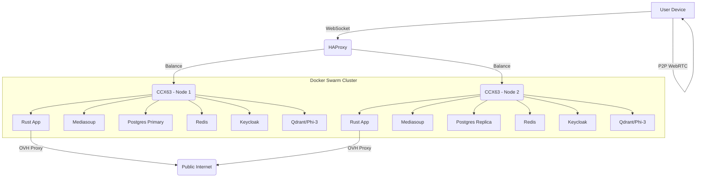
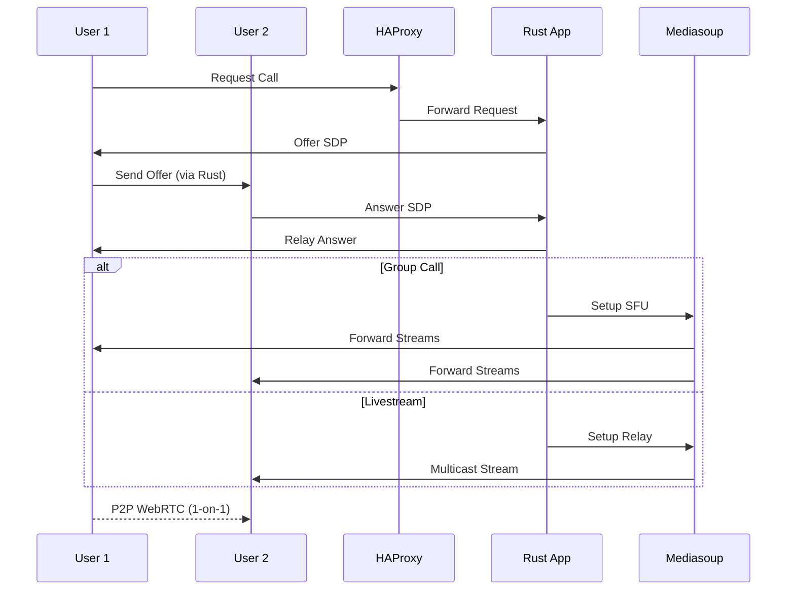
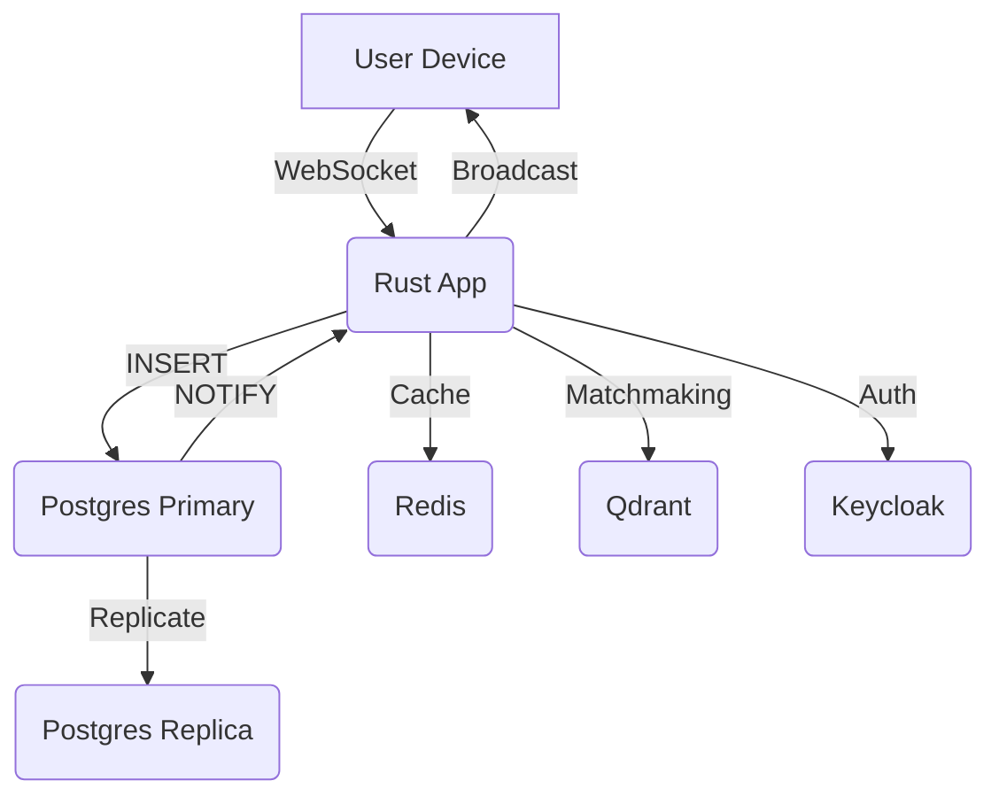

Below is a polished README/project specification in Markdown format for your video dating app with streams, followed by system design diagrams using Mermaid. This spec captures the architecture, tech stack, deployment, and scaling plan we’ve finalized, making it easy to integrate into your documentation. I’ll keep it clear, concise, and professional.

---

# Video Dating App with Streams - Project Specification

## Overview
This project is a scalable, cost-efficient video dating platform supporting 1-on-1 video calls, group calls, and livestreams. Designed to handle 5M users with a free tier, it leverages Rust for performance, Hetzner CCX63 servers for compute, and Docker Swarm for deployment. The app offers real-time chat, AI-driven matchmaking, and SSO authentication, aiming to be the "Tinder of Video Dating" with unlimited usage.

## Features
- **1-on-1 Video Calls**: WebRTC P2P for private dating.
- **Group Calls**: Up to 10 users via Selective Forwarding Unit (SFU).
- **Livestreams**: 1-to-500+ viewers via media relay.
- **Real-Time Chat**: Live messaging with PostgreSQL updates.
- **AI Matchmaking**: Qdrant vectors + Phi-3 concierge.
- **SSO**: Google login via Keycloak.
- **Free Tier**: 15-18 months breakeven at 5M users.

## Tech Stack
- **Backend**: Rust (Actix Web) - Signaling, SFU, relay, auth.
- **Media Server**: Mediasoup - WebRTC relay for streams.
- **Database**: PostgreSQL (HA) - Profiles, chat, ML data.
- **Cache**: Redis - Active sessions.
- **Auth**: Keycloak - SSO with OAuth2.
- **AI**: Qdrant (vectors) + Phi-3 (chat/concierge).
- **Load Balancer**: HAProxy - Traffic distribution.
- **Orchestration**: Docker Swarm - Deployment and scaling.
- **Proxy**: OVH DDoS Protection - 480 Gbps/server security.
- **Infra**: Hetzner CCX63 - 48 vCPU, 192GB RAM, 960GB NVMe.

## Deployment
- **Launch**: 1 CCX13 ($14.09-$15.09/month) - 10K users, 3K peak.
- **Scale**: 2 CCX63 ($654-$667/month) - 5M users, 2M peak.
  - Regions: DE (EU), US-East (NA), optional SG (Asia).
- **Docker Swarm**: 2 nodes (manager + worker), `docker-compose.yml` defines services.
- **OVH Proxy**: $6/month, routes traffic via IP tunneling.

## Resource Usage (5M Users, 2 CCX63)
- **Peak Load**: 1.5M 1-on-1 + 500K streams = 2M connections.
- **CPU**: 41-48 vCPUs/server (85-100% of 48).
- **Memory**: 86-108GB/server (45-56% of 192GB).
- **Bandwidth**: 3.2TB (base) = $0; 80TB (stream-heavy) = $52.
- **Surplus**: 0-7 vCPUs, 84-106GB—scales to 3rd CCX63 if needed.

## Cost Breakdown
- **Base**: $810-$925/month (2 CCX63, AI, proxy).
- **Stream-Heavy**: $862-$977/month (80TB traffic).
- **Breakeven**: $0.00016-$0.00020/user/month—15-18 months free.

## Scaling Plan
- **Launch**: 1 CCX13 (2 vCPU, 8GB) - 3K peak.
- **Growth**: 1 CCX63 at 100K-500K users.
- **Peak**: 2 CCX63 at 5M users; add 3rd ($333) for 10M or stream spikes.
- **Traffic**: $1/TB beyond 128TB (2 CCX63).

## Setup Instructions
1. **Hetzner**: Provision 2 CCX63 (DE, US-East) via [hetzner.com/cloud](https://www.hetzner.com/cloud).
2. **OVH Proxy**: Sign up at [ovhcloud.com](https://www.ovhcloud.com/en/), configure IP routing ($3/server).
3. **Docker Swarm**:
   - Install Docker: `apt install docker.io`.
   - Init Swarm: `docker swarm init` (manager), `docker swarm join` (worker).
   - Deploy: `docker stack deploy -c docker-compose.yml app`.
4. **Services**: Build Rust/Mediasoup images, pull Postgres/Redis/Keycloak/Qdrant/HAProxy.
5. **Postgres HA**: Set primary + replica, use Patroni for failover.
6. **Keycloak**: Configure Google SSO in Admin Console.

## System Design Diagrams

### High-Level Architecture

### Video Call Flow

### Real-Time Data Flow

---

## Notes
- **Monitoring**: Add Prometheus/Grafana later for metrics.
- **Logging**: Consider Sentry if debugging needs arise.
- **Growth**: 3rd CCX63 at 10M users or 80TB+ traffic.

This spec and diagrams provide a clear blueprint—add it to your docs and tweak as needed! Anything else to refine?