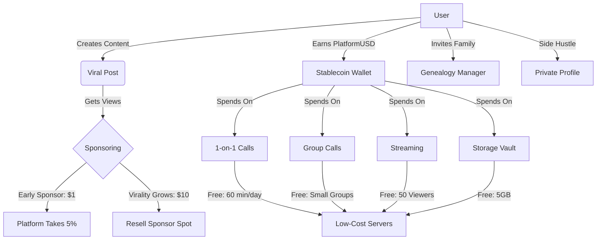

# ViralValue: A Next-Gen Social Media Platform

ViralValue is a revolutionary social media platform that combines real-world services with a stablecoin-based economy. Users earn rewards for viral content and spend them on practical features like video calls, storage, and more—all at unbeatable prices. Our goal? Deliver value to users, creators, and sponsors while growing fast through utility and innovation.

## Core Concept
- **Earn**: Users gain *PlatformUSD* (a USD-pegged stablecoin) based on content virality or tips.
- **Spend**: Redeem *PlatformUSD* on services with intrinsic value—calls, streams, storage.
- **Grow**: Free tiers, network effects, and competitive pricing drive rapid adoption.

## Key Features

1. **1-on-1 Video Calls**  
   - Free tier: 60 min/day.  
   - Paid: Unlimited for $1/month.  
   - Ultra-low cost via Rust, Flutter, WebRTC, and Hetzner servers.

2. **Group Calls (Many-to-Many)**  
   - Free for small groups (up to 5).  
   - Paid: $5/month for 10 hours of larger calls.  
   - Affordable at $15/month per 1Gbps server (1000 users).

3. **Streaming (1-to-Many)**  
   - Free for 50 viewers.  
   - Paid: $10/month for 1000 viewers.  
   - Competitive pricing for creators.

4. **Dynamic Sponsoring**  
   - Sponsor posts early (e.g., $1).  
   - Cost rises with virality (e.g., $10 at 10K views).  
   - Resell sponsor spots for profit; platform takes 5% cut.

5. **Auto-Genealogy Manager**  
   - ID-verified users build family trees for free.  
   - Premium: Historical data or DNA integration.  
   - Connects distant relatives automatically.

6. **Storage Vault**  
   - Free: 5GB.  
   - Paid: $1/month for 100GB.  
   - Cheaper than Google/iCloud with auto-sync.

7. **Private Profiles**  
   - Separate, unlinked profiles for privacy (e.g., side hustles).  
   - Free to create; extras like encryption optional.

## Stablecoin Economy
- **PlatformUSD**: A stablecoin pegged to USD.  
- **Why**: Simplifies earning (from posts/streams) and spending (on services).  
- **How**: Backed by reserves or AI-managed collateral for stability.

## Growth Strategy
- **Hook**: Free video calls pull users in.  
- **Network**: Genealogy and group calls spread via invites.  
- **Viral Loop**: Sponsoring incentivizes sharing.  
- **Revenue**: Paid tiers, sponsor cuts, and ad partnerships.

## Diagram
Below is a visual overview of how ViralValue works:

## Why It Works
- **Value**: Saves users money on calls, storage, and heritage tools.  
- **Earnings**: Monetizes virality instantly.  
- **Scale**: Free tiers and network effects drive explosive growth.  
- **Edge**: AI (optional) optimizes rewards and stability.

## Next Steps
1. **MVP**: Launch with video calls and sponsoring.  
2. **Stablecoin**: Roll out *PlatformUSD* for transactions.  
3. **Expand**: Add genealogy, storage, and privacy features.

Let’s build a platform that’s useful, profitable, and unstoppable!

